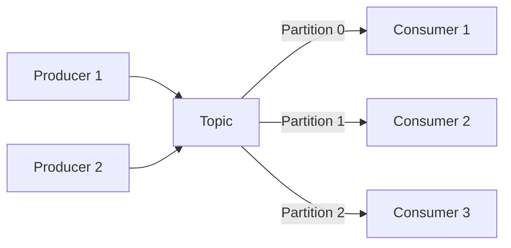
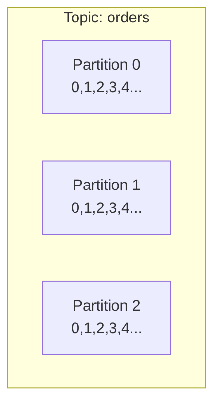
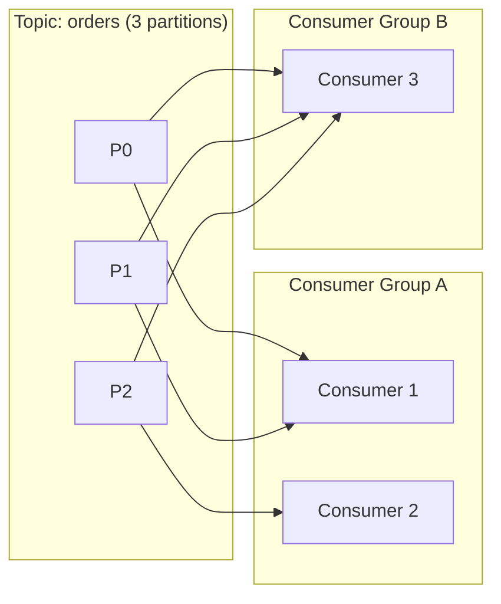
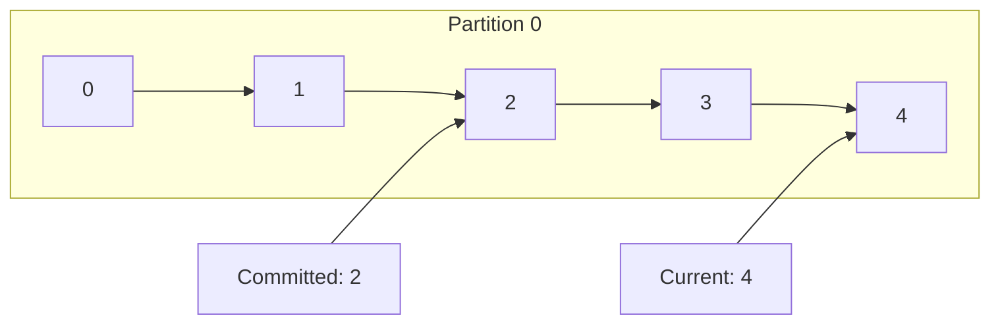
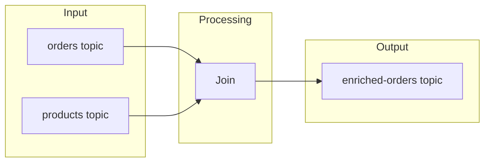
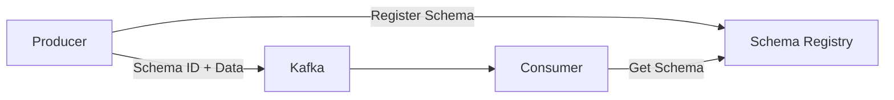
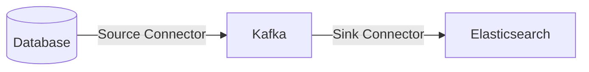

# Apache Kafka

High-throughput distributed event streaming platform.

---

## What is Kafka?



Kafka is a distributed commit log designed for high-throughput, fault-tolerant messaging.

---

## Core Concepts

| Concept | Description |
|---------|-------------|
| **Topic** | Category/feed of messages |
| **Partition** | Ordered, immutable sequence within topic |
| **Offset** | Message position in partition |
| **Producer** | Writes messages to topics |
| **Consumer** | Reads messages from topics |
| **Consumer Group** | Consumers sharing topic partitions |
| **Broker** | Kafka server |
| **Cluster** | Group of brokers |

---

## Topics and Partitions



### Why Partitions?

1. **Parallelism** - Multiple consumers process simultaneously
2. **Scalability** - Spread load across brokers
3. **Ordering** - Guaranteed within partition

### Partition Assignment

```
Message Key → hash(key) % num_partitions → Partition

"user-123" → hash → Partition 1
"user-456" → hash → Partition 2
"user-123" → hash → Partition 1 (same key = same partition)
```

---

## Consumer Groups



**Rules:**

- Each partition → one consumer per group
- Multiple groups can read same partition
- More partitions = more parallelism

---

## Python Implementation

### Setup

```bash
# Install Kafka (Docker)
docker-compose up -d

# Install kafka-python
pip install kafka-python
```

### Docker Compose

```yaml
version: '3'
services:
  zookeeper:
    image: confluentinc/cp-zookeeper:7.4.0
    environment:
      ZOOKEEPER_CLIENT_PORT: 2181

  kafka:
    image: confluentinc/cp-kafka:7.4.0
    depends_on:
      - zookeeper
    ports:
      - "9092:9092"
    environment:
      KAFKA_BROKER_ID: 1
      KAFKA_ZOOKEEPER_CONNECT: zookeeper:2181
      KAFKA_ADVERTISED_LISTENERS: PLAINTEXT://localhost:9092
      KAFKA_OFFSETS_TOPIC_REPLICATION_FACTOR: 1
```

### Producer

```python
from kafka import KafkaProducer
import json

producer = KafkaProducer(
    bootstrap_servers=['localhost:9092'],
    value_serializer=lambda v: json.dumps(v).encode('utf-8'),
    key_serializer=lambda k: k.encode('utf-8') if k else None,
    acks='all',  # Wait for all replicas
    retries=3
)

def send_order(order: dict):
    # Key ensures same user goes to same partition
    future = producer.send(
        topic='orders',
        key=order['user_id'],
        value=order
    )
    
    # Block for synchronous send (optional)
    try:
        record_metadata = future.get(timeout=10)
        print(f"Sent to partition {record_metadata.partition}, offset {record_metadata.offset}")
    except Exception as e:
        print(f"Error: {e}")

# Usage
send_order({'user_id': 'user-123', 'total': 99.99})

# Always flush/close
producer.flush()
producer.close()
```

### Consumer

```python
from kafka import KafkaConsumer
import json

consumer = KafkaConsumer(
    'orders',
    bootstrap_servers=['localhost:9092'],
    group_id='order-processor',
    auto_offset_reset='earliest',  # Start from beginning if no offset
    enable_auto_commit=False,  # Manual commit
    value_deserializer=lambda v: json.loads(v.decode('utf-8'))
)

try:
    for message in consumer:
        print(f"Partition: {message.partition}, Offset: {message.offset}")
        print(f"Key: {message.key}, Value: {message.value}")
        
        try:
            process_order(message.value)
            consumer.commit()  # Commit after processing
        except Exception as e:
            print(f"Error processing: {e}")
            # Don't commit - message will be reprocessed
finally:
    consumer.close()
```

### Batch Consumer

```python
consumer = KafkaConsumer(
    'orders',
    bootstrap_servers=['localhost:9092'],
    group_id='batch-processor',
    max_poll_records=100  # Batch size
)

for messages in consumer:
    batch = list(messages)
    process_batch(batch)
    consumer.commit()
```

---

## Exactly-Once Semantics

### Idempotent Producer

```python
producer = KafkaProducer(
    bootstrap_servers=['localhost:9092'],
    enable_idempotence=True,  # Prevents duplicates
    acks='all',
    retries=5
)
```

### Transactional Producer

```python
producer = KafkaProducer(
    bootstrap_servers=['localhost:9092'],
    transactional_id='order-service-1'
)

producer.init_transactions()

try:
    producer.begin_transaction()
    producer.send('orders', value=order1)
    producer.send('inventory', value=inventory_update)
    producer.commit_transaction()
except Exception:
    producer.abort_transaction()
```

---

## Offsets and Commits



### Commit Strategies

```python
# Auto-commit (default)
consumer = KafkaConsumer(
    'orders',
    enable_auto_commit=True,
    auto_commit_interval_ms=5000  # Every 5 seconds
)

# Manual commit - synchronous
consumer.commit()

# Manual commit - async
consumer.commit_async(callback=on_commit)

# Commit specific offsets
from kafka import TopicPartition
tp = TopicPartition('orders', 0)
consumer.commit({tp: OffsetAndMetadata(offset=100, metadata='')})
```

---

## Seeking to Offsets

```python
from kafka import TopicPartition

tp = TopicPartition('orders', 0)

# Seek to beginning
consumer.seek_to_beginning(tp)

# Seek to end
consumer.seek_to_end(tp)

# Seek to specific offset
consumer.seek(tp, 100)

# Seek by timestamp
offsets = consumer.offsets_for_times({tp: timestamp_ms})
consumer.seek(tp, offsets[tp].offset)
```

---

## Topic Management

```python
from kafka.admin import KafkaAdminClient, NewTopic

admin = KafkaAdminClient(bootstrap_servers=['localhost:9092'])

# Create topic
topic = NewTopic(
    name='orders',
    num_partitions=3,
    replication_factor=1,
    topic_configs={'retention.ms': '604800000'}  # 7 days
)
admin.create_topics([topic])

# Delete topic
admin.delete_topics(['orders'])

# List topics
admin.list_topics()
```

---

## Kafka Streams Concepts



### Stream Processing with Faust

```python
import faust

app = faust.App('order-processor', broker='kafka://localhost:9092')

class Order(faust.Record):
    order_id: str
    user_id: str
    total: float

orders_topic = app.topic('orders', value_type=Order)
processed_topic = app.topic('processed-orders', value_type=Order)

@app.agent(orders_topic)
async def process_orders(orders):
    async for order in orders:
        print(f"Processing order {order.order_id}")
        # Enrich/transform
        order.total *= 1.1  # Add tax
        await processed_topic.send(value=order)

# Aggregation
order_counts = app.Table('order-counts', default=int)

@app.agent(orders_topic)
async def count_orders(orders):
    async for order in orders:
        order_counts[order.user_id] += 1
```

---

## Schema Registry



### With Avro

```python
from confluent_kafka.avro import AvroProducer
from confluent_kafka import avro

schema_str = """
{
    "type": "record",
    "name": "Order",
    "fields": [
        {"name": "order_id", "type": "string"},
        {"name": "total", "type": "double"}
    ]
}
"""

producer = AvroProducer({
    'bootstrap.servers': 'localhost:9092',
    'schema.registry.url': 'http://localhost:8081'
}, default_value_schema=avro.loads(schema_str))

producer.produce(
    topic='orders',
    value={'order_id': '123', 'total': 99.99}
)
producer.flush()
```

---

## Kafka Connect



### Connector Configuration

```json
{
  "name": "postgres-source",
  "config": {
    "connector.class": "io.debezium.connector.postgresql.PostgresConnector",
    "database.hostname": "postgres",
    "database.port": "5432",
    "database.user": "postgres",
    "database.password": "password",
    "database.dbname": "orders",
    "table.include.list": "public.orders",
    "topic.prefix": "cdc"
  }
}
```

---

## Performance Tuning

### Producer

```python
producer = KafkaProducer(
    bootstrap_servers=['localhost:9092'],
    batch_size=16384,         # Batch size in bytes
    linger_ms=5,              # Wait up to 5ms for batch
    compression_type='snappy', # Compress batches
    buffer_memory=33554432    # 32MB buffer
)
```

### Consumer

```python
consumer = KafkaConsumer(
    'orders',
    fetch_min_bytes=1024,     # Min data per fetch
    fetch_max_wait_ms=500,    # Max wait for min bytes
    max_poll_records=500,     # Records per poll
    session_timeout_ms=10000  # Consumer heartbeat timeout
)
```

---

## Monitoring

### Key Metrics

| Metric | Description | Alert Threshold |
|--------|-------------|-----------------|
| Consumer lag | Messages behind | > 1000 |
| Under-replicated partitions | Unhealthy replicas | > 0 |
| Request latency | Produce/fetch time | > 100ms |
| ISR shrink rate | Replica issues | > 0 |

### Consumer Lag Check

```python
from kafka import KafkaAdminClient

admin = KafkaAdminClient(bootstrap_servers=['localhost:9092'])
consumer_groups = admin.list_consumer_groups()
# Check lag with admin.describe_consumer_groups()
```

---

## Best Practices

1. **Choose partition key wisely** - Even distribution
2. **Use idempotent producers** - Prevent duplicates
3. **Set appropriate replication** - Usually 3
4. **Monitor consumer lag** - Detect processing delays
5. **Use schema registry** - Schema evolution
6. **Tune batch sizes** - Balance latency/throughput
7. **Enable compression** - Reduce network/storage

---

## Next Steps

- **[MQTT](06_mqtt.md)** - Lightweight IoT messaging
