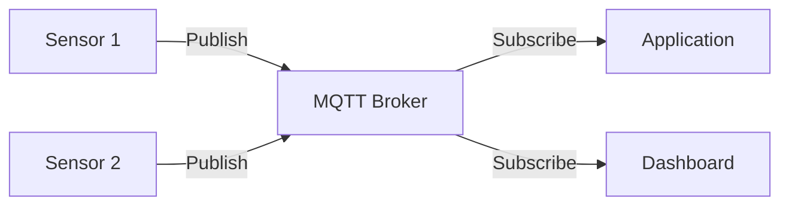
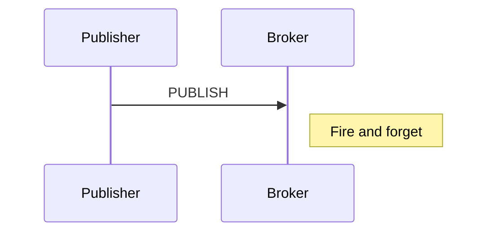
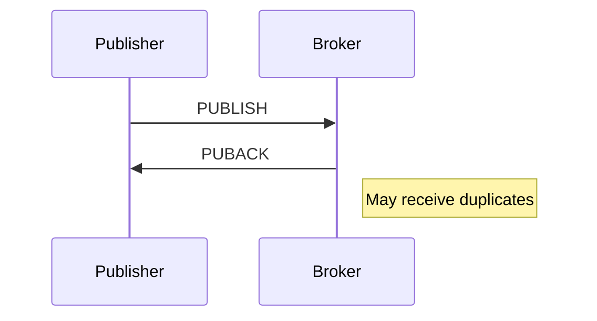
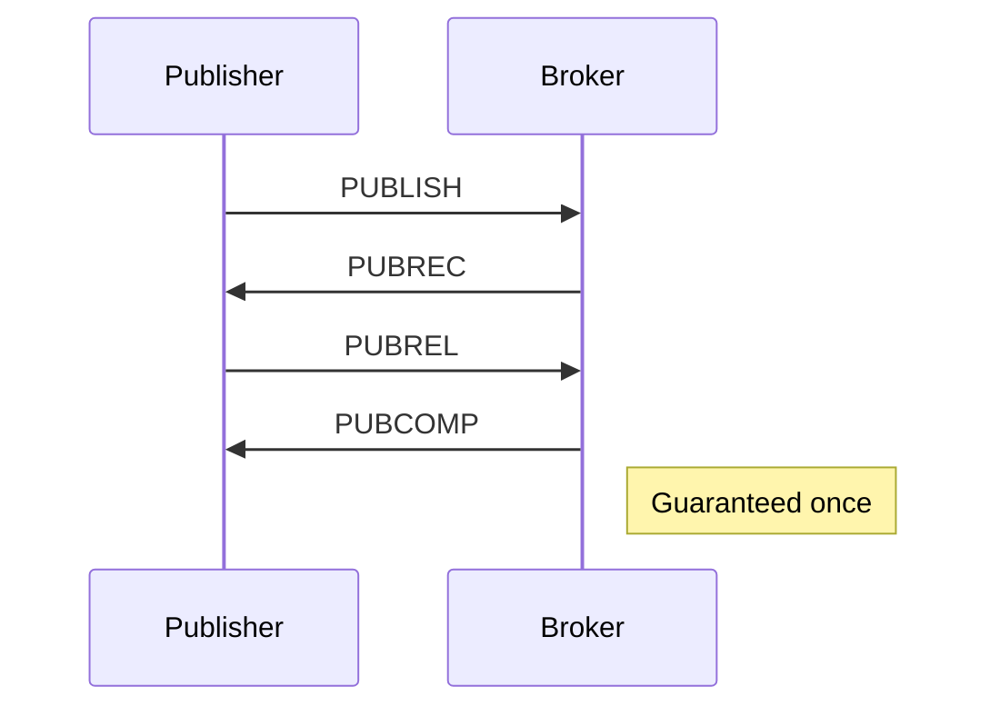

# MQTT

Lightweight pub/sub messaging protocol designed for IoT and constrained devices.

---

## What is MQTT?



**M**essage **Q**ueuing **T**elemetry **T**ransport - ideal for:

- IoT devices with limited bandwidth
- Unreliable networks
- Battery-powered devices

---

## Core Concepts

| Concept | Description |
|---------|-------------|
| **Client** | Publisher or subscriber |
| **Broker** | Central message router |
| **Topic** | Message channel (hierarchical) |
| **Publish** | Send message to topic |
| **Subscribe** | Listen to topic(s) |
| **QoS** | Delivery guarantee level |
| **Retain** | Store last message per topic |

---

## Topics

### Hierarchical Structure

```
home/
├── living-room/
│   ├── temperature     → "home/living-room/temperature"
│   ├── humidity        → "home/living-room/humidity"
│   └── light           → "home/living-room/light"
├── bedroom/
│   └── temperature     → "home/bedroom/temperature"
└── status              → "home/status"
```

### Wildcards

| Wildcard | Match | Example |
|----------|-------|---------|
| **+** | Single level | `home/+/temperature` → matches `home/bedroom/temperature` |
| **#** | Multiple levels | `home/#` → matches all under `home/` |

```python
# Subscribe patterns
"home/+/temperature"     # All room temperatures
"home/#"                 # Everything in home
"home/bedroom/+"         # All bedroom sensors
"+/+/temperature"        # All temperatures anywhere
```

---

## QoS Levels

### QoS 0: At Most Once



- No acknowledgment
- Can lose messages
- Fastest, lowest overhead

### QoS 1: At Least Once



- Acknowledged delivery
- Message stored until ACK
- May have duplicates

### QoS 2: Exactly Once



- 4-way handshake
- No duplicates
- Highest overhead

### When to Use

| QoS | Use Case |
|-----|----------|
| 0 | Non-critical telemetry, frequent updates |
| 1 | Important data where duplicates are OK |
| 2 | Critical commands, financial transactions |

---

## Python Implementation

### Setup

```bash
# Install broker (Docker)
docker run -d --name mosquitto -p 1883:1883 eclipse-mosquitto

# Install paho-mqtt
pip install paho-mqtt
```

### Publisher

```python
import paho.mqtt.client as mqtt
import json
import time

# Connect callback
def on_connect(client, userdata, flags, rc):
    if rc == 0:
        print("Connected successfully")
    else:
        print(f"Connection failed: {rc}")

# Create client
client = mqtt.Client(client_id="sensor-001")
client.on_connect = on_connect

# Optional: Authentication
# client.username_pw_set("user", "password")

# Optional: TLS
# client.tls_set()

# Connect
client.connect("localhost", 1883, keepalive=60)
client.loop_start()

# Publish messages
try:
    while True:
        temperature = 22.5  # Read from sensor
        
        # Publish with QoS 1
        result = client.publish(
            topic="home/living-room/temperature",
            payload=json.dumps({"value": temperature, "unit": "celsius"}),
            qos=1,
            retain=True  # Store last value
        )
        
        # Check if published
        result.wait_for_publish()
        print(f"Published: {temperature}")
        
        time.sleep(5)
except KeyboardInterrupt:
    pass
finally:
    client.loop_stop()
    client.disconnect()
```

### Subscriber

```python
import paho.mqtt.client as mqtt
import json

def on_connect(client, userdata, flags, rc):
    print(f"Connected with result code {rc}")
    # Subscribe on connect (resubscribe on reconnect)
    client.subscribe("home/#", qos=1)

def on_message(client, userdata, msg):
    print(f"Topic: {msg.topic}")
    print(f"QoS: {msg.qos}")
    print(f"Retain: {msg.retain}")
    
    try:
        payload = json.loads(msg.payload.decode())
        print(f"Payload: {payload}")
    except:
        print(f"Payload (raw): {msg.payload}")

def on_subscribe(client, userdata, mid, granted_qos):
    print(f"Subscribed with QoS: {granted_qos}")

# Create client
client = mqtt.Client(client_id="app-001")
client.on_connect = on_connect
client.on_message = on_message
client.on_subscribe = on_subscribe

# Connect and block
client.connect("localhost", 1883, keepalive=60)
client.loop_forever()
```

---

## Retained Messages

Last message stored by broker, sent to new subscribers.

```python
# Publish with retain
client.publish(
    "home/living-room/temperature",
    payload="25.5",
    retain=True
)

# Clear retained message
client.publish(
    "home/living-room/temperature",
    payload="",
    retain=True
)
```

---

## Last Will and Testament (LWT)

Broker publishes when client disconnects unexpectedly.

```python
client = mqtt.Client(client_id="sensor-001")

# Set LWT before connect
client.will_set(
    topic="home/living-room/status",
    payload="offline",
    qos=1,
    retain=True
)

client.connect("localhost", 1883)

# Publish online status
client.publish("home/living-room/status", "online", retain=True)
```

---

## Clean Session

```python
# Clean session: Start fresh
client = mqtt.Client(client_id="sensor-001", clean_session=True)

# Persistent session: Remember subscriptions and queued messages
client = mqtt.Client(client_id="sensor-001", clean_session=False)
```

---

## MQTT 5.0 Features

### Message Expiry

```python
from paho.mqtt.properties import Properties
from paho.mqtt.packettypes import PacketTypes

props = Properties(PacketTypes.PUBLISH)
props.MessageExpiryInterval = 60  # Expire in 60 seconds

client.publish(
    "commands/sensor-001",
    payload="reboot",
    properties=props
)
```

### Request-Response

```python
# Requester
props = Properties(PacketTypes.PUBLISH)
props.ResponseTopic = "responses/req-123"
props.CorrelationData = b"req-123"

client.subscribe("responses/req-123")
client.publish("commands/sensor-001", "status", properties=props)

# Responder
def on_message(client, userdata, msg):
    response_topic = msg.properties.ResponseTopic
    correlation = msg.properties.CorrelationData
    
    response_props = Properties(PacketTypes.PUBLISH)
    response_props.CorrelationData = correlation
    
    client.publish(response_topic, "OK", properties=response_props)
```

### Shared Subscriptions

```python
# Multiple clients share messages (load balancing)
client.subscribe("$share/group1/sensors/#")
```

---

## Security

### TLS/SSL

```python
import ssl

client = mqtt.Client()

# Server certificate
client.tls_set(
    ca_certs="/path/to/ca.crt",
    certfile="/path/to/client.crt",
    keyfile="/path/to/client.key",
    tls_version=ssl.PROTOCOL_TLS
)

client.connect("mqtt.example.com", 8883)
```

### Authentication

```python
# Username/password
client.username_pw_set("user", "password")

# Token (e.g., JWT)
client.username_pw_set("", "eyJhbGciOiJIUzI1NiIs...")
```

---

## Async Client

```python
import asyncio
from asyncio_mqtt import Client

async def main():
    async with Client("localhost") as client:
        # Subscribe
        async with client.messages() as messages:
            await client.subscribe("home/#")
            
            async for message in messages:
                print(message.payload.decode())

asyncio.run(main())
```

---

## Brokers

| Broker | Features | Use Case |
|--------|----------|----------|
| **Mosquitto** | Lightweight, simple | Development, small deployments |
| **HiveMQ** | Enterprise, clustering | Production, high availability |
| **EMQX** | High performance, clustering | Large scale IoT |
| **AWS IoT Core** | Managed, AWS integration | Cloud-native |
| **Azure IoT Hub** | Managed, Azure integration | Cloud-native |

---

## Message Patterns

### Telemetry

```
sensors/device-123/temperature  → {"value": 25.5}
sensors/device-123/humidity     → {"value": 60}
```

### Commands

```
commands/device-123/reboot      → "now"
commands/device-123/config      → {"interval": 30}
```

### Status

```
devices/device-123/status       → "online" (retained)
```

### Events

```
events/door-sensor-001/opened   → {"timestamp": "..."}
```

---

## Best Practices

1. **Use meaningful topic hierarchy** - Easy to subscribe with wildcards
2. **Set appropriate QoS** - Balance reliability vs overhead
3. **Use LWT** - Detect offline devices
4. **Enable TLS** - Encrypt all traffic
5. **Use retained messages** - For current state
6. **Keep payloads small** - Optimize for constrained devices
7. **Use client IDs** - Unique per device
8. **Handle reconnection** - Network unreliable

---

## Next Steps

- **[Best Practices](07_best_practices.md)** - Security, versioning, patterns
