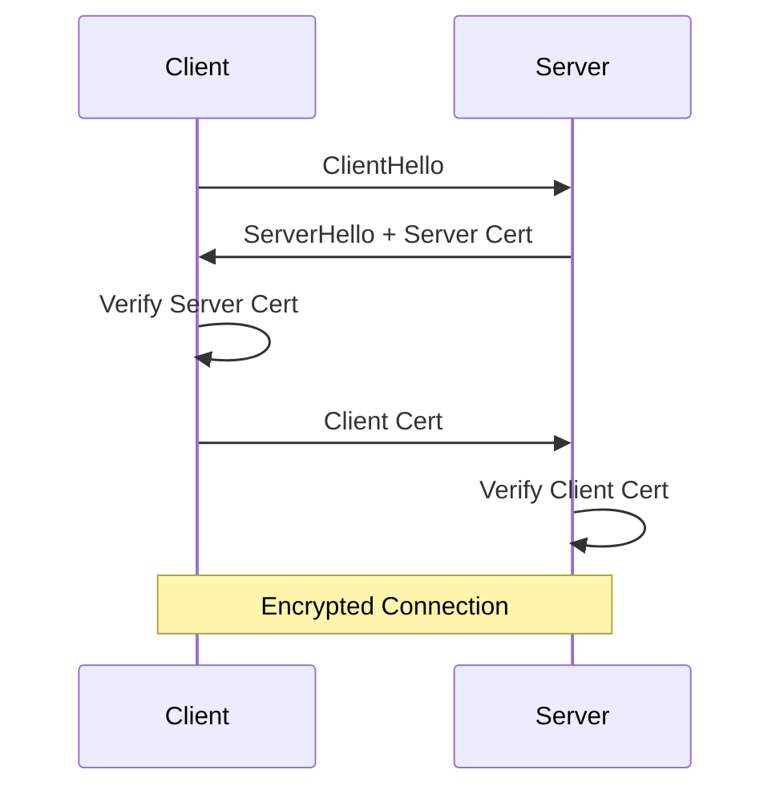
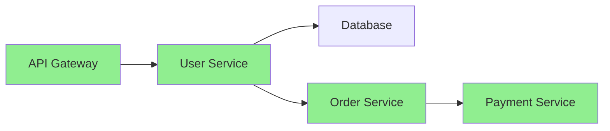
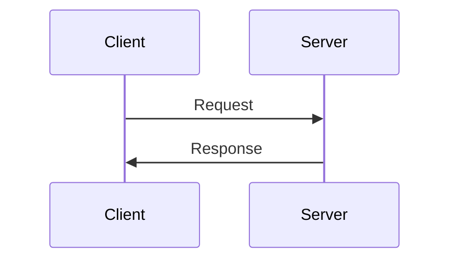
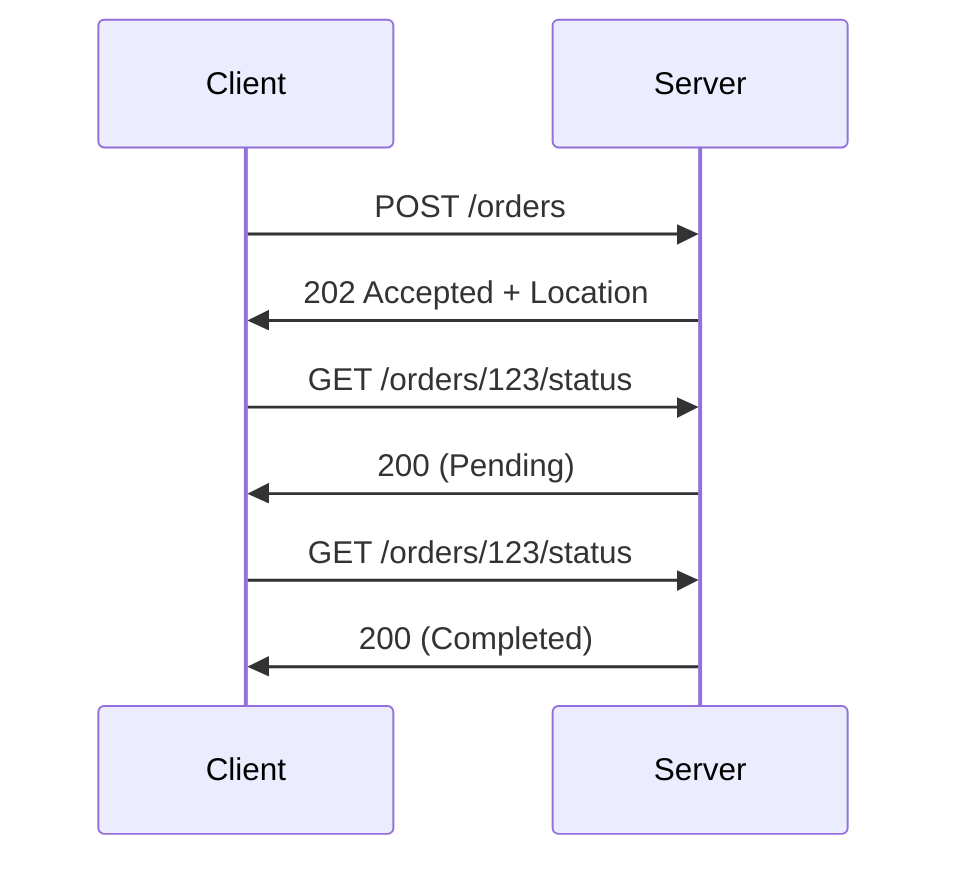
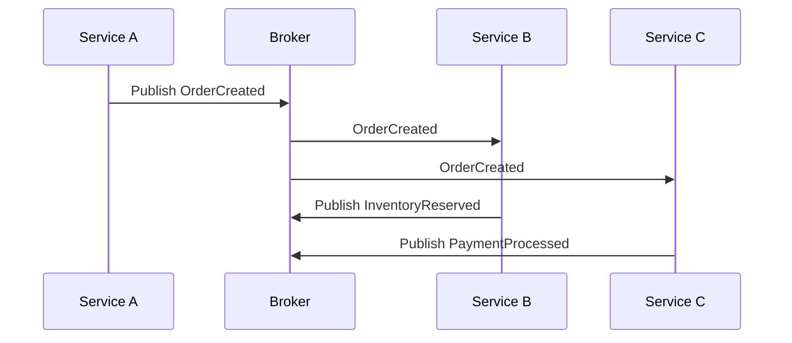
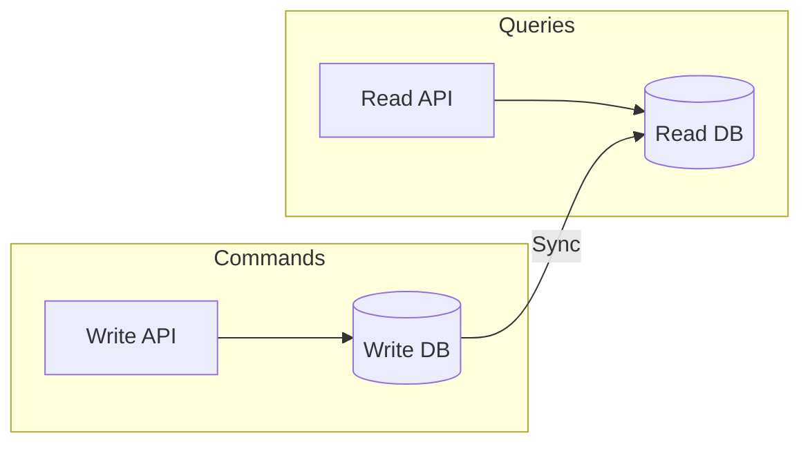

# API Best Practices

Security, versioning, error handling, and design patterns for all protocols.

---

## Security

### Authentication Methods

| Method | Use Case | Protocols |
|--------|----------|-----------|
| **API Key** | Simple integrations | REST, GraphQL |
| **JWT** | Stateless auth | REST, GraphQL, gRPC |
| **OAuth 2.0** | Third-party access | REST, GraphQL |
| **mTLS** | Service-to-service | gRPC, MQTT |
| **SASL** | Enterprise | Kafka, RabbitMQ |

### JWT Example

```python
import jwt
from datetime import datetime, timedelta

def create_token(user_id: str, secret: str) -> str:
    payload = {
        "sub": user_id,
        "iat": datetime.utcnow(),
        "exp": datetime.utcnow() + timedelta(hours=24),
        "roles": ["user"]
    }
    return jwt.encode(payload, secret, algorithm="HS256")

def verify_token(token: str, secret: str) -> dict:
    try:
        return jwt.decode(token, secret, algorithms=["HS256"])
    except jwt.ExpiredSignatureError:
        raise Exception("Token expired")
    except jwt.InvalidTokenError:
        raise Exception("Invalid token")
```

### mTLS (Mutual TLS)



---

## Versioning

### Strategies

| Strategy | Example | Pros | Cons |
|----------|---------|------|------|
| **URL** | `/v1/users` | Clear, cacheable | URL changes |
| **Header** | `Accept: application/vnd.api.v2+json` | Clean URLs | Hidden |
| **Query** | `/users?version=2` | Simple | Not RESTful |
| **Semantic** | Schema evolution | Flexible | Complex |

### Backward Compatibility Rules

```
✓ Add new fields (optional)
✓ Add new endpoints
✓ Add new optional parameters
✗ Remove fields
✗ Change field types
✗ Rename fields
✗ Change required → optional
```

### Deprecation

```yaml
# OpenAPI
paths:
  /users:
    get:
      deprecated: true
      x-deprecation-date: "2024-06-01"
      description: "Use /v2/users instead"
```

```protobuf
// Protobuf
message User {
  string id = 1;
  string name = 2;
  string email = 3;
  string old_field = 4 [deprecated = true];
}
```

---

## Error Handling

### Standardized Error Response

```json
{
  "error": {
    "code": "VALIDATION_ERROR",
    "message": "Request validation failed",
    "details": [
      {"field": "email", "message": "Invalid email format"},
      {"field": "age", "message": "Must be positive"}
    ],
    "request_id": "req_abc123",
    "timestamp": "2024-01-15T10:30:00Z",
    "documentation_url": "https://docs.api.com/errors/VALIDATION_ERROR"
  }
}
```

### Error Codes by Protocol

| Protocol | Error Format |
|----------|--------------|
| REST | HTTP status codes + JSON body |
| gRPC | Status codes + details |
| GraphQL | errors array in response |
| AMQP | NACK with reason |
| Kafka | Error in consumed record |

### Retry Strategies

```python
import time
from functools import wraps

def retry(max_attempts=3, backoff_factor=2):
    def decorator(func):
        @wraps(func)
        def wrapper(*args, **kwargs):
            attempt = 0
            while attempt < max_attempts:
                try:
                    return func(*args, **kwargs)
                except (ConnectionError, TimeoutError) as e:
                    attempt += 1
                    if attempt == max_attempts:
                        raise
                    wait = backoff_factor ** attempt
                    time.sleep(wait)
        return wrapper
    return decorator

@retry(max_attempts=3)
def call_api():
    # Make API call
    pass
```

---

## Rate Limiting

### Algorithms

| Algorithm | Description | Use Case |
|-----------|-------------|----------|
| **Fixed Window** | Count per time window | Simple limits |
| **Sliding Window** | Rolling count | Smoother limits |
| **Token Bucket** | Tokens replenish | Burst + steady |
| **Leaky Bucket** | Fixed rate | Smooth output |

### Response Headers

```http
HTTP/1.1 200 OK
X-RateLimit-Limit: 1000
X-RateLimit-Remaining: 999
X-RateLimit-Reset: 1640000000
```

### 429 Response

```http
HTTP/1.1 429 Too Many Requests
Retry-After: 60

{
  "error": {
    "code": "RATE_LIMIT_EXCEEDED",
    "message": "Rate limit exceeded. Try again in 60 seconds.",
    "retry_after": 60
  }
}
```

---

## Pagination

### Offset-Based

```json
{
  "data": [...],
  "pagination": {
    "page": 2,
    "per_page": 20,
    "total": 100,
    "total_pages": 5
  }
}
```

### Cursor-Based (Recommended)

```json
{
  "data": [...],
  "pagination": {
    "next_cursor": "eyJpZCI6MTIzfQ==",
    "has_more": true
  }
}
```

### GraphQL (Relay-style)

```graphql
type UserConnection {
  edges: [UserEdge!]!
  pageInfo: PageInfo!
}

type PageInfo {
  hasNextPage: Boolean!
  endCursor: String
}
```

---

## Idempotency

### Idempotency Keys

```http
POST /payments HTTP/1.1
Idempotency-Key: unique-request-id-123
Content-Type: application/json

{"amount": 100}
```

```python
import hashlib
import redis

r = redis.Redis()

def process_with_idempotency(idempotency_key: str, func, *args):
    # Check if already processed
    result = r.get(f"idempotency:{idempotency_key}")
    if result:
        return json.loads(result)
    
    # Process
    result = func(*args)
    
    # Store result (24 hour TTL)
    r.setex(f"idempotency:{idempotency_key}", 86400, json.dumps(result))
    
    return result
```

---

## Observability

### Distributed Tracing



### OpenTelemetry

```python
from opentelemetry import trace
from opentelemetry.trace import SpanKind

tracer = trace.get_tracer(__name__)

def process_order(order_id: str):
    with tracer.start_as_current_span(
        "process_order",
        kind=SpanKind.SERVER,
        attributes={"order_id": order_id}
    ) as span:
        try:
            result = do_processing()
            span.set_attribute("result", "success")
            return result
        except Exception as e:
            span.record_exception(e)
            span.set_status(trace.Status(trace.StatusCode.ERROR))
            raise
```

### Logging Standards

```json
{
  "timestamp": "2024-01-15T10:30:00Z",
  "level": "INFO",
  "service": "order-service",
  "trace_id": "abc123",
  "span_id": "def456",
  "message": "Order processed",
  "order_id": "order-789",
  "duration_ms": 150
}
```

---

## API Design Patterns

### Request-Reply



### Async Request-Reply



### Event-Driven



### CQRS (Command Query Responsibility Segregation)



---

## Protocol Migration

### REST → gRPC

```
1. Define .proto from OpenAPI
2. Implement gRPC service
3. Run both (gateway)
4. Migrate clients
5. Deprecate REST
```

### Sync → Async

```
1. Add message queue
2. Publish events alongside sync
3. Migrate consumers
4. Remove sync calls
```

---

## Testing

### Contract Testing

```yaml
# Pact contract
consumer: OrderService
provider: InventoryService
interactions:
  - description: Check inventory
    request:
      method: GET
      path: /inventory/sku-123
    response:
      status: 200
      body:
        sku: "sku-123"
        quantity: 100
```

### Load Testing

```bash
# k6 load test
k6 run --vus 100 --duration 30s script.js
```

```javascript
// script.js
import http from 'k6/http';

export default function() {
  http.get('http://api.example.com/users');
}
```

---

## Checklist

### Security ✓

- [ ] HTTPS/TLS everywhere
- [ ] Authentication on all endpoints
- [ ] Authorization checks
- [ ] Rate limiting
- [ ] Input validation
- [ ] Output sanitization

### Reliability ✓

- [ ] Timeouts configured
- [ ] Retry with backoff
- [ ] Circuit breakers
- [ ] Idempotency for writes
- [ ] Health endpoints

### Observability ✓

- [ ] Structured logging
- [ ] Distributed tracing
- [ ] Metrics collection
- [ ] Alerting configured
- [ ] Error tracking

---

## Files in This Directory

| File | Description |
|------|-------------|
| [00_protocols_overview](00_protocols_overview.md) | Protocol comparison |
| [01_rest_api](01_rest_api.md) | REST fundamentals |
| [02_grpc](02_grpc.md) | gRPC with Protobuf |
| [03_graphql](03_graphql.md) | GraphQL queries |
| [04_amqp_rabbitmq](04_amqp_rabbitmq.md) | RabbitMQ messaging |
| [05_kafka](05_kafka.md) | Kafka streaming |
| [06_mqtt](06_mqtt.md) | MQTT for IoT |
