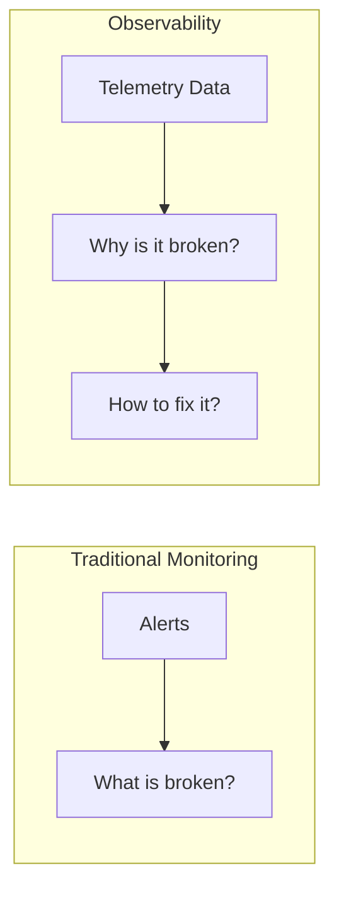
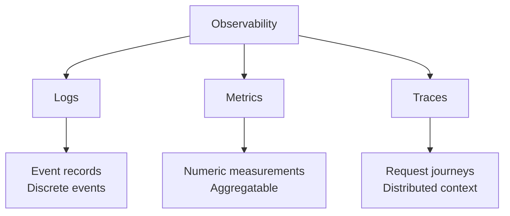
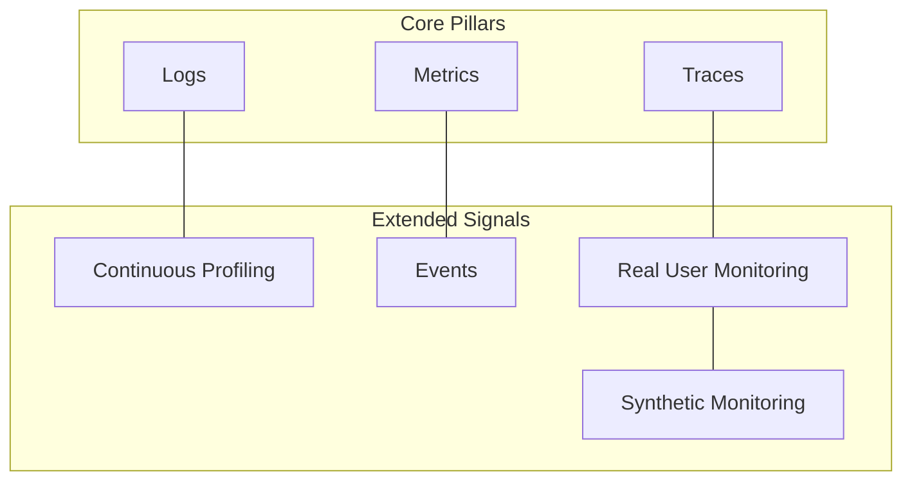
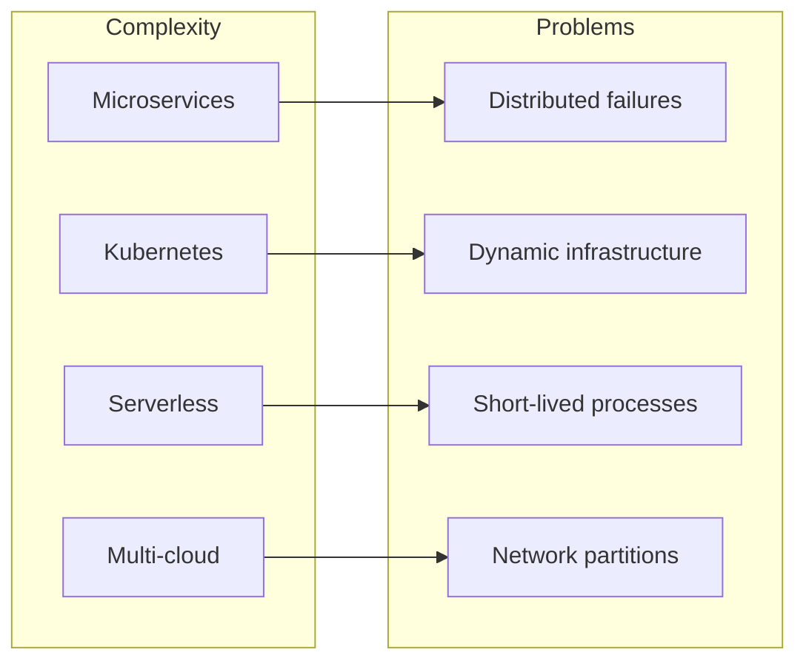
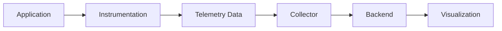
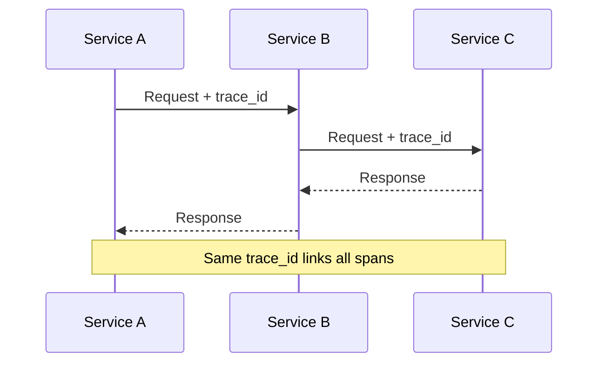
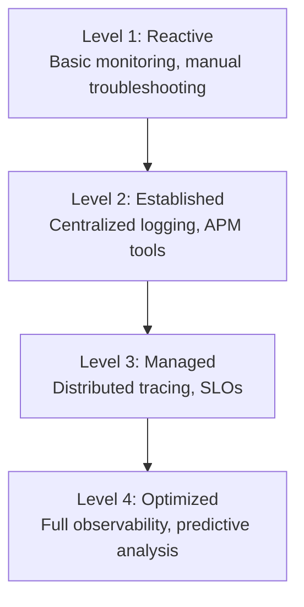
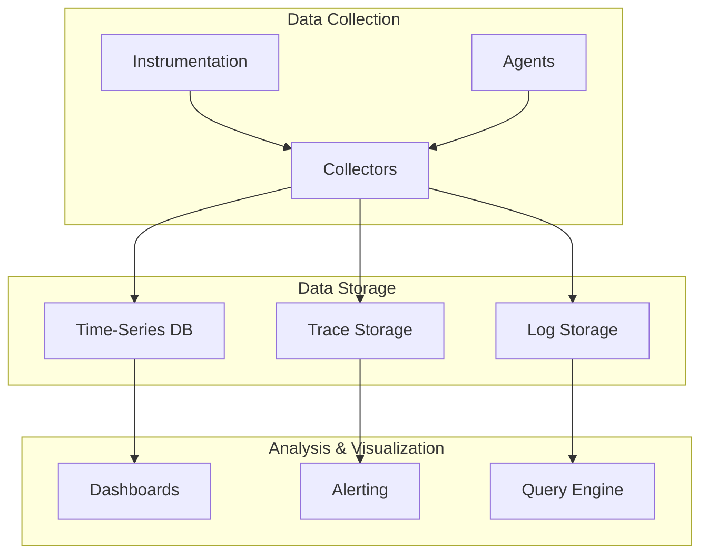

# Observability Overview

A comprehensive guide to understanding and implementing observability in modern systems.

---

## What is Observability?

Observability is the ability to understand the internal state of a system by examining its external outputs. Unlike traditional monitoring, which tells you **what** is broken, observability helps answer **why** it's broken.



---

## The Three Pillars of Observability



### 1. Logs

Discrete event records that capture what happened at a specific point in time.

| Aspect | Description |
|--------|-------------|
| **Format** | Text or structured (JSON) |
| **Cardinality** | High volume |
| **Use Case** | Debugging, audit trails |
| **Example** | `ERROR: Connection refused to database` |

### 2. Metrics

Numeric measurements collected over intervals of time.

| Aspect | Description |
|--------|-------------|
| **Format** | Numeric values with labels |
| **Cardinality** | Low (aggregated) |
| **Use Case** | Alerting, dashboards, trends |
| **Example** | `http_requests_total{status="200"}` |

### 3. Traces

End-to-end tracking of requests as they flow through distributed systems.

| Aspect | Description |
|--------|-------------|
| **Format** | Spans with context |
| **Cardinality** | Medium (sampled) |
| **Use Case** | Latency analysis, dependency mapping |
| **Example** | Request journey through 5 microservices |

---

## Beyond the Three Pillars

Modern observability extends beyond logs, metrics, and traces:



| Signal | Description |
|--------|-------------|
| **Continuous Profiling** | CPU, memory, and I/O profiling over time |
| **Events** | Discrete occurrences like deployments |
| **Real User Monitoring** | Actual user experience data |
| **Synthetic Monitoring** | Simulated user interactions |

---

## Why Observability Matters

### Challenges in Modern Systems



### Benefits of Observability

| Benefit | Description |
|---------|-------------|
| **Faster MTTR** | Reduce mean time to resolution |
| **Proactive Detection** | Identify issues before users report |
| **Root Cause Analysis** | Understand why failures occur |
| **Performance Optimization** | Find and fix bottlenecks |
| **Capacity Planning** | Make informed scaling decisions |

---

## Observability vs Monitoring

| Aspect | Monitoring | Observability |
|--------|------------|---------------|
| **Question** | Is it broken? | Why is it broken? |
| **Approach** | Predefined alerts | Exploratory analysis |
| **Known Unknowns** | ✓ Handles well | ✓ Handles well |
| **Unknown Unknowns** | ✗ Struggles | ✓ Excels |
| **Data** | Aggregated metrics | Rich telemetry |
| **Context** | Limited | Full request context |

---

## Key Concepts

### Telemetry

The process of measuring and transmitting data for monitoring.



### Instrumentation

Adding code to emit telemetry data.

```python
# Manual instrumentation example
def process_order(order_id):
    span = tracer.start_span("process_order")
    span.set_attribute("order.id", order_id)
    try:
        result = do_processing(order_id)
        span.set_status(StatusCode.OK)
        return result
    except Exception as e:
        span.set_status(StatusCode.ERROR)
        span.record_exception(e)
        raise
    finally:
        span.end()
```

### Context Propagation

Passing trace context across service boundaries.



### Cardinality

The number of unique combinations of label values.

```python
# Low cardinality (good)
http_requests{method="GET", status="200"}

# High cardinality (problematic)
http_requests{user_id="12345", session_id="abc123"}
```

---

## Observability Maturity Model



| Level | Characteristics |
|-------|-----------------|
| **Reactive** | Logs in files, SSH to debug |
| **Established** | Centralized logs, basic dashboards |
| **Managed** | Tracing, SLO-based alerting |
| **Optimized** | AI/ML insights, self-healing |

---

## Observability Stack Components



### Popular Tools by Category

| Category | Tools |
|----------|-------|
| **Instrumentation** | OpenTelemetry, Prometheus Client |
| **Collection** | OTel Collector, Fluentd, Vector |
| **Metrics Storage** | Prometheus, InfluxDB, Mimir |
| **Log Storage** | Elasticsearch, Loki, Splunk |
| **Trace Storage** | Jaeger, Zipkin, Tempo |
| **Visualization** | Grafana, Kibana, Datadog |
| **APM** | New Relic, Dynatrace, Honeycomb |

---

## Best Practices

### Instrumentation

- ✓ Use structured logging
- ✓ Include correlation IDs
- ✓ Keep cardinality under control
- ✓ Use semantic conventions

### Data Collection

- ✓ Sample traces appropriately
- ✓ Buffer data locally
- ✓ Compress before sending
- ✓ Handle backpressure

### Analysis

- ✓ Define SLIs and SLOs
- ✓ Create actionable alerts
- ✓ Build investigative dashboards
- ✓ Document runbooks

---

## Documentation Index

| Document | Description |
|----------|-------------|
| **[OpenTelemetry Overview](01_opentelemetry_overview.md)** | Introduction to OpenTelemetry |
| **[Traces](02_traces.md)** | Distributed tracing concepts |
| **[Metrics](03_metrics.md)** | Metric types and collection |
| **[Logs](04_logs.md)** | Structured logging |
| **[Collector](05_collector.md)** | OTel Collector configuration |
| **[Instrumentation](06_instrumentation.md)** | Auto and manual instrumentation |
| **[Best Practices](07_best_practices.md)** | Production recommendations |
