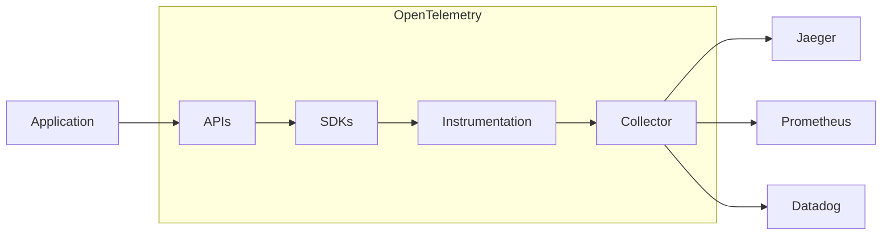
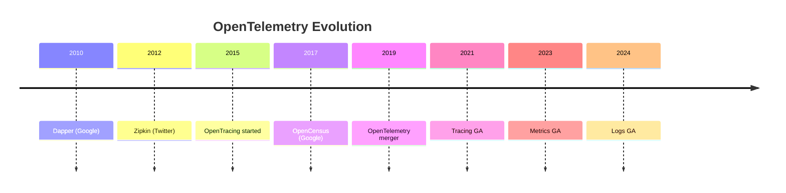
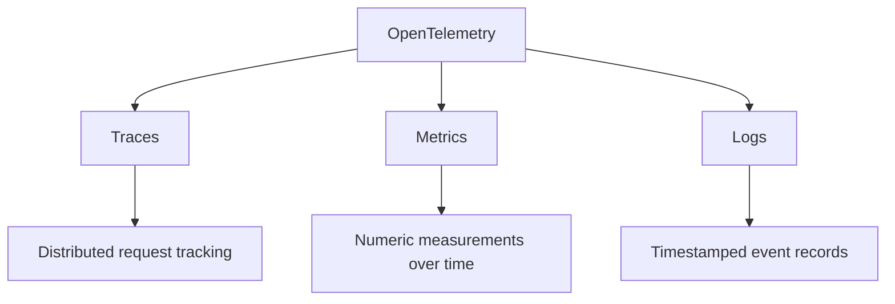
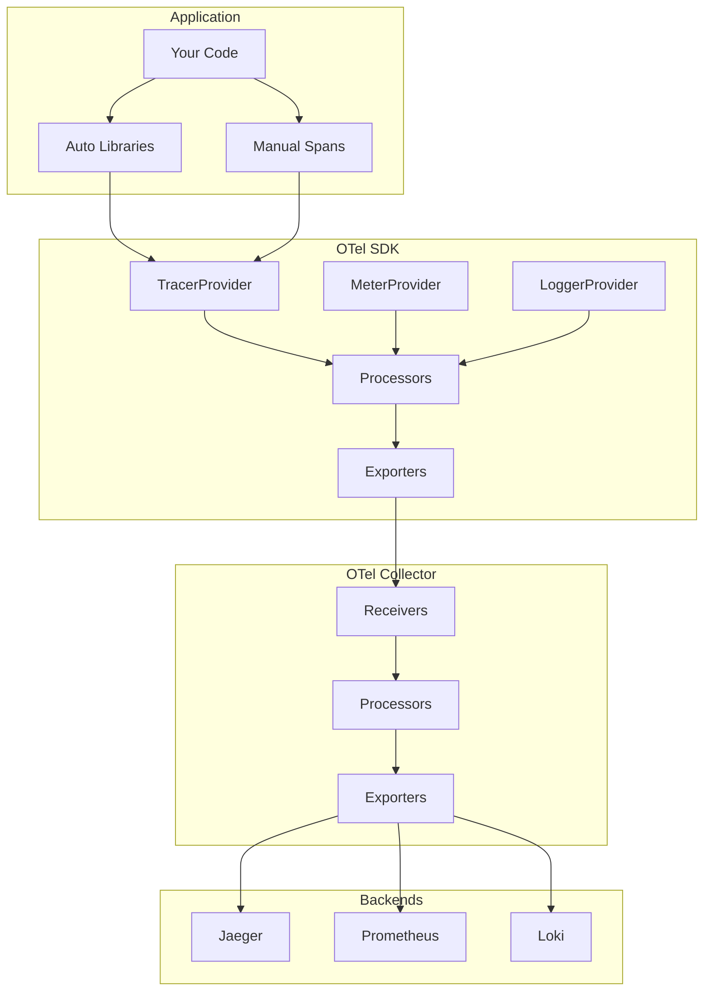
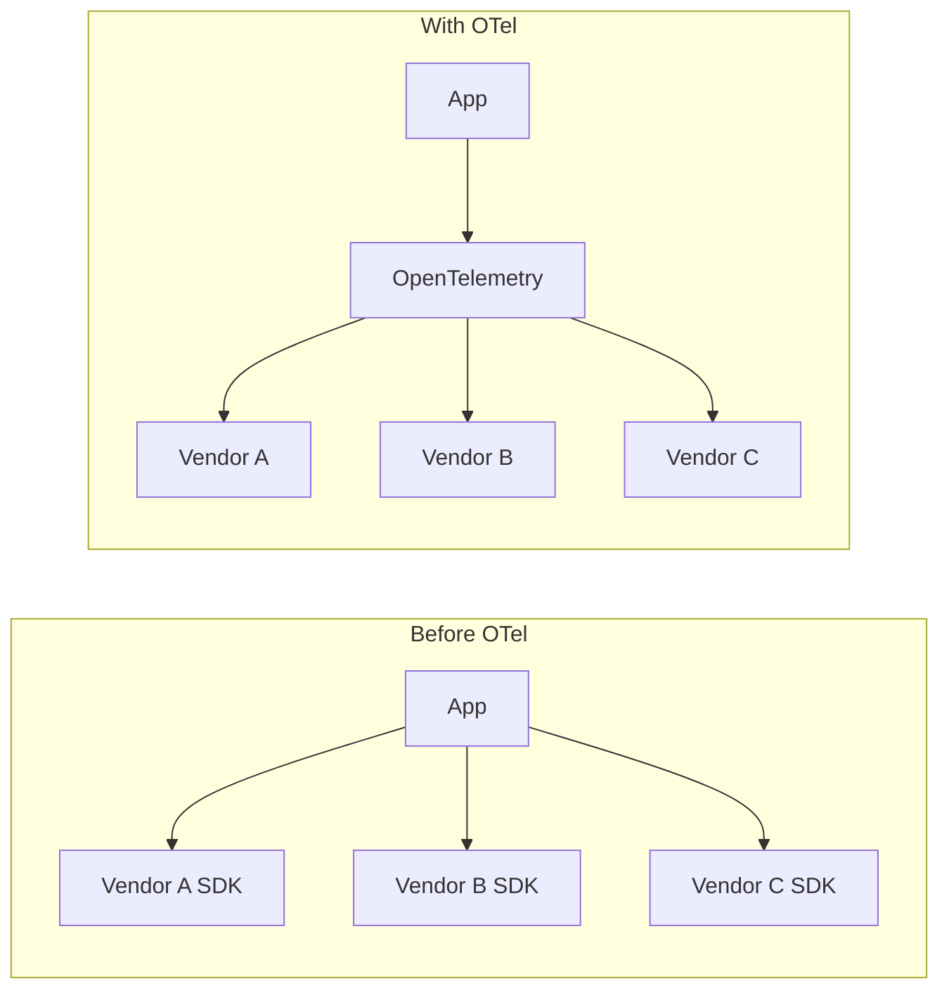
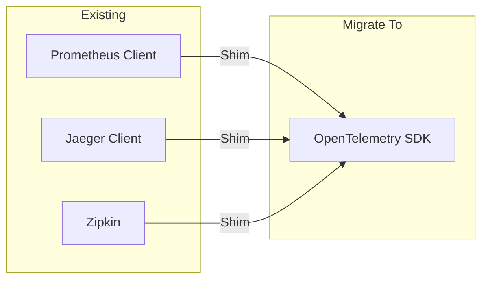
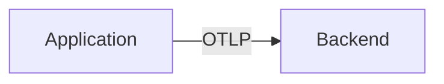
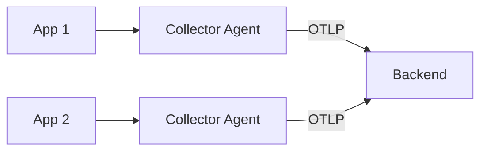
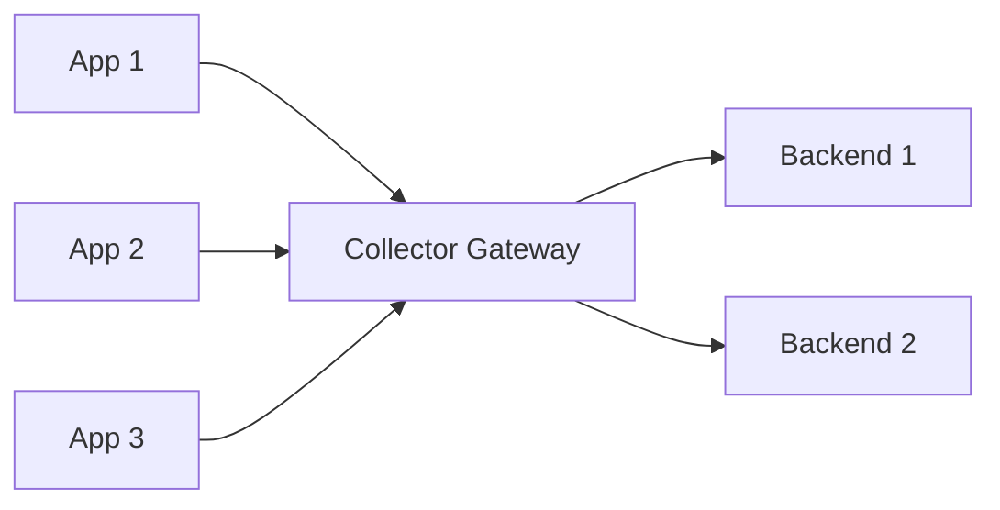
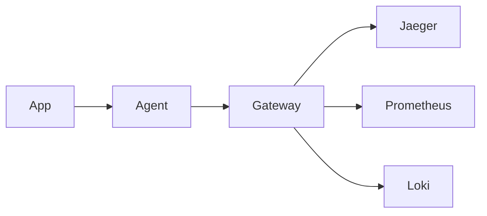

# OpenTelemetry Overview

OpenTelemetry (OTel) is a vendor-neutral, open-source observability framework for instrumenting, generating, collecting, and exporting telemetry data.

---

## What is OpenTelemetry?



OpenTelemetry provides:

| Component | Description |
|-----------|-------------|
| **APIs** | Language-specific interfaces for telemetry |
| **SDKs** | Implementations of the APIs |
| **Instrumentation** | Auto and manual instrumentation libraries |
| **Collector** | Vendor-agnostic data processing pipeline |
| **Semantic Conventions** | Standard attribute naming |

---

## History and Evolution



OpenTelemetry was formed by merging two projects:

| Project | Focus |
|---------|-------|
| **OpenTracing** | Vendor-neutral tracing API |
| **OpenCensus** | Metrics and tracing with exporters |

---

## Core Concepts

### Telemetry Signals



### Components Architecture



---

## Why OpenTelemetry?

### Problems it Solves



### Key Benefits

| Benefit | Description |
|---------|-------------|
| **Vendor Neutrality** | Avoid lock-in to specific vendors |
| **Single Standard** | One SDK for all telemetry |
| **Cross-Language** | Consistent across languages |
| **Future-Proof** | CNCF incubating project |
| **Extensible** | Plugin architecture |

---

## Supported Languages

OpenTelemetry provides SDKs for many programming languages:

| Language | Status | Auto-Instrumentation |
|----------|--------|---------------------|
| **Java** | Stable | ✓ Agent available |
| **Python** | Stable | ✓ Available |
| **Go** | Stable | Partial |
| **JavaScript** | Stable | ✓ Available |
| **.NET** | Stable | ✓ Available |
| **C++** | Stable | Limited |
| **Rust** | Beta | Limited |
| **Ruby** | Beta | ✓ Available |
| **PHP** | Beta | ✓ Available |
| **Swift** | Alpha | Limited |
| **Erlang/Elixir** | Beta | Limited |

---

## OTel vs Alternatives

### Comparison with Other Tools

| Aspect | OpenTelemetry | Prometheus | Jaeger |
|--------|---------------|------------|--------|
| **Scope** | Full observability | Metrics only | Traces only |
| **Collection** | Push & Pull | Pull | Push |
| **Vendor Lock** | None | None | None |
| **Standards** | OTLP | Prom format | OpenTracing |
| **Languages** | 11+ | 10+ | 10+ |

### Migration Path



---

## OpenTelemetry Protocol (OTLP)

The native protocol for transmitting telemetry data.

### Protocol Options

| Transport | Use Case |
|-----------|----------|
| **gRPC** | High throughput, streaming |
| **HTTP/protobuf** | Wide compatibility |
| **HTTP/JSON** | Debugging, simple setup |

### OTLP Message Structure

```protobuf
message TracesData {
  repeated ResourceSpans resource_spans = 1;
}

message ResourceSpans {
  Resource resource = 1;
  repeated ScopeSpans scope_spans = 2;
}

message ScopeSpans {
  InstrumentationScope scope = 1;
  repeated Span spans = 2;
}
```

### Export Example

```python
from opentelemetry.exporter.otlp.proto.grpc.trace_exporter import OTLPSpanExporter

exporter = OTLPSpanExporter(
    endpoint="localhost:4317",
    insecure=True
)
```

---

## Getting Started

### Installation (Python)

```bash
# Core packages
pip install opentelemetry-api opentelemetry-sdk

# OTLP exporter
pip install opentelemetry-exporter-otlp

# Auto-instrumentation
pip install opentelemetry-instrumentation
```

### Basic Setup

```python
from opentelemetry import trace
from opentelemetry.sdk.trace import TracerProvider
from opentelemetry.sdk.trace.export import BatchSpanProcessor
from opentelemetry.exporter.otlp.proto.grpc.trace_exporter import OTLPSpanExporter

# Set up the TracerProvider
provider = TracerProvider()
processor = BatchSpanProcessor(OTLPSpanExporter())
provider.add_span_processor(processor)
trace.set_tracer_provider(provider)

# Get a tracer
tracer = trace.get_tracer(__name__)

# Create a span
with tracer.start_as_current_span("my-operation") as span:
    span.set_attribute("key", "value")
    # Your code here
```

---

## Environment Variables

Common configuration via environment variables:

| Variable | Description |
|----------|-------------|
| `OTEL_SERVICE_NAME` | Service name for all telemetry |
| `OTEL_RESOURCE_ATTRIBUTES` | Additional resource attributes |
| `OTEL_EXPORTER_OTLP_ENDPOINT` | OTLP endpoint URL |
| `OTEL_TRACES_SAMPLER` | Sampling strategy |
| `OTEL_PROPAGATORS` | Context propagation format |

```bash
export OTEL_SERVICE_NAME="my-service"
export OTEL_EXPORTER_OTLP_ENDPOINT="http://localhost:4317"
export OTEL_TRACES_SAMPLER="parentbased_traceidratio"
export OTEL_TRACES_SAMPLER_ARG="0.1"
```

---

## Semantic Conventions

Standard attribute names for common concepts:

### Service Attributes

```python
from opentelemetry.sdk.resources import Resource

resource = Resource.create({
    "service.name": "order-service",
    "service.version": "1.2.3",
    "service.namespace": "shop",
    "deployment.environment": "production"
})
```

### HTTP Attributes

| Attribute | Example |
|-----------|---------|
| `http.request.method` | GET |
| `http.route` | /users/:id |
| `http.response.status_code` | 200 |
| `url.path` | /users/123 |
| `server.address` | api.example.com |

### Database Attributes

| Attribute | Example |
|-----------|---------|
| `db.system` | postgresql |
| `db.operation.name` | SELECT |
| `db.query.text` | SELECT * FROM users |
| `db.namespace` | mydb |

---

## Architecture Patterns

### Direct Export



Simple but limited flexibility.

### Collector as Agent



Per-host collectors for local processing.

### Collector as Gateway



Centralized processing and routing.

### Full Pipeline



Combines agent and gateway for maximum flexibility.

---

## Next Steps

- **[Traces](02_traces.md)** - Deep dive into distributed tracing
- **[Metrics](03_metrics.md)** - Understanding metrics collection
- **[Logs](04_logs.md)** - Structured logging with OTel
- **[Collector](05_collector.md)** - Setting up the OTel Collector
