# OpenTelemetry Overview

OpenTelemetry (OTel) is a vendor-neutral, open-source observability framework for instrumenting, generating, collecting, and exporting telemetry data.

---

## What is OpenTelemetry?

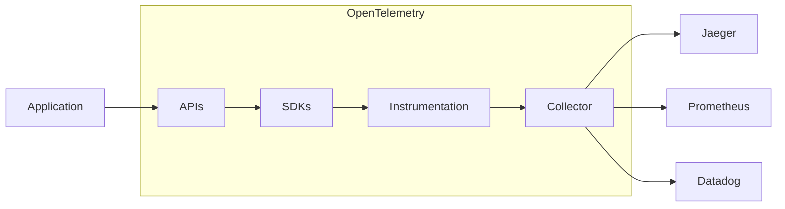
```mermaid
graph LR
    subgraph "OpenTelemetry"
        API[APIs]
        SDK[SDKs]
        I[Instrumentation]
        C[Collector]
    end
    
    App[Application] --> API
    API --> SDK
    SDK --> I
    I --> C
    C --> B1[Jaeger]
    C --> B2[Prometheus]
    C --> B3[Datadog]
```

OpenTelemetry provides:

| Component | Description |
|-----------|-------------|
| **APIs** | Language-specific interfaces for telemetry |
| **SDKs** | Implementations of the APIs |
| **Instrumentation** | Auto and manual instrumentation libraries |
| **Collector** | Vendor-agnostic data processing pipeline |
| **Semantic Conventions** | Standard attribute naming |

---

## History and Evolution

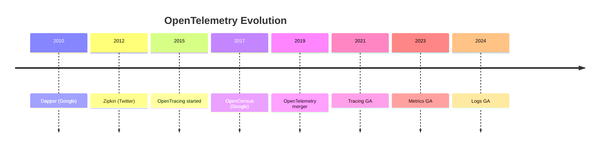
```mermaid
timeline
    title OpenTelemetry Evolution
    2010 : Dapper (Google)
    2012 : Zipkin (Twitter)
    2015 : OpenTracing started
    2017 : OpenCensus (Google)
    2019 : OpenTelemetry merger
    2021 : Tracing GA
    2023 : Metrics GA
    2024 : Logs GA
```

OpenTelemetry was formed by merging two projects:

| Project | Focus |
|---------|-------|
| **OpenTracing** | Vendor-neutral tracing API |
| **OpenCensus** | Metrics and tracing with exporters |

---

## Core Concepts

### Telemetry Signals

OpenTelemetry standardizes the collection of three primary telemetry signals:

**1. Traces (Distributed Request Tracking)**
Traces track the progression of a single request, called a trace, as it is handled by services that make up an application.

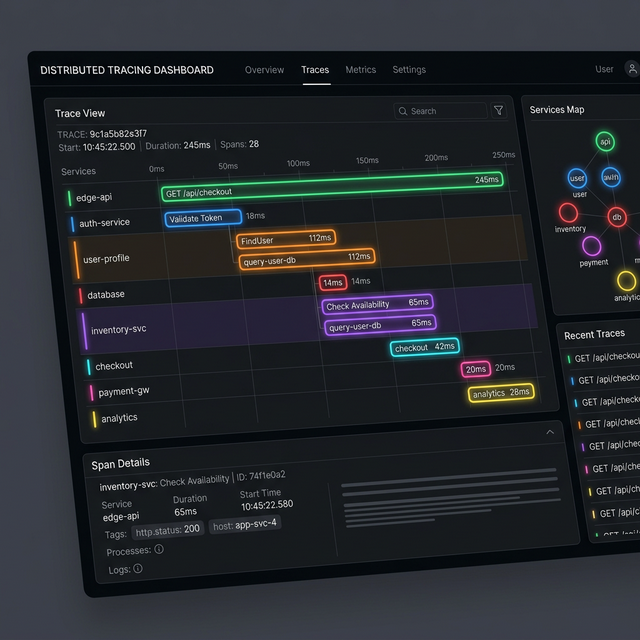

**2. Metrics (Numeric Measurements)**
Metrics are a service measuring some operations at regular intervals, providing aggregations over time.

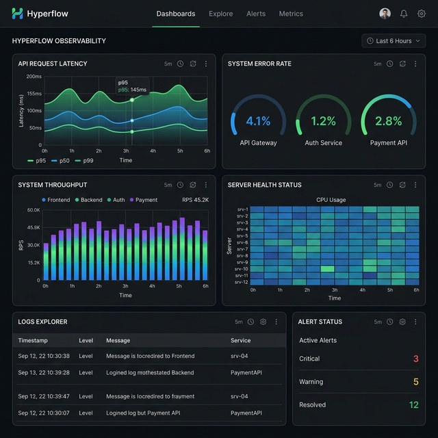

**3. Logs (Timestamped Event Records)**
Logs are timestamped text records, structured or unstructured, with metadata.

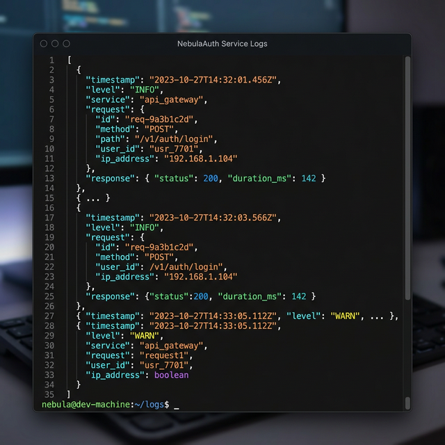

### Components Architecture

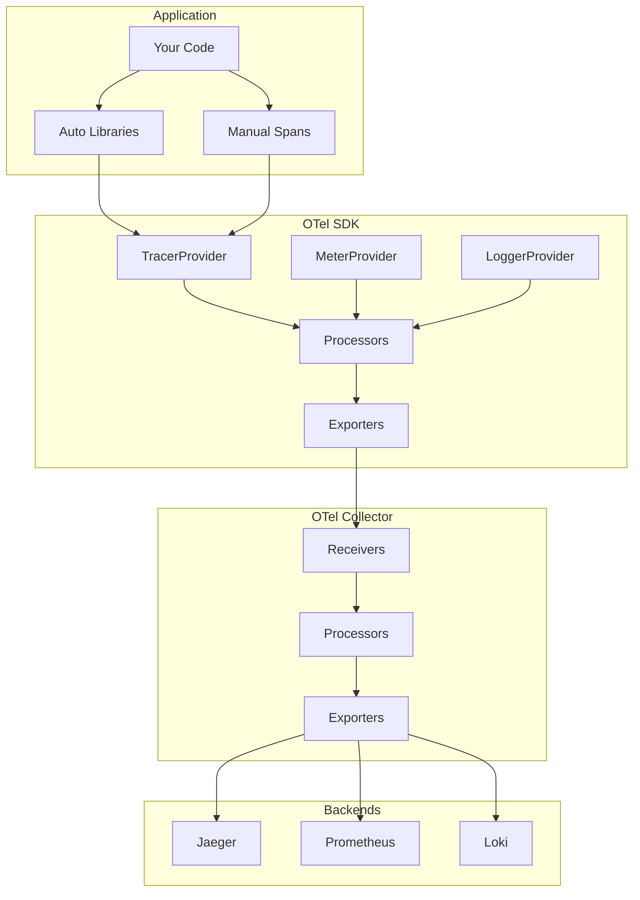
```mermaid
graph TB
    subgraph "Application"
        Code[Your Code]
        AL[Auto Libraries]
        ML[Manual Spans]
    end
    
    subgraph "OTel SDK"
        TP[TracerProvider]
        MP[MeterProvider]
        LP[LoggerProvider]
        Proc[Processors]
        Exp[Exporters]
    end
    
    subgraph "OTel Collector"
        R[Receivers]
        P[Processors]
        E[Exporters]
    end
    
    subgraph "Backends"
        J[Jaeger]
        Pr[Prometheus]
        L[Loki]
    end
    
    Code --> AL
    Code --> ML
    AL --> TP
    ML --> TP
    TP --> Proc
    MP --> Proc
    LP --> Proc
    Proc --> Exp
    Exp --> R
    R --> P
    P --> E
    E --> J
    E --> Pr
    E --> L
```

---

## Why OpenTelemetry?

### Problems it Solves

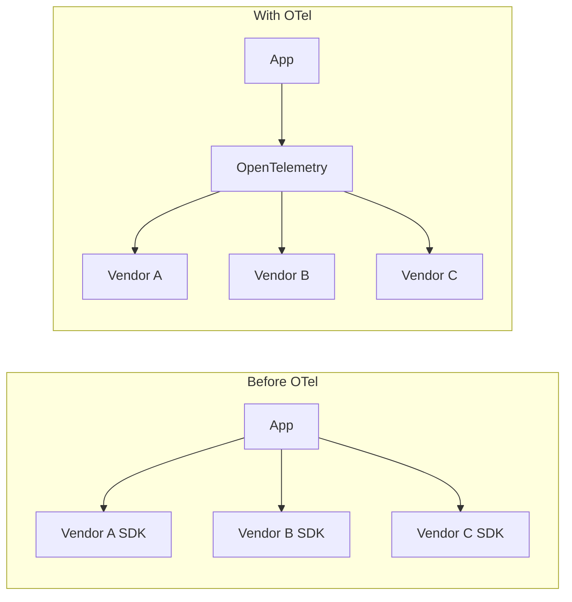
```mermaid
graph LR
    subgraph "Before OTel"
        V1[Vendor A SDK]
        V2[Vendor B SDK]
        V3[Vendor C SDK]
        App1[App] --> V1
        App1 --> V2
        App1 --> V3
    end
    
    subgraph "With OTel"
        OT[OpenTelemetry]
        App2[App] --> OT
        OT --> B1[Vendor A]
        OT --> B2[Vendor B]
        OT --> B3[Vendor C]
    end
```

### Key Benefits

| Benefit | Description |
|---------|-------------|
| **Vendor Neutrality** | Avoid lock-in to specific vendors |
| **Single Standard** | One SDK for all telemetry |
| **Cross-Language** | Consistent across languages |
| **Future-Proof** | CNCF incubating project |
| **Extensible** | Plugin architecture |

---

## Supported Languages

OpenTelemetry provides SDKs for many programming languages:

| Language | Status | Auto-Instrumentation |
|----------|--------|---------------------|
| **Java** | Stable | ✓ Agent available |
| **Python** | Stable | ✓ Available |
| **Go** | Stable | Partial |
| **JavaScript** | Stable | ✓ Available |
| **.NET** | Stable | ✓ Available |
| **C++** | Stable | Limited |
| **Rust** | Beta | Limited |
| **Ruby** | Beta | ✓ Available |
| **PHP** | Beta | ✓ Available |
| **Swift** | Alpha | Limited |
| **Erlang/Elixir** | Beta | Limited |

---

## OTel vs Alternatives

### Comparison with Other Tools

| Aspect | OpenTelemetry | Prometheus | Jaeger |
|--------|---------------|------------|--------|
| **Scope** | Full observability | Metrics only | Traces only |
| **Collection** | Push & Pull | Pull | Push |
| **Vendor Lock** | None | None | None |
| **Standards** | OTLP | Prom format | OpenTracing |
| **Languages** | 11+ | 10+ | 10+ |

### Migration Path

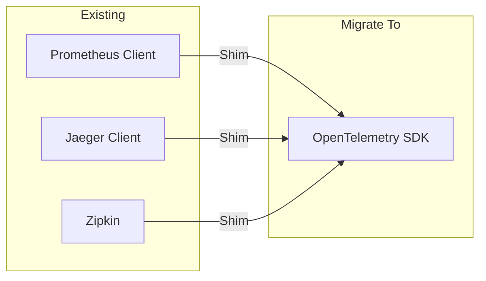
```mermaid
graph LR
    subgraph "Existing"
        Prom[Prometheus Client]
        JClient[Jaeger Client]
        Zip[Zipkin]
    end
    
    subgraph "Migrate To"
        OTel[OpenTelemetry SDK]
    end
    
    Prom --> |Shim| OTel
    JClient --> |Shim| OTel
    Zip --> |Shim| OTel
```

---

## OpenTelemetry Protocol (OTLP)

The native protocol for transmitting telemetry data.

### Protocol Options

| Transport | Use Case |
|-----------|----------|
| **gRPC** | High throughput, streaming |
| **HTTP/protobuf** | Wide compatibility |
| **HTTP/JSON** | Debugging, simple setup |

### OTLP Message Structure

```protobuf
message TracesData {
  repeated ResourceSpans resource_spans = 1;
}

message ResourceSpans {
  Resource resource = 1;
  repeated ScopeSpans scope_spans = 2;
}

message ScopeSpans {
  InstrumentationScope scope = 1;
  repeated Span spans = 2;
}
```

### Export Example

```python
from opentelemetry.exporter.otlp.proto.grpc.trace_exporter import OTLPSpanExporter

exporter = OTLPSpanExporter(
    endpoint="localhost:4317",
    insecure=True
)
```

---

## Getting Started

### Installation (Python)

```bash
# Core packages
pip install opentelemetry-api opentelemetry-sdk

# OTLP exporter
pip install opentelemetry-exporter-otlp

# Auto-instrumentation
pip install opentelemetry-instrumentation
```

### Basic Setup

```python
from opentelemetry import trace
from opentelemetry.sdk.trace import TracerProvider
from opentelemetry.sdk.trace.export import BatchSpanProcessor
from opentelemetry.exporter.otlp.proto.grpc.trace_exporter import OTLPSpanExporter

# Set up the TracerProvider
provider = TracerProvider()
processor = BatchSpanProcessor(OTLPSpanExporter())
provider.add_span_processor(processor)
trace.set_tracer_provider(provider)

# Get a tracer
tracer = trace.get_tracer(__name__)

# Create a span
with tracer.start_as_current_span("my-operation") as span:
    span.set_attribute("key", "value")
    # Your code here
```

---

## Environment Variables

Common configuration via environment variables:

| Variable | Description |
|----------|-------------|
| `OTEL_SERVICE_NAME` | Service name for all telemetry |
| `OTEL_RESOURCE_ATTRIBUTES` | Additional resource attributes |
| `OTEL_EXPORTER_OTLP_ENDPOINT` | OTLP endpoint URL |
| `OTEL_TRACES_SAMPLER` | Sampling strategy |
| `OTEL_PROPAGATORS` | Context propagation format |

```bash
export OTEL_SERVICE_NAME="my-service"
export OTEL_EXPORTER_OTLP_ENDPOINT="http://localhost:4317"
export OTEL_TRACES_SAMPLER="parentbased_traceidratio"
export OTEL_TRACES_SAMPLER_ARG="0.1"
```

---

## Semantic Conventions

Standard attribute names for common concepts:

### Service Attributes

```python
from opentelemetry.sdk.resources import Resource

resource = Resource.create({
    "service.name": "order-service",
    "service.version": "1.2.3",
    "service.namespace": "shop",
    "deployment.environment": "production"
})
```

### HTTP Attributes

| Attribute | Example |
|-----------|---------|
| `http.request.method` | GET |
| `http.route` | /users/:id |
| `http.response.status_code` | 200 |
| `url.path` | /users/123 |
| `server.address` | api.example.com |

### Database Attributes

| Attribute | Example |
|-----------|---------|
| `db.system` | postgresql |
| `db.operation.name` | SELECT |
| `db.query.text` | SELECT * FROM users |
| `db.namespace` | mydb |

---

## Architecture Patterns

### Direct Export

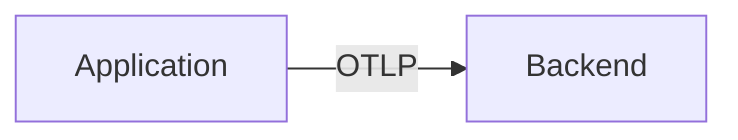
```mermaid
graph LR
    App[Application] --> |OTLP| Backend[Backend]
```

Simple but limited flexibility.

### Collector as Agent

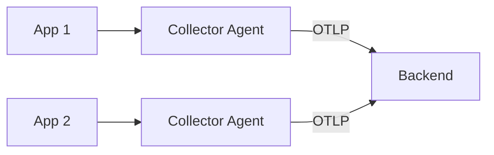
```mermaid
graph LR
    App1[App 1] --> Agent1[Collector Agent]
    App2[App 2] --> Agent2[Collector Agent]
    Agent1 --> |OTLP| Backend
    Agent2 --> |OTLP| Backend
```

Per-host collectors for local processing.

### Collector as Gateway

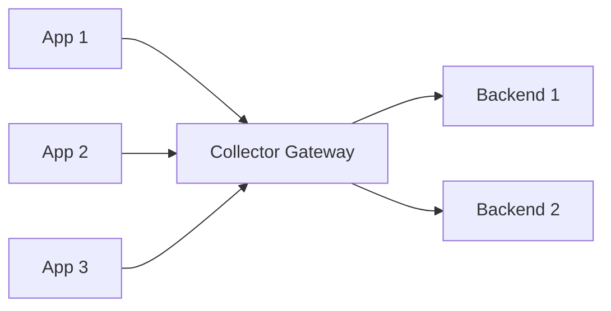
```mermaid
graph LR
    App1[App 1] --> Gateway[Collector Gateway]
    App2[App 2] --> Gateway
    App3[App 3] --> Gateway
    Gateway --> B1[Backend 1]
    Gateway --> B2[Backend 2]
```

Centralized processing and routing.

### Full Pipeline

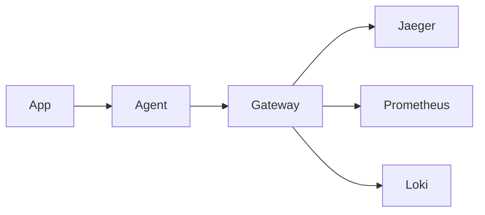
```mermaid
graph LR
    App1[App] --> Agent[Agent]
    Agent --> Gateway[Gateway]
    Gateway --> J[Jaeger]
    Gateway --> P[Prometheus]
    Gateway --> L[Loki]
```

Combines agent and gateway for maximum flexibility.

---

## OpenTelemetry in the Age of AI Agents

As system architectures evolve from standard microservices to **Agentic Architectures** (systems where autonomous AI agents interact with standard microservices, databases, and queues), the complexity of tracking requests grows exponentially. OpenTelemetry is no longer just "nice to have"—it becomes the critical backbone for understanding non-deterministic systems.

### The Challenge of Agentic Architectures

In a traditional microservice architecture, a user clicking "Checkout" triggers a predictable, deterministic chain of events (Frontend $\rightarrow$ Auth $\rightarrow$ Inventory $\rightarrow$ Payment).

In an Agentic architecture, a user asking a chatbot "Plan my trip and book the cheapest flights" triggers a highly non-deterministic chain. The "Travel Agent" might:

1. Call an LLM to parse the intent.
2. Search a vector database for past preferences.
3. Queue 5 parallel tasks to standard Flight API microservices to check prices.
4. Call another "Booking Agent" to finalize the transaction.
5. Fail, auto-retry, and choose a different path entirely.

Without observability, debugging why an agent made a specific decision or why a task took 45 seconds is nearly impossible.

### How OpenTelemetry Helps

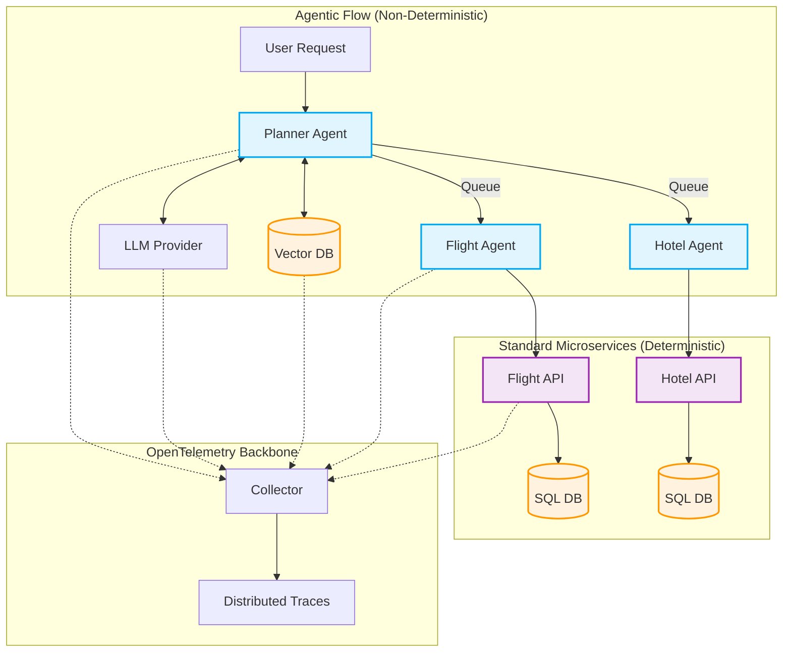
```mermaid
graph TB
    subgraph "Agentic Flow (Non-Deterministic)"
        User[User Request] --> Planner[Planner Agent]
        Planner <--> LLM[LLM Provider]
        Planner <--> VDB[(Vector DB)]
        
        Planner -->|Queue| Task1[Flight Agent]
        Planner -->|Queue| Task2[Hotel Agent]
    end
    
    subgraph "Standard Microservices (Deterministic)"
        Task1 --> API1[Flight API]
        Task2 --> API2[Hotel API]
        API1 --> SQL1[(SQL DB)]
        API2 --> SQL2[(SQL DB)]
    end
    
    subgraph "OpenTelemetry Backbone"
        Planner -.-> OTel[Collector]
        LLM -.-> OTel
        VDB -.-> OTel
        Task1 -.-> OTel
        API1 -.-> OTel
        
        OTel --> Traces[Distributed Traces]
    end
    
    classDef ai fill:#e1f5fe,stroke:#03a9f4,stroke-width:2px;
    classDef ms fill:#f3e5f5,stroke:#9c27b0,stroke-width:2px;
    classDef db fill:#fff3e0,stroke:#ff9800,stroke-width:2px;
    
    class Planner,Task1,Task2 ai;
    class API1,API2 ms;
    class VDB,SQL1,SQL2 db;
```

OpenTelemetry solves the "black box" problem of AI agents through its three core signals:

#### 1. Tracing the "Thought Process" (Spans)

By wrapping agent steps in **Spans**, you can view the agent's thought process as a flame graph.

* **Parent Span**: "Plan Trip" (Duration: 12s)
* **Child Spans**: "LLM generation" (4s), "Vector Search" (0.5s), "Tool Execution: Flight Search" (7s).
Tracing context (`trace_id`) is seamlessly propagated from the Python/LangChain Agent down through the message queue (Kafka/RabbitMQ) and into the standard Java/Go microservices.

#### 2. Metrics for Token Usage and Costs

Standard metrics track CPU and Memory. In an agentic world, OpenTelemetry `Counters` and `Histograms` are essential for tracking:

* OpenTelemetry `Counter`: Total tokens consumed by the Planner Agent.
* OpenTelemetry `Histogram`: LLM Time To First Token (TTFT).
* OpenTelemetry `Up/Down Counter`: Number of active background agent tasks currently queued.

#### 3. Structured Logging for Prompts and Outputs

Standard logs say "User authenticated." Agent logs need to capture massive payloads safely.
Using OpenTelemetry standard attributes, you log:

* `gen_ai.prompt`: "Find a flight to Tokyo..."
* `gen_ai.completion`: "I have found 3 flights..."
* `gen_ai.system.model`: "gpt-4-turbo"

### Benefits of the OTel + Agent Combo

| Benefit | Description |
|---------|-------------|
| **Deterministic Debugging** | If an agent hallucinates, the trace proves exactly what prompt was generated and which standard API the agent subsequently called. |
| **Standardization** | OTel's Semantic Conventions (e.g., `gen_ai.prompt.tokens`) means you don't invent your own logging format for LLMs. |
| **Cross-Boundary Visibility** | The trace flows smoothly from the AI framework (LlamaIndex/LangChain) into your legacy Spring Boot microservice, giving a full timeline. |

### Is OpenTelemetry Enough? (The LLM Observability Gap)

OpenTelemetry is **necessary, but not sufficient** for LLM and Agentic workflows.

Because LLMs are non-deterministic (the same input can produce different outputs), traditional observability falls short. OTel tells you exactly *what* happened, but it cannot tell you if what happened was *good*.

| Domain | What it Answers | Tools Used |
|--------|-----------------|------------|
| **Operational Observability** | How long did the prompt take? What was the prompt? Did the API crash? How many tokens were used? | **OpenTelemetry** |
| **Quality Observability** | Did it hallucinate? Was it toxic? Did the RAG retrieve the right context? Was the structured output valid JSON? | **Evaluation Frameworks** (LangSmith, Phoenix, TruLens) |

#### The Missing Pieces

To achieve true LLM Observability, the raw operational data collected by OpenTelemetry must be pipelined into **Evaluation Frameworks** (like LangSmith, Phoenix, or TruLens).

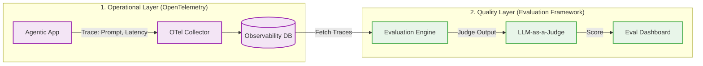
```mermaid
graph LR
    subgraph "1. Operational Layer (OpenTelemetry)"
        App[Agentic App] --> |Trace: Prompt, Latency| OTel[OTel Collector]
        OTel --> DB[(Observability DB)]
    end
    
    subgraph "2. Quality Layer (Evaluation Framework)"
        DB --> |Fetch Traces| EvalEngine[Evaluation Engine]
        EvalEngine --> |Judge Output| Judge[LLM-as-a-Judge]
        Judge --> |Score| Dashboard[Eval Dashboard]
    end
    
    classDef otel fill:#f3e5f5,stroke:#9c27b0,stroke-width:2px;
    classDef eval fill:#e8f5e9,stroke:#4caf50,stroke-width:2px;
    
    class App,OTel,DB otel;
    class EvalEngine,Judge,Dashboard eval;
```

These frameworks use the OTel data to perform:

1. **LLM-as-a-Judge**: Running the OTel-captured output through another LLM to score it for relevance, faithfulness, or toxicity.
2. **Guardrails**: Intercepting the OTel-captured output and validating it against predefined rules (e.g., "No PII allowed") before showing it to the user.
3. **Drift Detection**: Analyzing the OTel-captured embeddings over time to see if user topics or model responses are shifting.

**Example: An Evaluation Dashboard**
Once OpenTelemetry data is scored, it is visualized in specialized dashboards that focus on quality metrics (like Hallucination Rate and Faithfulness) alongside traditional OTel metrics (like Latency and Tokens).

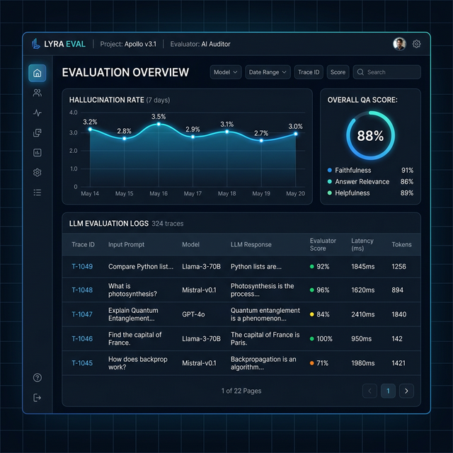

**The Golden Rule for GenAI**: Use OpenTelemetry to gather the raw data (the strings, the latencies, the errors), and use specialized Evaluation tools to assign a quality score to that data.

1. **LLM-as-a-Judge**: Running the OTel-captured output through another LLM to score it for relevance or toxicity.
2. **Guardrails**: Intercepting the OTel-captured output and validating it against predefined rules before showing it to the user.
3. **Drift Detection**: Analyzing the OTel-captured embeddings over time to see if user topics are shifting.

---

## Next Steps

* **[Traces](02_traces.md)** - Deep dive into distributed tracing
* **[Metrics](03_metrics.md)** - Understanding metrics collection
* **[Logs](04_logs.md)** - Structured logging with OTel
* **[Collector](05_collector.md)** - Setting up the OTel Collector
