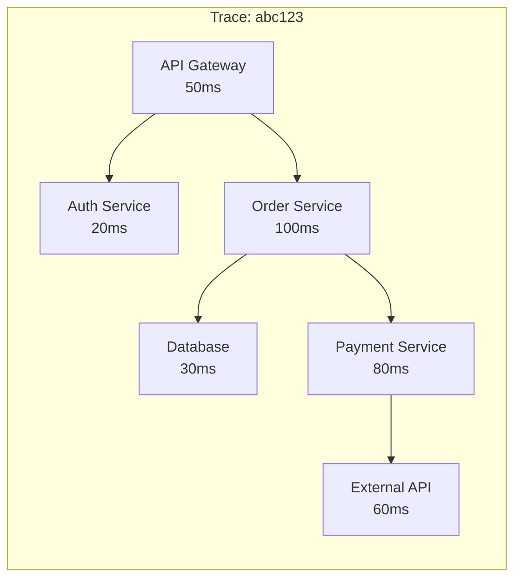
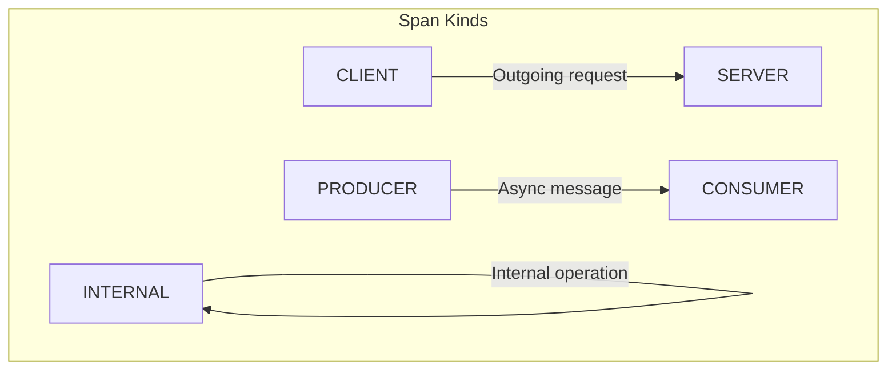
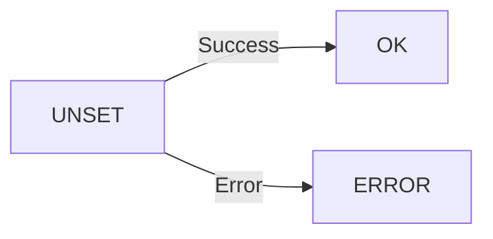
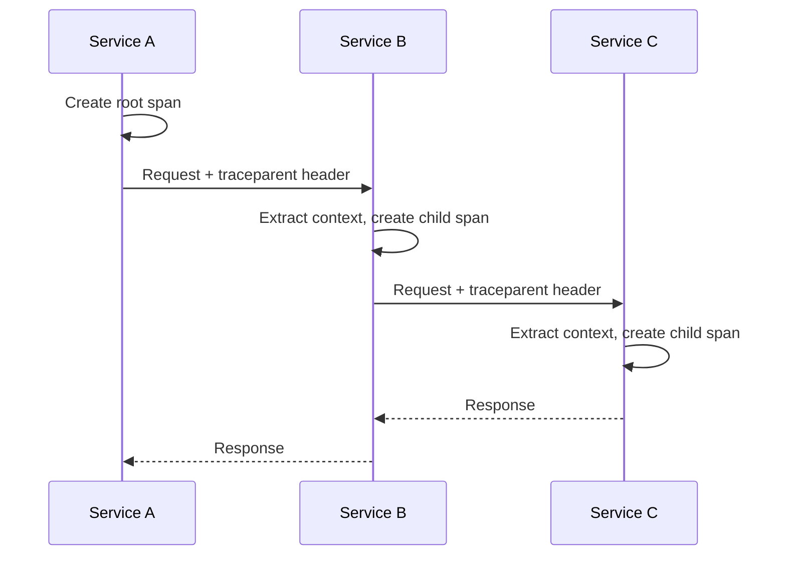
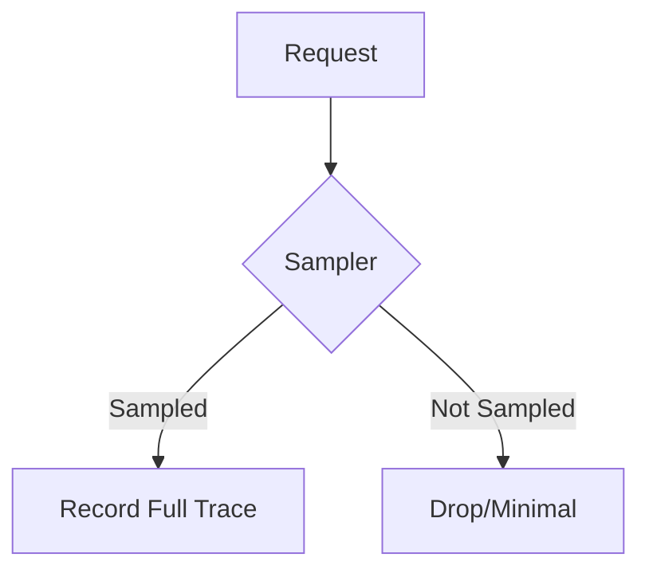
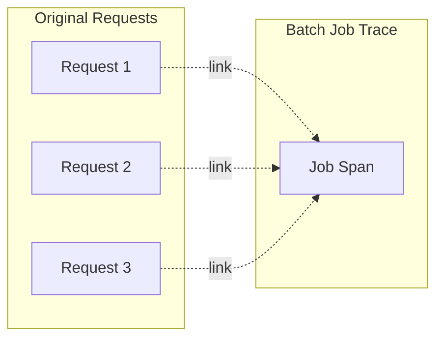
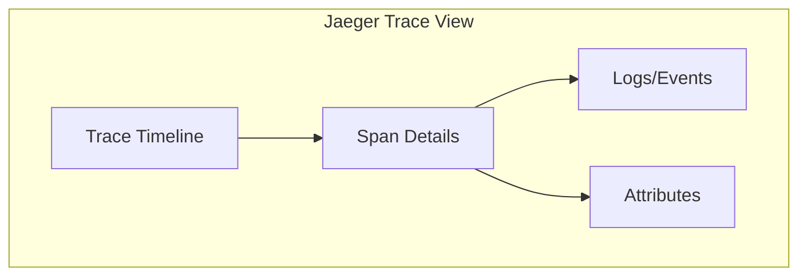

# Distributed Tracing with OpenTelemetry

Traces provide end-to-end visibility into request flows across distributed systems.

---

## What is a Trace?

A trace represents the journey of a single request as it propagates through a distributed system.



---

## Trace Anatomy

### Spans

A span represents a single unit of work within a trace.

```mermaid
gantt
    title Trace Timeline (Trace ID: abc123)
    dateFormat X
    axisFormat %L ms
    
    section API Gateway
    root-span       :0, 200
    
    section Auth Service
    auth-check      :10, 30
    
    section Order Service
    process-order   :40, 150
    
    section Database
    db-query        :50, 80
    
    section Payment
    charge-card     :90, 170
    
    section External
    api-call        :100, 160
```



### Span Structure

```python
{
    "trace_id": "abc123def456...",
    "span_id": "span789...",
    "parent_span_id": "parent123...",
    "name": "process-order",
    "kind": "INTERNAL",
    "start_time": "2024-01-15T10:30:00.000Z",
    "end_time": "2024-01-15T10:30:00.110Z",
    "status": {"code": "OK"},
    "attributes": {
        "order.id": "12345",
        "customer.tier": "premium"
    },
    "events": [
        {"name": "order.validated", "timestamp": "..."}
    ],
    "links": []
}
```

### Key Components

| Component | Description |
|-----------|-------------|
| **Trace ID** | Unique identifier for the entire trace |
| **Span ID** | Unique identifier for this span |
| **Parent Span ID** | ID of the parent span (null for root) |
| **Name** | Operation name |
| **Kind** | Span type (server, client, internal, etc.) |
| **Start/End Time** | Duration boundaries |
| **Status** | OK, ERROR, or UNSET |
| **Attributes** | Key-value metadata |
| **Events** | Timestamped annotations |
| **Links** | References to other traces |

---

## Span Kinds



| Kind | Description | Example |
|------|-------------|---------|
| **CLIENT** | Outgoing synchronous request | HTTP client call |
| **SERVER** | Incoming request handler | HTTP server endpoint |
| **INTERNAL** | Internal operation | Business logic |
| **PRODUCER** | Async message sender | Publish to queue |
| **CONSUMER** | Async message receiver | Subscribe handler |

---

## Creating Traces in Python

### Basic Span Creation

```python
from opentelemetry import trace
from opentelemetry.sdk.trace import TracerProvider
from opentelemetry.sdk.trace.export import (
    ConsoleSpanExporter,
    BatchSpanProcessor
)

# Set up provider
provider = TracerProvider()
processor = BatchSpanProcessor(ConsoleSpanExporter())
provider.add_span_processor(processor)
trace.set_tracer_provider(provider)

# Get tracer
tracer = trace.get_tracer("my-service", "1.0.0")

# Create a span
with tracer.start_as_current_span("my-operation") as span:
    print("Doing work...")
```

### Nested Spans

```python
def process_order(order_id: str):
    with tracer.start_as_current_span("process-order") as parent:
        parent.set_attribute("order.id", order_id)
        
        # Child span automatically parented
        with tracer.start_as_current_span("validate-order"):
            validate(order_id)
        
        with tracer.start_as_current_span("charge-payment"):
            charge(order_id)
        
        with tracer.start_as_current_span("send-confirmation"):
            notify(order_id)
```

### Manual Parent-Child

```python
from opentelemetry.trace import SpanContext, TraceFlags
from opentelemetry import context

# Create parent span
with tracer.start_as_current_span("parent") as parent:
    parent_ctx = parent.get_span_context()
    
    # Create child with explicit parent
    ctx = trace.set_span_in_context(parent)
    with tracer.start_as_current_span("child", context=ctx):
        pass
```

---

## Span Attributes

### Adding Attributes

```python
with tracer.start_as_current_span("http-request") as span:
    # Single attribute
    span.set_attribute("http.method", "GET")
    
    # Multiple attributes
    span.set_attributes({
        "http.url": "https://api.example.com/users",
        "http.status_code": 200,
        "user.id": 12345,
        "user.premium": True
    })
```

### Attribute Types

| Type | Python Type | Example |
|------|-------------|---------|
| String | str | `"GET"` |
| Integer | int | `200` |
| Float | float | `3.14` |
| Boolean | bool | `True` |
| String Array | List[str] | `["tag1", "tag2"]` |
| Int Array | List[int] | `[1, 2, 3]` |

### Semantic Conventions

```python
from opentelemetry.semconv.trace import SpanAttributes

with tracer.start_as_current_span("db-query") as span:
    span.set_attribute(SpanAttributes.DB_SYSTEM, "postgresql")
    span.set_attribute(SpanAttributes.DB_OPERATION, "SELECT")
    span.set_attribute(SpanAttributes.DB_STATEMENT, 
                      "SELECT * FROM users WHERE id = ?")
```

---

## Span Events

Events represent discrete occurrences during a span's lifetime.

```python
from opentelemetry.trace import Status, StatusCode

with tracer.start_as_current_span("process-file") as span:
    # Add event
    span.add_event("file.opened", {
        "file.name": "data.csv",
        "file.size": 1024
    })
    
    # Process file...
    for i, record in enumerate(records):
        if i % 1000 == 0:
            span.add_event("progress", {"records_processed": i})
    
    # Final event
    span.add_event("file.processed", {
        "total_records": len(records)
    })
```

### Exception Recording

```python
import traceback

with tracer.start_as_current_span("risky-operation") as span:
    try:
        do_something_risky()
    except Exception as e:
        # Record exception as event
        span.record_exception(e)
        
        # Set error status
        span.set_status(Status(StatusCode.ERROR, str(e)))
        
        raise
```

---

## Span Status



| Status | When to Use |
|--------|-------------|
| `UNSET` | Default, no explicit status |
| `OK` | Explicitly successful |
| `ERROR` | Operation failed |

```python
from opentelemetry.trace import Status, StatusCode

with tracer.start_as_current_span("operation") as span:
    try:
        result = do_work()
        span.set_status(Status(StatusCode.OK))
    except Exception as e:
        span.set_status(Status(StatusCode.ERROR, str(e)))
        raise
```

---

## Context Propagation

### How It Works



### W3C Trace Context

The standard propagation format:

```http
traceparent: 00-0af7651916cd43dd8448eb211c80319c-b7ad6b7169203331-01
tracestate: congo=t61rcWkgMzE
```

Format: `version-trace_id-span_id-trace_flags`

### Propagation Configuration

```python
from opentelemetry import trace
from opentelemetry.propagate import set_global_textmap
from opentelemetry.propagators.composite import CompositeHTTPPropagator
from opentelemetry.trace.propagation.tracecontext import (
    TraceContextTextMapPropagator
)
from opentelemetry.propagators.b3 import B3MultiFormat

# Configure propagators
set_global_textmap(CompositeHTTPPropagator([
    TraceContextTextMapPropagator(),  # W3C Trace Context
    B3MultiFormat()  # B3 for Zipkin compatibility
]))
```

### Injecting Context

```python
from opentelemetry.propagate import inject
import requests

def call_downstream_service():
    with tracer.start_as_current_span("call-service-b") as span:
        headers = {}
        inject(headers)  # Adds traceparent header
        
        response = requests.get(
            "http://service-b/api/data",
            headers=headers
        )
        return response.json()
```

### Extracting Context

```python
from opentelemetry.propagate import extract
from flask import Flask, request

app = Flask(__name__)

@app.route("/api/data")
def handle_request():
    # Extract context from incoming request
    ctx = extract(request.headers)
    
    # Create span with extracted context
    with tracer.start_as_current_span(
        "handle-request",
        context=ctx
    ) as span:
        return process_request()
```

---

## Sampling

Sampling controls which traces are recorded.



### Sampler Types

| Sampler | Description |
|---------|-------------|
| `AlwaysOn` | Record all traces |
| `AlwaysOff` | Record no traces |
| `TraceIdRatio` | Sample X% of traces |
| `ParentBased` | Respect parent decision |

### Configuration

```python
from opentelemetry.sdk.trace import TracerProvider
from opentelemetry.sdk.trace.sampling import (
    TraceIdRatioBased,
    ParentBasedTraceIdRatio
)

# Sample 10% of traces
sampler = TraceIdRatioBased(0.1)

# Respect parent, sample 10% of root spans
sampler = ParentBasedTraceIdRatio(0.1)

provider = TracerProvider(sampler=sampler)
```

### Custom Sampler

```python
from opentelemetry.sdk.trace.sampling import (
    Sampler, Decision, SamplingResult
)

class PrioritySampler(Sampler):
    def should_sample(self, parent_context, trace_id, name, 
                      kind=None, attributes=None, links=None):
        # Always sample high-priority requests
        if attributes and attributes.get("priority") == "high":
            return SamplingResult(Decision.RECORD_AND_SAMPLE)
        
        # Sample 10% of others
        if trace_id % 10 == 0:
            return SamplingResult(Decision.RECORD_AND_SAMPLE)
        
        return SamplingResult(Decision.DROP)
    
    def get_description(self):
        return "PrioritySampler"
```

---

## Span Links

Links connect related traces.



```python
from opentelemetry import trace
from opentelemetry.trace import Link

# Collect span contexts from queued items
links = []
for item in queue.get_batch():
    ctx = extract(item.headers)
    span = trace.get_current_span(ctx)
    if span:
        links.append(Link(span.get_span_context()))

# Create batch processing span with links
with tracer.start_as_current_span(
    "process-batch",
    links=links
) as span:
    process_items(queue.get_batch())
```

---

## Auto-Instrumentation

### Python Setup

```bash
# Install auto-instrumentation
pip install opentelemetry-instrumentation

# Discover available instrumentations
opentelemetry-instrument --help

# Run with auto-instrumentation
opentelemetry-instrument \
    --traces_exporter console \
    --service_name my-app \
    python app.py
```

### Common Instrumentations

| Library | Package |
|---------|---------|
| Flask | `opentelemetry-instrumentation-flask` |
| FastAPI | `opentelemetry-instrumentation-fastapi` |
| Requests | `opentelemetry-instrumentation-requests` |
| SQLAlchemy | `opentelemetry-instrumentation-sqlalchemy` |
| Redis | `opentelemetry-instrumentation-redis` |
| Celery | `opentelemetry-instrumentation-celery` |

### Programmatic Instrumentation

```python
from opentelemetry.instrumentation.flask import FlaskInstrumentor
from opentelemetry.instrumentation.requests import RequestsInstrumentor

# Instrument Flask
FlaskInstrumentor().instrument()

# Instrument requests library
RequestsInstrumentor().instrument()

# Now all Flask endpoints and HTTP calls are traced
```

---

## Best Practices

### Span Naming

```python
# ✓ Good - specific, parameterized
"GET /users/:id"
"process_order"
"db.postgresql.query"

# ✗ Bad - too specific (high cardinality)
"GET /users/12345"
f"process_order_{order_id}"
```

### Attribute Guidelines

```python
# ✓ Good - low cardinality
span.set_attribute("http.method", "GET")
span.set_attribute("user.tier", "premium")  # limited values

# ✗ Bad - high cardinality
span.set_attribute("user.id", user_id)  # millions of values
span.set_attribute("request.body", body)  # high cardinality, large
```

### Error Handling

```python
with tracer.start_as_current_span("operation") as span:
    try:
        result = risky_operation()
    except ValidationError as e:
        # Client error - may not be ERROR status
        span.record_exception(e)
        span.set_attribute("error.type", "validation")
        raise
    except Exception as e:
        # Server error - set ERROR status
        span.record_exception(e)
        span.set_status(Status(StatusCode.ERROR))
        raise
```

---

## Debugging Traces

### Console Exporter

```python
from opentelemetry.sdk.trace.export import ConsoleSpanExporter

processor = BatchSpanProcessor(ConsoleSpanExporter())
```

### Useful Environment Variables

```bash
# Enable debug logging
export OTEL_LOG_LEVEL=debug

# Print all spans to console
export OTEL_TRACES_EXPORTER=console

# Export to Jaeger
export OTEL_EXPORTER_JAEGER_ENDPOINT=http://localhost:14250
```

---

## Trace Visualization

### Jaeger UI



### Key Analysis Views

| View | Use Case |
|------|----------|
| **Service Map** | Visualize dependencies |
| **Trace Timeline** | Identify latency |
| **Span Details** | Debug specific operations |
| **Compare Traces** | Before/after analysis |

---

## Next Steps

- **[Metrics](03_metrics.md)** - Numeric measurements over time
- **[Logs](04_logs.md)** - Correlating logs with traces
- **[Instrumentation](06_instrumentation.md)** - Auto and manual instrumentation
