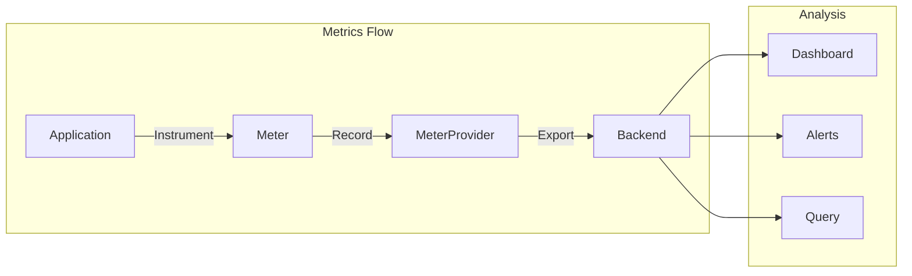
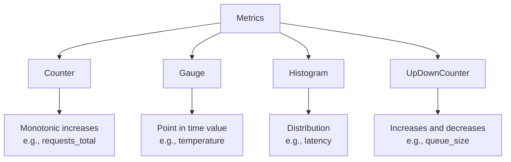
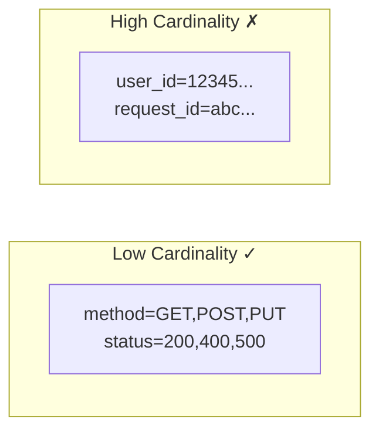
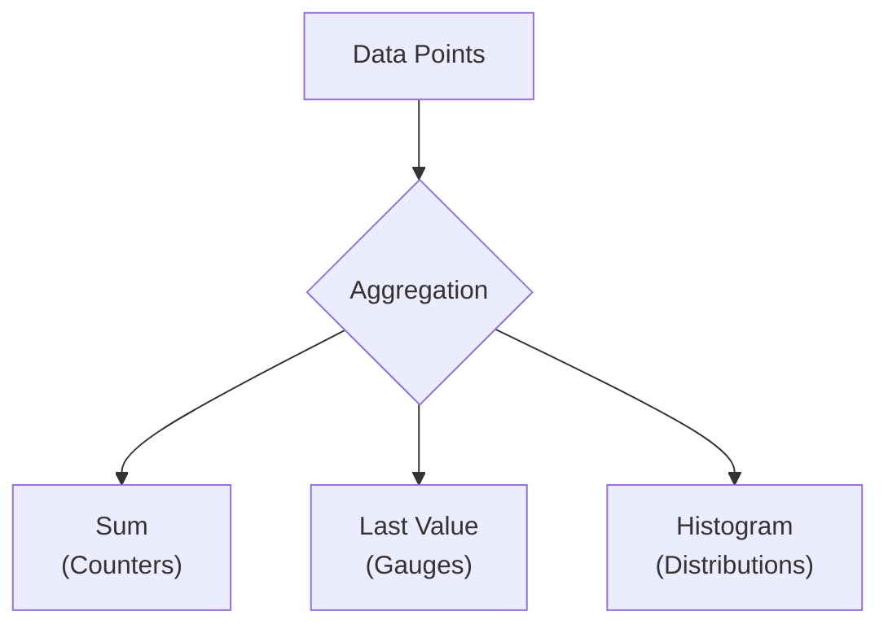
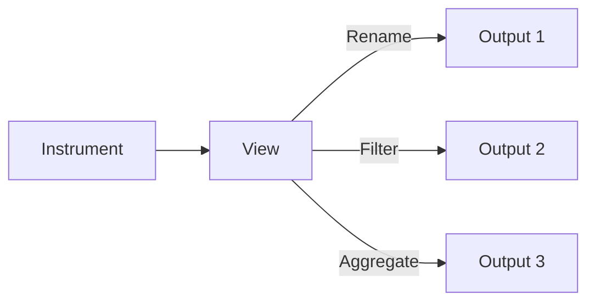
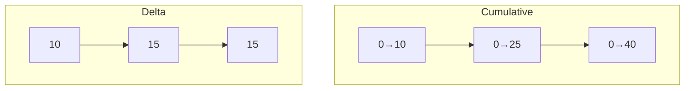

# Metrics with OpenTelemetry

Metrics provide quantitative measurements of system behavior over time.

---

## What are Metrics?

Metrics are numeric measurements collected at regular intervals.



---

## Metric Types

### Overview



### Counter

Monotonically increasing value.

```python
from opentelemetry import metrics

meter = metrics.get_meter("my-service", "1.0.0")

# Create counter
request_counter = meter.create_counter(
    "http.server.request.count",
    description="Total HTTP requests",
    unit="1"
)

# Increment
request_counter.add(1, {"http.method": "GET", "http.route": "/api/users"})
```

| Use Case | Example |
|----------|---------|
| Total requests | `http_requests_total` |
| Bytes sent | `network_bytes_sent` |
| Errors | `app_errors_total` |
| Tasks completed | `jobs_completed` |

### UpDownCounter

Value that can increase or decrease.

```python
# Create counter
active_connections = meter.create_up_down_counter(
    "http.server.active_connections",
    description="Current active connections",
    unit="1"
)

# On connection open
active_connections.add(1)

# On connection close
active_connections.add(-1)
```

| Use Case | Example |
|----------|---------|
| Active connections | `db_connections_active` |
| Queue size | `message_queue_size` |
| Cache entries | `cache_entries` |

### Gauge

Point-in-time measurement using callback.

```python
import psutil

def get_cpu_usage(options):
    yield metrics.Observation(
        psutil.cpu_percent(),
        {"host": "server1"}
    )

# Create observable gauge
meter.create_observable_gauge(
    "system.cpu.utilization",
    callbacks=[get_cpu_usage],
    description="CPU usage percentage",
    unit="%"
)
```

| Use Case | Example |
|----------|---------|
| CPU usage | `system_cpu_percent` |
| Memory usage | `system_memory_used` |
| Temperature | `hardware_temperature` |
| Thread count | `process_threads` |

### Histogram

Distribution of values (for latency, size, etc.).

```python
# Create histogram
request_duration = meter.create_histogram(
    "http.server.request.duration",
    description="HTTP request duration",
    unit="ms"
)

# Record value
import time
start = time.time()
handle_request()
duration = (time.time() - start) * 1000
request_duration.record(duration, {"http.method": "GET"})
```

| Use Case | Example |
|----------|---------|
| Request latency | `http_request_duration_ms` |
| Response size | `http_response_size_bytes` |
| Batch size | `batch_size_items` |

---

## Metric Attributes

Labels that add dimensions to metrics.

```python
# Counter with attributes
request_counter.add(1, {
    "http.method": "GET",
    "http.route": "/api/users",
    "http.status_code": 200,
    "service.version": "1.2.0"
})
```

### Cardinality Warning



| Cardinality | Unique Combinations | Impact |
|-------------|---------------------|--------|
| **Low** | < 100 | ✓ Efficient |
| **Medium** | 100-1000 | ⚠️ Watch carefully |
| **High** | > 1000 | ✗ Memory issues |

---

## Setting Up Metrics

### Complete Setup

```python
from opentelemetry import metrics
from opentelemetry.sdk.metrics import MeterProvider
from opentelemetry.sdk.metrics.export import (
    PeriodicExportingMetricReader,
    ConsoleMetricExporter
)

# Set up exporter
exporter = ConsoleMetricExporter()
reader = PeriodicExportingMetricReader(
    exporter,
    export_interval_millis=5000
)

# Create provider
provider = MeterProvider(metric_readers=[reader])
metrics.set_meter_provider(provider)

# Get meter
meter = metrics.get_meter("my-service", "1.0.0")
```

### OTLP Export

```python
from opentelemetry.exporter.otlp.proto.grpc.metric_exporter import (
    OTLPMetricExporter
)

exporter = OTLPMetricExporter(
    endpoint="localhost:4317",
    insecure=True
)

reader = PeriodicExportingMetricReader(
    exporter,
    export_interval_millis=10000
)

provider = MeterProvider(metric_readers=[reader])
```

---

## Observable Instruments

Collected via callbacks when metrics are exported.

### Observable Counter

```python
import random

def get_total_bytes_sent(options):
    # Query your data source
    bytes_sent = get_network_stats()
    yield metrics.Observation(
        bytes_sent,
        {"interface": "eth0"}
    )

meter.create_observable_counter(
    "network.bytes.sent",
    callbacks=[get_total_bytes_sent],
    description="Total bytes sent",
    unit="By"
)
```

### Observable UpDownCounter

```python
def get_queue_size(options):
    yield metrics.Observation(
        message_queue.size(),
        {"queue": "orders"}
    )

meter.create_observable_up_down_counter(
    "message.queue.size",
    callbacks=[get_queue_size],
    description="Number of messages in queue",
    unit="1"
)
```

### Observable Gauge

```python
import psutil

def get_memory_usage(options):
    mem = psutil.virtual_memory()
    yield metrics.Observation(mem.percent, {"type": "used"})
    yield metrics.Observation(100 - mem.percent, {"type": "available"})

meter.create_observable_gauge(
    "system.memory.utilization",
    callbacks=[get_memory_usage],
    description="Memory utilization",
    unit="%"
)
```

---

## Aggregation

How metric data points are combined.



### Aggregation Types

| Type | Used For | Output |
|------|----------|--------|
| **Sum** | Counter, UpDownCounter | Single total |
| **LastValue** | Gauge | Most recent value |
| **ExplicitBucketHistogram** | Histogram | Bucket counts |

### Custom Histogram Buckets

```python
from opentelemetry.sdk.metrics import MeterProvider
from opentelemetry.sdk.metrics.view import View

# Custom buckets for latency
view = View(
    instrument_name="http.server.request.duration",
    aggregation=ExplicitBucketHistogramAggregation(
        boundaries=[5, 10, 25, 50, 100, 250, 500, 1000]
    )
)

provider = MeterProvider(
    metric_readers=[reader],
    views=[view]
)
```

---

## Views

Views transform and filter metrics.



### Renaming Metrics

```python
from opentelemetry.sdk.metrics.view import View

view = View(
    instrument_name="http.server.request.duration",
    name="request.latency.ms"  # New name
)
```

### Dropping Attributes

```python
view = View(
    instrument_name="http.server.request.*",
    attribute_keys=["http.method", "http.status_code"]
    # Only keep these attributes, drop others
)
```

### Dropping Metrics

```python
view = View(
    instrument_name="internal.debug.*",
    aggregation=DropAggregation()  # Disable these metrics
)
```

---

## Temporality

How metric values relate to time.



| Temporality | Description | Use Case |
|-------------|-------------|----------|
| **Cumulative** | Total since start | Prometheus |
| **Delta** | Change since last export | Cloudwatch, Datadog |

### Configuration

```python
from opentelemetry.sdk.metrics.export import (
    AggregationTemporality
)

# For Prometheus (cumulative)
exporter = OTLPMetricExporter(
    preferred_temporality={
        Counter: AggregationTemporality.CUMULATIVE
    }
)

# For DataDog (delta)
exporter = OTLPMetricExporter(
    preferred_temporality={
        Counter: AggregationTemporality.DELTA
    }
)
```

---

## Common Patterns

### RED Metrics

Request, Error, Duration pattern for services.

```python
# Rate - requests per second
request_counter = meter.create_counter(
    "http.server.requests",
    description="Total requests"
)

# Errors - error count
error_counter = meter.create_counter(
    "http.server.errors",
    description="Total errors"
)

# Duration - latency distribution
duration_histogram = meter.create_histogram(
    "http.server.duration",
    description="Request duration",
    unit="ms"
)

def handle_request(request):
    start = time.time()
    request_counter.add(1, {"endpoint": request.path})
    
    try:
        response = process(request)
    except Exception as e:
        error_counter.add(1, {"endpoint": request.path, "error": type(e).__name__})
        raise
    finally:
        duration = (time.time() - start) * 1000
        duration_histogram.record(duration, {"endpoint": request.path})
    
    return response
```

### USE Metrics

Utilization, Saturation, Errors for resources.

```python
# Utilization - percentage in use
def get_cpu(options):
    yield Observation(psutil.cpu_percent())

meter.create_observable_gauge(
    "system.cpu.utilization",
    callbacks=[get_cpu],
    unit="%"
)

# Saturation - queue length, wait time
meter.create_observable_gauge(
    "system.cpu.load_average",
    callbacks=[get_load_avg]
)

# Errors - hardware/software errors
meter.create_counter(
    "system.disk.errors",
    description="Disk errors"
)
```

### Four Golden Signals

Google's SRE approach.

| Signal | Metric Example |
|--------|----------------|
| **Latency** | Request duration histogram |
| **Traffic** | Requests per second |
| **Errors** | Error rate |
| **Saturation** | Queue depth, thread pool |

---

## Auto-Instrumentation Metrics

### Runtime Metrics

```python
from opentelemetry.instrumentation.system_metrics import SystemMetricsInstrumentor

# Enables: system.cpu.*, system.memory.*, process.*
SystemMetricsInstrumentor().instrument()
```

### HTTP Metrics

```python
from opentelemetry.instrumentation.flask import FlaskInstrumentor

FlaskInstrumentor().instrument()
# Automatically records:
# - http.server.request.duration
# - http.server.active_requests
# - http.server.request.size
# - http.server.response.size
```

---

## Prometheus Integration

### Prometheus Exporter

```python
from prometheus_client import start_http_server
from opentelemetry.exporter.prometheus import PrometheusMetricReader

# Start Prometheus endpoint
reader = PrometheusMetricReader()
provider = MeterProvider(metric_readers=[reader])

# Metrics available at http://localhost:8000/metrics
start_http_server(8000)
```

### Prometheus Format

```promql
# HELP http_server_request_duration_ms HTTP request duration
# TYPE http_server_request_duration_ms histogram
http_server_request_duration_ms_bucket{method="GET",le="50"} 100
http_server_request_duration_ms_bucket{method="GET",le="100"} 150
http_server_request_duration_ms_bucket{method="GET",le="+Inf"} 200
http_server_request_duration_ms_sum{method="GET"} 5234
http_server_request_duration_ms_count{method="GET"} 200
```

---

## Best Practices

### Naming Conventions

```python
# ✓ Good - follows semantic conventions
"http.server.request.duration"
"db.client.operation.duration"
"system.cpu.utilization"

# ✗ Bad - inconsistent, unclear
"httpDuration"
"DB_LATENCY"
"cpu"
```

### Unit Guidelines

| Type | Unit | Example |
|------|------|---------|
| Duration | ms, s | `http.duration` (ms) |
| Size | By, KiBy | `http.response.size` (By) |
| Count | 1 | `http.requests` (1) |
| Percentage | % | `cpu.utilization` (%) |

### Attribute Best Practices

```python
# ✓ Good - low cardinality
{"http.method": "GET", "http.status_code": 200}

# ✗ Bad - high cardinality
{"user.id": user_id, "request.id": request_id}
```

---

## Debugging

### Console Exporter

```python
from opentelemetry.sdk.metrics.export import ConsoleMetricExporter

reader = PeriodicExportingMetricReader(
    ConsoleMetricExporter(),
    export_interval_millis=5000
)
```

### Environment Variables

```bash
# Export interval
export OTEL_METRIC_EXPORT_INTERVAL=10000

# Exporter
export OTEL_METRICS_EXPORTER=console

# Endpoint
export OTEL_EXPORTER_OTLP_METRICS_ENDPOINT=http://localhost:4317
```

---

## Example: Complete Application

```python
from opentelemetry import metrics
from opentelemetry.sdk.metrics import MeterProvider
from opentelemetry.sdk.metrics.export import (
    PeriodicExportingMetricReader
)
from opentelemetry.exporter.otlp.proto.grpc.metric_exporter import (
    OTLPMetricExporter
)
import time
import random

# Setup
exporter = OTLPMetricExporter(endpoint="localhost:4317", insecure=True)
reader = PeriodicExportingMetricReader(exporter, export_interval_millis=5000)
provider = MeterProvider(metric_readers=[reader])
metrics.set_meter_provider(provider)

meter = metrics.get_meter("order-service", "1.0.0")

# Instruments
order_counter = meter.create_counter("orders.created")
order_value = meter.create_histogram("orders.value", unit="USD")
processing_time = meter.create_histogram("orders.processing_time", unit="ms")
active_orders = meter.create_up_down_counter("orders.active")

def create_order(order):
    active_orders.add(1)
    start = time.time()
    
    try:
        # Process order
        result = process_order(order)
        
        # Record metrics
        order_counter.add(1, {"status": "success", "type": order.type})
        order_value.record(order.total, {"type": order.type})
        
        return result
    except Exception as e:
        order_counter.add(1, {"status": "error", "type": order.type})
        raise
    finally:
        duration = (time.time() - start) * 1000
        processing_time.record(duration, {"type": order.type})
        active_orders.add(-1)
```

---

## Next Steps

- **[Logs](04_logs.md)** - Structured logging with OpenTelemetry
- **[Collector](05_collector.md)** - Processing metrics with OTel Collector
- **[Best Practices](07_best_practices.md)** - Production recommendations
