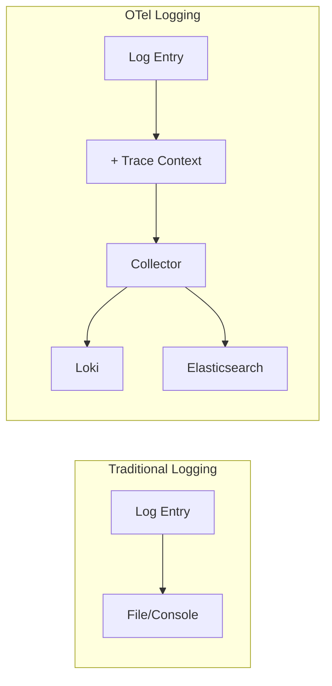
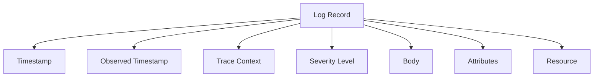
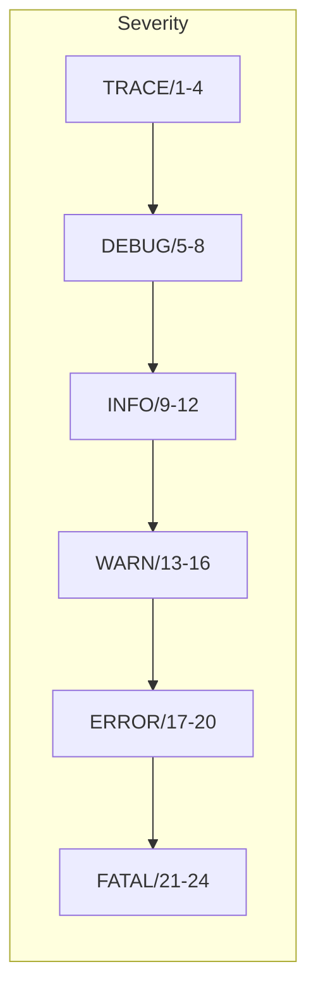
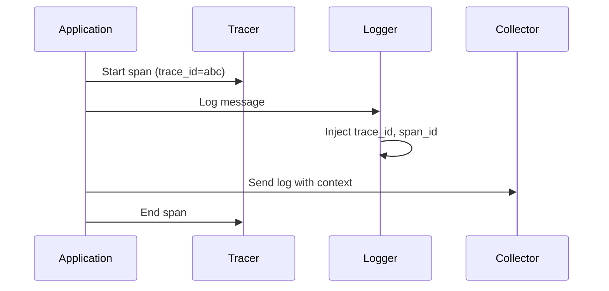
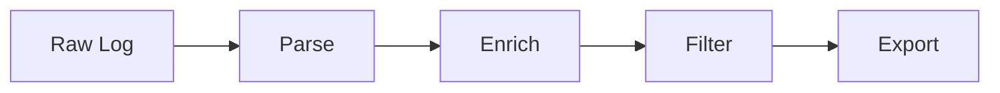

# Logging with OpenTelemetry

Structured logging integrated with traces and metrics for complete observability.

---

## Logs in OpenTelemetry

OpenTelemetry provides a standardized approach to logging that correlates with traces.



---

## Log Data Model

### Log Record Structure



| Field | Description |
|-------|-------------|
| **Timestamp** | When the event occurred |
| **ObservedTimestamp** | When the log was collected |
| **TraceId** | Associated trace ID |
| **SpanId** | Associated span ID |
| **SeverityNumber** | Numeric severity (1-24) |
| **SeverityText** | Severity name (INFO, ERROR) |
| **Body** | Log message content |
| **Attributes** | Structured key-value data |
| **Resource** | Service metadata |

### OTLP Log Format

```json
{
  "resourceLogs": [{
    "resource": {
      "attributes": [
        {"key": "service.name", "value": {"stringValue": "order-service"}}
      ]
    },
    "scopeLogs": [{
      "scope": {"name": "my-logger"},
      "logRecords": [{
        "timeUnixNano": "1705312200000000000",
        "severityNumber": 9,
        "severityText": "INFO",
        "body": {"stringValue": "Order processed successfully"},
        "traceId": "abc123...",
        "spanId": "def456...",
        "attributes": [
          {"key": "order.id", "value": {"stringValue": "12345"}}
        ]
      }]
    }]
  }]
}
```

---

## Severity Levels



| Level | Number | Use Case |
|-------|--------|----------|
| TRACE | 1-4 | Detailed debugging |
| DEBUG | 5-8 | Debug information |
| INFO | 9-12 | Normal operations |
| WARN | 13-16 | Potential issues |
| ERROR | 17-20 | Error conditions |
| FATAL | 21-24 | Unrecoverable errors |

---

## Setting Up OTel Logging

### Python Setup with Logging

```python
import logging
from opentelemetry import trace
from opentelemetry._logs import set_logger_provider
from opentelemetry.sdk._logs import LoggerProvider, LoggingHandler
from opentelemetry.sdk._logs.export import (
    BatchLogRecordProcessor,
    ConsoleLogExporter
)

# Set up LoggerProvider
logger_provider = LoggerProvider()
logger_provider.add_log_record_processor(
    BatchLogRecordProcessor(ConsoleLogExporter())
)
set_logger_provider(logger_provider)

# Create handler for standard logging
handler = LoggingHandler(
    level=logging.NOTSET,
    logger_provider=logger_provider
)

# Configure root logger
logging.getLogger().addHandler(handler)
logging.getLogger().setLevel(logging.INFO)

# Now use standard logging
logger = logging.getLogger(__name__)
logger.info("Application started")
```

### OTLP Export

```python
from opentelemetry.exporter.otlp.proto.grpc._log_exporter import (
    OTLPLogExporter
)

exporter = OTLPLogExporter(
    endpoint="localhost:4317",
    insecure=True
)

logger_provider.add_log_record_processor(
    BatchLogRecordProcessor(exporter)
)
```

---

## Trace Context Correlation

Automatically correlate logs with traces.



### Automatic Injection

```python
import logging
from opentelemetry import trace
from opentelemetry.sdk._logs import LoggingHandler

# Setup (as shown above)
logger = logging.getLogger(__name__)
tracer = trace.get_tracer(__name__)

# Logs within spans automatically get trace context
with tracer.start_as_current_span("process-order"):
    logger.info("Processing order")  # Has trace_id, span_id
    
    with tracer.start_as_current_span("validate-payment"):
        logger.info("Validating payment")  # Same trace_id, different span_id
```

### Manual Injection

```python
import logging

class TraceContextFilter(logging.Filter):
    def filter(self, record):
        span = trace.get_current_span()
        ctx = span.get_span_context()
        
        record.trace_id = format(ctx.trace_id, '032x') if ctx.trace_id else ""
        record.span_id = format(ctx.span_id, '016x') if ctx.span_id else ""
        
        return True

# Add filter to logger
logger.addFilter(TraceContextFilter())

# Configure formatter
formatter = logging.Formatter(
    '%(asctime)s - %(name)s - [trace_id=%(trace_id)s span_id=%(span_id)s] - %(message)s'
)
```

---

## Structured Logging

### JSON Logging

```python
import json
import logging

class JsonFormatter(logging.Formatter):
    def format(self, record):
        log_data = {
            "timestamp": self.formatTime(record),
            "level": record.levelname,
            "message": record.getMessage(),
            "logger": record.name,
            "trace_id": getattr(record, 'trace_id', ''),
            "span_id": getattr(record, 'span_id', ''),
        }
        
        # Add extra fields
        if hasattr(record, 'extra_data'):
            log_data.update(record.extra_data)
        
        return json.dumps(log_data)

# Setup
handler = logging.StreamHandler()
handler.setFormatter(JsonFormatter())
logger.addHandler(handler)
```

### Logging with Context

```python
class ContextLogger:
    def __init__(self, logger):
        self.logger = logger
        self.context = {}
    
    def bind(self, **kwargs):
        """Add persistent context"""
        new_logger = ContextLogger(self.logger)
        new_logger.context = {**self.context, **kwargs}
        return new_logger
    
    def info(self, message, **extra):
        self.logger.info(
            message,
            extra={"extra_data": {**self.context, **extra}}
        )
    
    def error(self, message, **extra):
        self.logger.error(
            message,
            extra={"extra_data": {**self.context, **extra}}
        )

# Usage
log = ContextLogger(logger).bind(service="order-service")
log = log.bind(request_id="req-123")
log.info("Processing order", order_id="456")
```

---

## Log Attributes

### Common Attributes

```python
logger.info(
    "Order completed",
    extra={
        "extra_data": {
            # Business context
            "order.id": "12345",
            "order.total": 99.99,
            "customer.tier": "premium",
            
            # Technical context
            "http.method": "POST",
            "http.route": "/orders",
            "duration_ms": 150,
            
            # Error context (if applicable)
            "error.type": "ValidationError",
            "error.message": "Invalid input"
        }
    }
)
```

### Semantic Conventions

| Category | Attributes |
|----------|------------|
| **Exception** | `exception.type`, `exception.message`, `exception.stacktrace` |
| **Code** | `code.function`, `code.filepath`, `code.lineno` |
| **Thread** | `thread.id`, `thread.name` |
| **HTTP** | `http.method`, `http.status_code` |
| **User** | `enduser.id`, `enduser.role` |

---

## Exception Logging

### Proper Exception Handling

```python
import traceback

def process_order(order_id):
    try:
        result = do_processing(order_id)
        logger.info("Order processed", extra={
            "extra_data": {"order.id": order_id, "status": "success"}
        })
        return result
        
    except ValidationError as e:
        logger.warning(
            f"Validation failed for order {order_id}",
            extra={
                "extra_data": {
                    "order.id": order_id,
                    "exception.type": type(e).__name__,
                    "exception.message": str(e),
                    "validation.field": e.field
                }
            }
        )
        raise
        
    except Exception as e:
        logger.error(
            f"Failed to process order {order_id}",
            extra={
                "extra_data": {
                    "order.id": order_id,
                    "exception.type": type(e).__name__,
                    "exception.message": str(e),
                    "exception.stacktrace": traceback.format_exc()
                }
            },
            exc_info=True
        )
        raise
```

### With Tracing

```python
with tracer.start_as_current_span("process-order") as span:
    try:
        result = do_processing(order_id)
        logger.info("Order processed", extra={"extra_data": {"order.id": order_id}})
    except Exception as e:
        # Log error
        logger.error(f"Processing failed: {e}", exc_info=True)
        
        # Also record in span
        span.record_exception(e)
        span.set_status(trace.Status(trace.StatusCode.ERROR))
        raise
```

---

## Log Processing

### In OTel Collector

```yaml
processors:
  # Parse JSON logs
  attributes/parse:
    actions:
      - key: log.body
        action: extract
        pattern: '^(?P<timestamp>\S+) (?P<level>\S+) (?P<message>.*)$'
  
  # Add attributes
  attributes/enrich:
    actions:
      - key: environment
        value: production
        action: insert
  
  # Filter logs
  filter:
    logs:
      exclude:
        match_type: strict
        bodies:
          - "health check"
```

### Log Transform



---

## Integration with Logging Libraries

### Python Logging

```python
from opentelemetry.sdk._logs import LoggingHandler

# Already shown above - use LoggingHandler
```

### Structlog

```python
import structlog
from opentelemetry import trace

def add_trace_context(logger, method_name, event_dict):
    span = trace.get_current_span()
    ctx = span.get_span_context()
    
    if ctx.is_valid:
        event_dict["trace_id"] = format(ctx.trace_id, '032x')
        event_dict["span_id"] = format(ctx.span_id, '016x')
    
    return event_dict

structlog.configure(
    processors=[
        structlog.processors.TimeStamper(fmt="iso"),
        add_trace_context,
        structlog.processors.JSONRenderer()
    ]
)

log = structlog.get_logger()
log.info("Order created", order_id="123")
```

### Loguru

```python
from loguru import logger
from opentelemetry import trace

def trace_context_injector(record):
    span = trace.get_current_span()
    ctx = span.get_span_context()
    
    record["extra"]["trace_id"] = format(ctx.trace_id, '032x') if ctx.is_valid else ""
    record["extra"]["span_id"] = format(ctx.span_id, '016x') if ctx.is_valid else ""

logger.configure(patcher=trace_context_injector)

logger.info("Processing request", order_id="123")
```

---

## Log Levels Best Practices

### What to Log at Each Level

| Level | When to Use | Examples |
|-------|-------------|----------|
| **TRACE** | Very detailed debugging | Function entry/exit, loop iterations |
| **DEBUG** | Development debugging | Variable values, state changes |
| **INFO** | Normal operations | Request received, job started |
| **WARN** | Potential issues | Slow query, retry attempt |
| **ERROR** | Failures (recoverable) | API error, validation failure |
| **FATAL** | Unrecoverable failures | Database down, config missing |

### Example

```python
# TRACE - very detailed
logger.debug("Entering function process_order with order_id=%s", order_id)

# DEBUG - development
logger.debug("Cart items: %s", cart_items)

# INFO - normal operations  
logger.info("Order %s created successfully", order_id)

# WARN - potential issues
logger.warning("Slow database query: %dms", query_time)

# ERROR - failures
logger.error("Failed to charge card for order %s: %s", order_id, error)

# FATAL - unrecoverable
logger.critical("Database connection failed, shutting down")
```

---

## Log Sampling

Reduce log volume while keeping important logs.

```python
import random

class SamplingFilter(logging.Filter):
    def __init__(self, sample_rate=0.1, always_include_levels=None):
        super().__init__()
        self.sample_rate = sample_rate
        self.always_include = always_include_levels or {
            logging.WARNING, logging.ERROR, logging.CRITICAL
        }
    
    def filter(self, record):
        # Always include warnings and errors
        if record.levelno in self.always_include:
            return True
        
        # Sample INFO and DEBUG
        return random.random() < self.sample_rate

logger.addFilter(SamplingFilter(sample_rate=0.1))
```

---

## Log Correlation in Practice

### Full Example

```python
import logging
import time
from opentelemetry import trace
from opentelemetry.sdk.trace import TracerProvider
from opentelemetry._logs import set_logger_provider
from opentelemetry.sdk._logs import LoggerProvider, LoggingHandler

# Setup
trace.set_tracer_provider(TracerProvider())
tracer = trace.get_tracer("order-service")

logger_provider = LoggerProvider()
set_logger_provider(logger_provider)

logging.getLogger().addHandler(
    LoggingHandler(logger_provider=logger_provider)
)
logger = logging.getLogger(__name__)

# Application code
@app.route("/orders", methods=["POST"])
def create_order():
    with tracer.start_as_current_span("create-order") as span:
        order_id = generate_order_id()
        span.set_attribute("order.id", order_id)
        
        logger.info("Starting order creation", extra={
            "extra_data": {"order.id": order_id}
        })
        
        try:
            with tracer.start_as_current_span("validate-order"):
                logger.debug("Validating order data")
                validate(request.json)
            
            with tracer.start_as_current_span("save-order"):
                logger.debug("Saving to database")
                save_order(request.json)
            
            with tracer.start_as_current_span("send-notification"):
                logger.info("Sending confirmation")
                send_email(request.json)
            
            logger.info("Order created successfully", extra={
                "extra_data": {"order.id": order_id, "status": "completed"}
            })
            return {"order_id": order_id}
            
        except Exception as e:
            logger.error(f"Order creation failed: {e}", exc_info=True)
            span.record_exception(e)
            span.set_status(trace.Status(trace.StatusCode.ERROR))
            raise
```

### Querying Correlated Data

```sql
-- Find all logs for a specific trace
SELECT * FROM logs 
WHERE trace_id = 'abc123...'
ORDER BY timestamp;

-- Find traces with errors
SELECT DISTINCT trace_id FROM logs
WHERE severity >= 'ERROR'
AND timestamp > NOW() - INTERVAL '1 hour';
```

---

## Best Practices

### Do's ✓

- Use structured logging (JSON)
- Include trace context
- Use appropriate log levels
- Add relevant attributes
- Sample high-volume logs

### Don'ts ✗

- Log sensitive data (passwords, tokens)
- Log high-cardinality identifiers excessively
- Use string concatenation for log messages
- Log every function entry/exit
- Ignore log levels

### Security Considerations

```python
# ✗ Bad - logs sensitive data
logger.info(f"User logged in with password: {password}")

# ✓ Good - redact sensitive data
logger.info("User logged in", extra={
    "extra_data": {
        "user.id": user_id,
        "login.method": "password"
    }
})
```

---

## Next Steps

- **[Collector](05_collector.md)** - Processing logs with OTel Collector
- **[Best Practices](07_best_practices.md)** - Production recommendations
