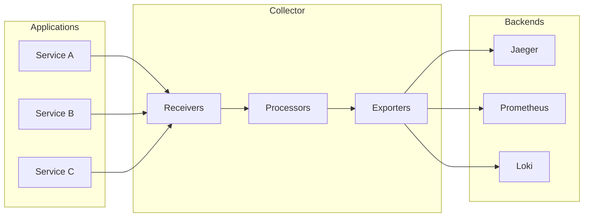
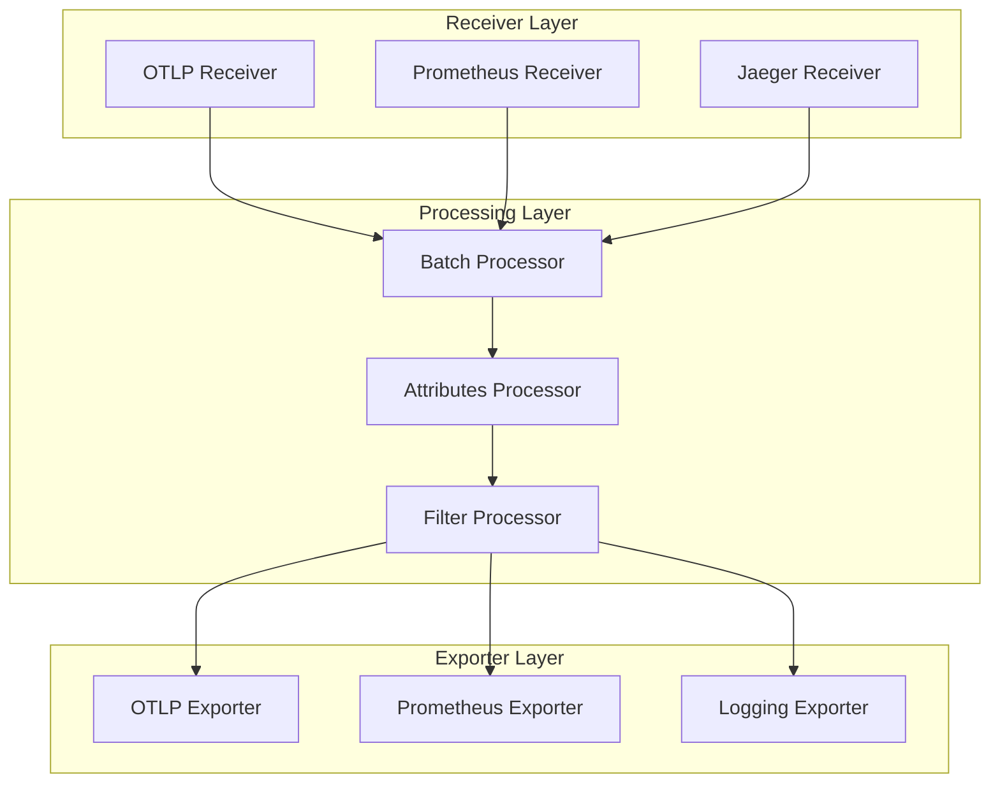
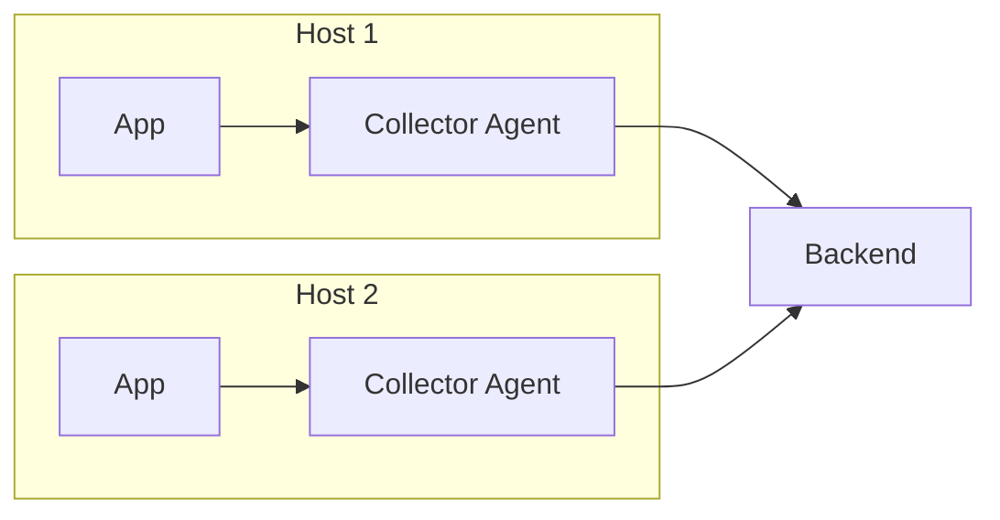
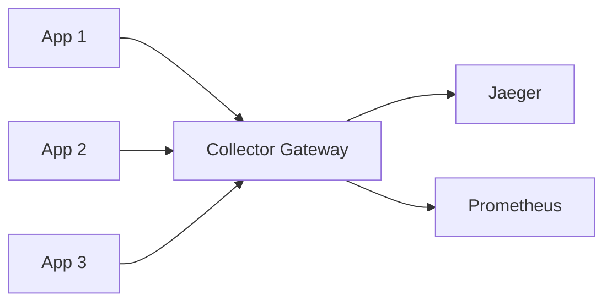
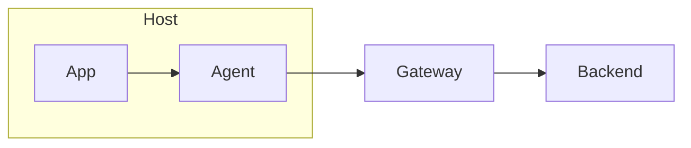

# OpenTelemetry Collector

The OTel Collector is a vendor-agnostic proxy for receiving, processing, and exporting telemetry data.

---

## What is the Collector?



---

## Why Use a Collector?

| Benefit | Description |
|---------|-------------|
| **Vendor Neutrality** | Switch backends without code changes |
| **Processing** | Transform, filter, sample data |
| **Buffering** | Handle network issues gracefully |
| **Multi-destination** | Send to multiple backends |
| **Protocol Translation** | Convert between formats |
| **Resource Offload** | Reduce app overhead |

---

## Architecture Components

### Pipeline Overview



### Receivers

Ingest telemetry data from various sources.

| Receiver | Protocol | Use Case |
|----------|----------|----------|
| `otlp` | OTLP gRPC/HTTP | Native OTel apps |
| `prometheus` | Prometheus | Scrape Prometheus targets |
| `jaeger` | Jaeger protocols | Jaeger-instrumented apps |
| `zipkin` | Zipkin | Zipkin-instrumented apps |
| `hostmetrics` | System calls | Host metrics |
| `filelog` | File | Log files |

### Processors

Transform and filter data.

| Processor | Purpose |
|-----------|---------|
| `batch` | Batches data for efficiency |
| `attributes` | Add/modify/delete attributes |
| `filter` | Drop unwanted data |
| `resource` | Modify resource attributes |
| `span` | Modify spans |
| `tail_sampling` | Intelligent trace sampling |
| `transform` | Complex transformations |

### Exporters

Send data to backends.

| Exporter | Destination |
|----------|-------------|
| `otlp` | OTLP-compatible backends |
| `prometheus` | Prometheus (scrape) |
| `prometheusremotewrite` | Prometheus (push) |
| `jaeger` | Jaeger |
| `loki` | Grafana Loki |
| `elasticsearch` | Elasticsearch |
| `debug` | Console output |

---

## Installation

### Docker

```bash
docker run -p 4317:4317 -p 4318:4318 \
    -v $(pwd)/otel-config.yaml:/etc/otel-config.yaml \
    otel/opentelemetry-collector:latest \
    --config=/etc/otel-config.yaml
```

### Kubernetes

```yaml
apiVersion: apps/v1
kind: Deployment
metadata:
  name: otel-collector
spec:
  replicas: 1
  selector:
    matchLabels:
      app: otel-collector
  template:
    metadata:
      labels:
        app: otel-collector
    spec:
      containers:
        - name: collector
          image: otel/opentelemetry-collector-contrib:latest
          args: ["--config=/etc/otel/config.yaml"]
          ports:
            - containerPort: 4317  # OTLP gRPC
            - containerPort: 4318  # OTLP HTTP
          volumeMounts:
            - name: config
              mountPath: /etc/otel
      volumes:
        - name: config
          configMap:
            name: otel-collector-config
```

### Binary

```bash
# Download
curl -L https://github.com/open-telemetry/opentelemetry-collector-releases/releases/download/v0.91.0/otelcol_0.91.0_darwin_arm64.tar.gz | tar xz

# Run
./otelcol --config=otel-config.yaml
```

---

## Basic Configuration

### Minimal Config

```yaml
receivers:
  otlp:
    protocols:
      grpc:
        endpoint: 0.0.0.0:4317
      http:
        endpoint: 0.0.0.0:4318

processors:
  batch:

exporters:
  debug:
    verbosity: detailed

service:
  pipelines:
    traces:
      receivers: [otlp]
      processors: [batch]
      exporters: [debug]
    metrics:
      receivers: [otlp]
      processors: [batch]
      exporters: [debug]
    logs:
      receivers: [otlp]
      processors: [batch]
      exporters: [debug]
```

### Complete Production Config

```yaml
receivers:
  otlp:
    protocols:
      grpc:
        endpoint: 0.0.0.0:4317
      http:
        endpoint: 0.0.0.0:4318
        cors:
          allowed_origins:
            - "http://localhost:*"
  
  prometheus:
    config:
      scrape_configs:
        - job_name: 'otel-collector'
          scrape_interval: 10s
          static_configs:
            - targets: ['localhost:8888']

processors:
  batch:
    send_batch_size: 10000
    timeout: 10s
  
  memory_limiter:
    check_interval: 1s
    limit_mib: 2000
    spike_limit_mib: 400
  
  attributes:
    actions:
      - key: environment
        value: production
        action: insert

exporters:
  otlp/jaeger:
    endpoint: jaeger:4317
    tls:
      insecure: true
  
  prometheusremotewrite:
    endpoint: http://prometheus:9090/api/v1/write
  
  loki:
    endpoint: http://loki:3100/loki/api/v1/push

extensions:
  health_check:
    endpoint: 0.0.0.0:13133
  zpages:
    endpoint: 0.0.0.0:55679

service:
  extensions: [health_check, zpages]
  pipelines:
    traces:
      receivers: [otlp]
      processors: [memory_limiter, batch, attributes]
      exporters: [otlp/jaeger]
    metrics:
      receivers: [otlp, prometheus]
      processors: [memory_limiter, batch]
      exporters: [prometheusremotewrite]
    logs:
      receivers: [otlp]
      processors: [memory_limiter, batch]
      exporters: [loki]
```

---

## Receivers Deep Dive

### OTLP Receiver

```yaml
receivers:
  otlp:
    protocols:
      grpc:
        endpoint: 0.0.0.0:4317
        max_recv_msg_size_mib: 4
        max_concurrent_streams: 100
        keepalive:
          server_parameters:
            max_connection_idle: 11s
            max_connection_age: 30s
      http:
        endpoint: 0.0.0.0:4318
        cors:
          allowed_origins:
            - "https://example.com"
          allowed_headers:
            - "*"
```

### Prometheus Receiver

```yaml
receivers:
  prometheus:
    config:
      scrape_configs:
        - job_name: 'kubernetes-pods'
          kubernetes_sd_configs:
            - role: pod
          relabel_configs:
            - source_labels: [__meta_kubernetes_pod_annotation_prometheus_io_scrape]
              action: keep
              regex: true
            - source_labels: [__meta_kubernetes_pod_annotation_prometheus_io_port]
              action: replace
              target_label: __address__
              regex: (.+)
              replacement: $${1}:$${2}
```

### Filelog Receiver

```yaml
receivers:
  filelog:
    include:
      - /var/log/myapp/*.log
    operators:
      - type: regex_parser
        regex: '^(?P<timestamp>\d{4}-\d{2}-\d{2}) (?P<level>\w+) (?P<message>.*)$'
        timestamp:
          parse_from: attributes.timestamp
          layout: '%Y-%m-%d'
      - type: severity_parser
        parse_from: attributes.level
```

### Host Metrics Receiver

```yaml
receivers:
  hostmetrics:
    collection_interval: 30s
    scrapers:
      cpu:
      memory:
      disk:
      network:
      load:
      filesystem:
      process:
        include:
          names: ['myapp']
```

---

## Processors Deep Dive

### Batch Processor

```yaml
processors:
  batch:
    send_batch_size: 10000      # Max spans per batch
    send_batch_max_size: 11000  # Absolute max
    timeout: 10s                 # Max wait time
```

### Attributes Processor

```yaml
processors:
  attributes:
    actions:
      # Insert new attribute
      - key: environment
        value: production
        action: insert
      
      # Update existing
      - key: db.statement
        action: update
        value: "REDACTED"
      
      # Delete attribute
      - key: http.request.header.authorization
        action: delete
      
      # Hash sensitive data
      - key: user.email
        action: hash
      
      # Extract from value
      - key: url.path
        pattern: ^/api/(?P<version>v\d+)/(?P<resource>\w+)
        action: extract
```

### Filter Processor

```yaml
processors:
  filter:
    # Drop health checks
    traces:
      span:
        - 'attributes["http.route"] == "/health"'
        - 'name == "healthcheck"'
    
    # Drop debug logs
    logs:
      log_record:
        - 'severity_number < 9'  # Below INFO
    
    # Drop low-value metrics
    metrics:
      metric:
        - 'name == "go_gc_duration_seconds"'
```

### Resource Processor

```yaml
processors:
  resource:
    attributes:
      - key: cloud.provider
        value: aws
        action: insert
      - key: service.instance.id
        from_attribute: k8s.pod.uid
        action: insert
```

### Tail Sampling Processor

```yaml
processors:
  tail_sampling:
    decision_wait: 10s
    num_traces: 100
    expected_new_traces_per_sec: 10
    policies:
      # Always sample errors
      - name: errors
        type: status_code
        status_code:
          status_codes: [ERROR]
      
      # Sample slow requests
      - name: slow-traces
        type: latency
        latency:
          threshold_ms: 1000
      
      # Sample specific services more
      - name: payment-service
        type: string_attribute
        string_attribute:
          key: service.name
          values: [payment-service]
        
      # Probabilistic for everything else
      - name: probabilistic
        type: probabilistic
        probabilistic:
          sampling_percentage: 10
```

### Transform Processor

```yaml
processors:
  transform:
    trace_statements:
      - context: span
        statements:
          # Truncate long attributes
          - truncate_all(attributes, 256)
          
          # Set span name from attribute
          - set(name, attributes["http.route"]) 
            where attributes["http.route"] != nil
    
    log_statements:
      - context: log
        statements:
          # Parse JSON body
          - merge_maps(attributes, ParseJSON(body), "insert")
            where IsMatch(body, "^\\{")
```

---

## Exporters Deep Dive

### OTLP Exporter

```yaml
exporters:
  otlp:
    endpoint: otel-gateway:4317
    tls:
      cert_file: /certs/client.crt
      key_file: /certs/client.key
      ca_file: /certs/ca.crt
    headers:
      X-API-Key: "${env:API_KEY}"
    compression: gzip
    timeout: 30s
    retry_on_failure:
      enabled: true
      initial_interval: 5s
      max_interval: 30s
      max_elapsed_time: 300s
    sending_queue:
      enabled: true
      num_consumers: 10
      queue_size: 1000
```

### Prometheus Remote Write

```yaml
exporters:
  prometheusremotewrite:
    endpoint: https://prometheus.example.com/api/v1/write
    tls:
      insecure: false
    headers:
      Authorization: "Bearer ${env:PROM_TOKEN}"
    external_labels:
      cluster: production
      region: us-east-1
```

### Loki Exporter

```yaml
exporters:
  loki:
    endpoint: http://loki:3100/loki/api/v1/push
    default_labels_enabled:
      exporter: true
      level: true
    labels:
      attributes:
        service.name: "service"
        severity: "level"
      resource:
        k8s.namespace.name: "namespace"
```

---

## Deployment Patterns

### Agent Mode



Collector runs alongside each application.

```yaml
# Agent config - minimal processing
receivers:
  otlp:
    protocols:
      grpc:
        endpoint: localhost:4317

processors:
  batch:
    timeout: 1s

exporters:
  otlp:
    endpoint: gateway-collector:4317

service:
  pipelines:
    traces:
      receivers: [otlp]
      processors: [batch]
      exporters: [otlp]
```

### Gateway Mode



Centralized collector for processing.

```yaml
# Gateway config - heavy processing
receivers:
  otlp:
    protocols:
      grpc:
        endpoint: 0.0.0.0:4317

processors:
  memory_limiter:
    limit_mib: 4000
  tail_sampling:
    policies:
      - name: errors
        type: status_code
        status_code:
          status_codes: [ERROR]
  batch:
    send_batch_size: 10000

exporters:
  otlp/jaeger:
    endpoint: jaeger:4317

service:
  pipelines:
    traces:
      receivers: [otlp]
      processors: [memory_limiter, tail_sampling, batch]
      exporters: [otlp/jaeger]
```

### Agent + Gateway



Best of both worlds.

---

## Extensions

### Health Check

```yaml
extensions:
  health_check:
    endpoint: 0.0.0.0:13133
    path: "/health"
    response_body: '{"status": "healthy"}'
```

### zPages

Debug pages at <http://localhost:55679/debug/>

```yaml
extensions:
  zpages:
    endpoint: 0.0.0.0:55679
```

### pprof

Go profiling.

```yaml
extensions:
  pprof:
    endpoint: 0.0.0.0:1777
```

---

## Environment Variables

```yaml
receivers:
  otlp:
    protocols:
      grpc:
        endpoint: ${env:OTEL_COLLECTOR_ENDPOINT}

exporters:
  otlp:
    endpoint: ${env:BACKEND_ENDPOINT}
    headers:
      Authorization: "Bearer ${env:API_TOKEN}"
```

---

## Monitoring the Collector

### Self-Metrics

```yaml
service:
  telemetry:
    logs:
      level: info
    metrics:
      level: detailed
      address: 0.0.0.0:8888
```

### Key Metrics

| Metric | Description |
|--------|-------------|
| `otelcol_receiver_accepted_spans` | Spans received |
| `otelcol_receiver_refused_spans` | Spans rejected |
| `otelcol_processor_batch_timeout_trigger_send` | Batch timeout sends |
| `otelcol_exporter_sent_spans` | Spans exported |
| `otelcol_exporter_send_failed_spans` | Export failures |

---

## Docker Compose Example

```yaml
version: '3.8'

services:
  otel-collector:
    image: otel/opentelemetry-collector-contrib:latest
    command: ["--config=/etc/otel-collector-config.yaml"]
    volumes:
      - ./otel-collector-config.yaml:/etc/otel-collector-config.yaml
    ports:
      - "4317:4317"   # OTLP gRPC
      - "4318:4318"   # OTLP HTTP
      - "8888:8888"   # Metrics
      - "13133:13133" # Health check
    depends_on:
      - jaeger
      - prometheus

  jaeger:
    image: jaegertracing/all-in-one:latest
    ports:
      - "16686:16686" # UI
      - "14250:14250" # gRPC

  prometheus:
    image: prom/prometheus:latest
    volumes:
      - ./prometheus.yml:/etc/prometheus/prometheus.yml
    ports:
      - "9090:9090"

  grafana:
    image: grafana/grafana:latest
    ports:
      - "3000:3000"
    environment:
      - GF_AUTH_ANONYMOUS_ENABLED=true
      - GF_AUTH_ANONYMOUS_ORG_ROLE=Admin
```

---

## Best Practices

### Performance

- Use `memory_limiter` processor
- Enable compression for exporters
- Tune batch sizes appropriately
- Use sending queues for reliability

### Security

- Use TLS for all connections
- Avoid exposing receivers publicly
- Sanitize sensitive data in processors
- Use environment variables for secrets

### Reliability

- Enable retry on failure
- Use sending queues
- Monitor collector health
- Deploy in HA mode

---

## Troubleshooting

### Common Issues

| Issue | Solution |
|-------|----------|
| Data not arriving | Check receiver endpoint |
| High memory | Add memory_limiter |
| Data loss | Enable sending_queue |
| Slow export | Increase batch size |

### Debug Mode

```yaml
service:
  telemetry:
    logs:
      level: debug
```

### Testing Pipeline

```bash
# Send test trace
curl -X POST http://localhost:4318/v1/traces \
  -H 'Content-Type: application/json' \
  -d '{
    "resourceSpans": [{
      "scopeSpans": [{
        "spans": [{
          "traceId": "5B8EFFF798038103D269B633813FC60C",
          "spanId": "EEE19B7EC3C1B174",
          "name": "test-span",
          "startTimeUnixNano": "1544712660000000000",
          "endTimeUnixNano": "1544712661000000000"
        }]
      }]
    }]
  }'
```

---

## Next Steps

- **[Instrumentation](06_instrumentation.md)** - Auto and manual instrumentation
- **[Best Practices](07_best_practices.md)** - Production recommendations
