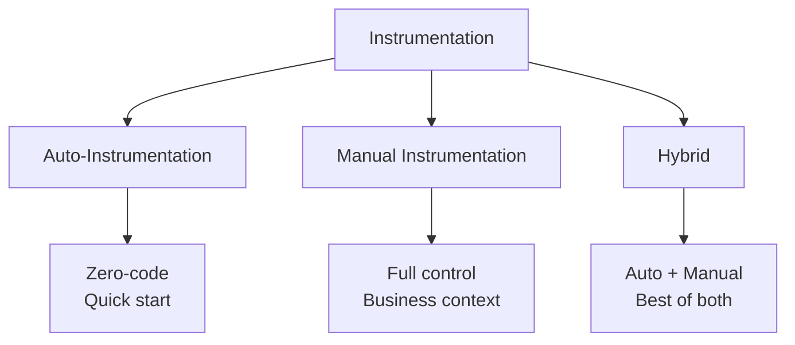

# OpenTelemetry Instrumentation

Instrumentation is the process of adding observability code to your applications.

---

## Instrumentation Types



| Type | Effort | Control | Use Case |
|------|--------|---------|----------|
| **Auto** | Low | Limited | Quick start, frameworks |
| **Manual** | High | Full | Business logic, custom spans |
| **Hybrid** | Medium | Full | Production systems |

---

## Auto-Instrumentation

### Python Setup

```bash
# Install core packages
pip install opentelemetry-api opentelemetry-sdk

# Install auto-instrumentation
pip install opentelemetry-distro opentelemetry-exporter-otlp

# Install all available instrumentations
opentelemetry-bootstrap -a install
```

### Running with Auto-Instrumentation

```bash
# Using opentelemetry-instrument
opentelemetry-instrument \
    --traces_exporter otlp \
    --metrics_exporter otlp \
    --logs_exporter otlp \
    --service_name my-service \
    --exporter_otlp_endpoint http://localhost:4317 \
    python app.py
```

### Environment Variables

```bash
export OTEL_SERVICE_NAME=my-service
export OTEL_TRACES_EXPORTER=otlp
export OTEL_METRICS_EXPORTER=otlp
export OTEL_LOGS_EXPORTER=otlp
export OTEL_EXPORTER_OTLP_ENDPOINT=http://localhost:4317
export OTEL_PYTHON_LOGGING_AUTO_INSTRUMENTATION_ENABLED=true

python app.py
```

---

## Available Python Instrumentations

### Web Frameworks

| Library | Package | Auto |
|---------|---------|------|
| Flask | `opentelemetry-instrumentation-flask` | ✓ |
| FastAPI | `opentelemetry-instrumentation-fastapi` | ✓ |
| Django | `opentelemetry-instrumentation-django` | ✓ |
| Tornado | `opentelemetry-instrumentation-tornado` | ✓ |
| aiohttp | `opentelemetry-instrumentation-aiohttp` | ✓ |

### HTTP Clients

| Library | Package | Auto |
|---------|---------|------|
| requests | `opentelemetry-instrumentation-requests` | ✓ |
| httpx | `opentelemetry-instrumentation-httpx` | ✓ |
| urllib3 | `opentelemetry-instrumentation-urllib3` | ✓ |
| aiohttp-client | `opentelemetry-instrumentation-aiohttp` | ✓ |

### Databases

| Library | Package | Auto |
|---------|---------|------|
| SQLAlchemy | `opentelemetry-instrumentation-sqlalchemy` | ✓ |
| psycopg2 | `opentelemetry-instrumentation-psycopg2` | ✓ |
| mysql | `opentelemetry-instrumentation-mysql` | ✓ |
| redis | `opentelemetry-instrumentation-redis` | ✓ |
| pymongo | `opentelemetry-instrumentation-pymongo` | ✓ |

### Messaging

| Library | Package | Auto |
|---------|---------|------|
| Celery | `opentelemetry-instrumentation-celery` | ✓ |
| Kafka | `opentelemetry-instrumentation-kafka-python` | ✓ |
| pika (RabbitMQ) | `opentelemetry-instrumentation-pika` | ✓ |

---

## Programmatic Auto-Instrumentation

### Flask Example

```python
from flask import Flask
from opentelemetry import trace
from opentelemetry.sdk.trace import TracerProvider
from opentelemetry.sdk.trace.export import BatchSpanProcessor
from opentelemetry.exporter.otlp.proto.grpc.trace_exporter import OTLPSpanExporter
from opentelemetry.instrumentation.flask import FlaskInstrumentor
from opentelemetry.instrumentation.requests import RequestsInstrumentor

# Setup TracerProvider
provider = TracerProvider()
processor = BatchSpanProcessor(
    OTLPSpanExporter(endpoint="localhost:4317", insecure=True)
)
provider.add_span_processor(processor)
trace.set_tracer_provider(provider)

# Create Flask app
app = Flask(__name__)

# Instrument Flask
FlaskInstrumentor().instrument_app(app)

# Instrument requests library
RequestsInstrumentor().instrument()

@app.route("/")
def hello():
    return "Hello, World!"

@app.route("/users/<user_id>")
def get_user(user_id):
    import requests
    # This HTTP call is automatically traced
    response = requests.get(f"http://user-service/users/{user_id}")
    return response.json()

if __name__ == "__main__":
    app.run()
```

### FastAPI Example

```python
from fastapi import FastAPI
from opentelemetry import trace
from opentelemetry.sdk.trace import TracerProvider
from opentelemetry.sdk.trace.export import BatchSpanProcessor
from opentelemetry.exporter.otlp.proto.grpc.trace_exporter import OTLPSpanExporter
from opentelemetry.instrumentation.fastapi import FastAPIInstrumentor
from opentelemetry.instrumentation.httpx import HTTPXClientInstrumentor

# Setup
provider = TracerProvider()
processor = BatchSpanProcessor(
    OTLPSpanExporter(endpoint="localhost:4317", insecure=True)
)
provider.add_span_processor(processor)
trace.set_tracer_provider(provider)

# Create app
app = FastAPI()

# Instrument
FastAPIInstrumentor.instrument_app(app)
HTTPXClientInstrumentor().instrument()

@app.get("/")
async def root():
    return {"message": "Hello World"}

@app.get("/items/{item_id}")
async def get_item(item_id: int):
    import httpx
    async with httpx.AsyncClient() as client:
        # Automatically traced
        response = await client.get(f"http://inventory/items/{item_id}")
        return response.json()
```

---

## Manual Instrumentation

### Basic Span Creation

```python
from opentelemetry import trace
from opentelemetry.sdk.trace import TracerProvider
from opentelemetry.sdk.trace.export import (
    BatchSpanProcessor, 
    ConsoleSpanExporter
)
from opentelemetry.sdk.resources import Resource

# Setup with resource
resource = Resource.create({
    "service.name": "order-service",
    "service.version": "1.0.0",
    "deployment.environment": "production"
})

provider = TracerProvider(resource=resource)
provider.add_span_processor(BatchSpanProcessor(ConsoleSpanExporter()))
trace.set_tracer_provider(provider)

# Get tracer
tracer = trace.get_tracer("order-service", "1.0.0")

# Create spans
def process_order(order_id: str, items: list):
    with tracer.start_as_current_span("process-order") as span:
        span.set_attribute("order.id", order_id)
        span.set_attribute("order.item_count", len(items))
        
        # Nested span
        with tracer.start_as_current_span("validate-items"):
            validate_items(items)
        
        with tracer.start_as_current_span("calculate-total"):
            total = calculate_total(items)
            span.set_attribute("order.total", total)
        
        return {"order_id": order_id, "total": total}
```

### Adding Rich Context

```python
from opentelemetry.trace import Status, StatusCode

def process_payment(order_id: str, amount: float, payment_method: str):
    with tracer.start_as_current_span("process-payment") as span:
        # Set attributes
        span.set_attributes({
            "order.id": order_id,
            "payment.amount": amount,
            "payment.method": payment_method,
            "payment.currency": "USD"
        })
        
        # Add event
        span.add_event("payment.initiated", {
            "payment.processor": "stripe"
        })
        
        try:
            result = charge_card(amount, payment_method)
            
            span.add_event("payment.completed", {
                "transaction.id": result.transaction_id
            })
            span.set_attribute("transaction.id", result.transaction_id)
            span.set_status(Status(StatusCode.OK))
            
            return result
            
        except InsufficientFundsError as e:
            span.add_event("payment.declined", {
                "reason": "insufficient_funds"
            })
            span.set_status(Status(StatusCode.ERROR, "Payment declined"))
            span.record_exception(e)
            raise
            
        except Exception as e:
            span.record_exception(e)
            span.set_status(Status(StatusCode.ERROR, str(e)))
            raise
```

### Span Links

```python
def process_batch(items: list):
    # Collect context from individual items
    links = []
    for item in items:
        if item.trace_context:
            ctx = extract(item.trace_context)
            parent_span = trace.get_current_span(ctx)
            if parent_span.get_span_context().is_valid:
                links.append(trace.Link(parent_span.get_span_context(), {
                    "item.id": item.id
                }))
    
    # Create batch span with links to original traces
    with tracer.start_as_current_span(
        "process-batch",
        links=links
    ) as span:
        span.set_attribute("batch.size", len(items))
        for item in items:
            process_item(item)
```

---

## Metrics Manual Instrumentation

```python
from opentelemetry import metrics
from opentelemetry.sdk.metrics import MeterProvider
from opentelemetry.sdk.metrics.export import (
    PeriodicExportingMetricReader
)
from opentelemetry.exporter.otlp.proto.grpc.metric_exporter import (
    OTLPMetricExporter
)

# Setup
reader = PeriodicExportingMetricReader(
    OTLPMetricExporter(endpoint="localhost:4317", insecure=True),
    export_interval_millis=10000
)
provider = MeterProvider(metric_readers=[reader])
metrics.set_meter_provider(provider)

# Get meter
meter = metrics.get_meter("order-service", "1.0.0")

# Create instruments
order_counter = meter.create_counter(
    "orders.total",
    description="Total orders processed",
    unit="1"
)

order_value_histogram = meter.create_histogram(
    "orders.value",
    description="Order value distribution",
    unit="USD"
)

active_orders = meter.create_up_down_counter(
    "orders.active",
    description="Currently processing orders"
)

# Use in code
def create_order(order):
    active_orders.add(1)
    
    try:
        result = process(order)
        order_counter.add(1, {
            "status": "success",
            "customer.tier": order.customer_tier
        })
        order_value_histogram.record(order.total, {
            "customer.tier": order.customer_tier
        })
        return result
    except Exception:
        order_counter.add(1, {"status": "error"})
        raise
    finally:
        active_orders.add(-1)
```

---

## Context Propagation

### Injecting Context (Outgoing)

```python
from opentelemetry.propagate import inject
import requests

def call_external_service(data):
    with tracer.start_as_current_span("call-service-b", kind=trace.SpanKind.CLIENT) as span:
        span.set_attribute("peer.service", "service-b")
        
        # Inject trace context into headers
        headers = {}
        inject(headers)
        
        response = requests.post(
            "http://service-b/api/process",
            json=data,
            headers=headers
        )
        
        span.set_attribute("http.status_code", response.status_code)
        return response.json()
```

### Extracting Context (Incoming)

```python
from opentelemetry.propagate import extract
from flask import request

@app.route("/api/process", methods=["POST"])
def handle_request():
    # Extract trace context from incoming headers
    ctx = extract(request.headers)
    
    # Create span with extracted context as parent
    with tracer.start_as_current_span(
        "handle-request",
        context=ctx,
        kind=trace.SpanKind.SERVER
    ) as span:
        span.set_attribute("http.method", request.method)
        span.set_attribute("http.route", "/api/process")
        
        result = do_processing(request.json)
        return result
```

### Async Context

```python
import asyncio
from opentelemetry import context

async def async_operation():
    # Context is automatically propagated in asyncio
    with tracer.start_as_current_span("async-parent"):
        # These run with parent context
        await asyncio.gather(
            async_task_1(),
            async_task_2()
        )

async def async_task_1():
    with tracer.start_as_current_span("async-task-1"):
        await some_async_work()

# For thread pools, attach context manually
from concurrent.futures import ThreadPoolExecutor

def run_in_thread(func, *args):
    ctx = context.get_current()
    
    def wrapper():
        token = context.attach(ctx)
        try:
            return func(*args)
        finally:
            context.detach(token)
    
    with ThreadPoolExecutor() as executor:
        return executor.submit(wrapper).result()
```

---

## Decorators for Clean Code

### Trace Decorator

```python
import functools
from opentelemetry import trace

def traced(span_name: str = None, attributes: dict = None):
    """Decorator to automatically trace a function."""
    def decorator(func):
        @functools.wraps(func)
        def wrapper(*args, **kwargs):
            tracer = trace.get_tracer(__name__)
            name = span_name or func.__name__
            
            with tracer.start_as_current_span(name) as span:
                # Add default attributes
                if attributes:
                    span.set_attributes(attributes)
                
                # Add function arguments as attributes
                span.set_attribute("function.name", func.__name__)
                
                try:
                    result = func(*args, **kwargs)
                    span.set_status(trace.Status(trace.StatusCode.OK))
                    return result
                except Exception as e:
                    span.record_exception(e)
                    span.set_status(trace.Status(trace.StatusCode.ERROR, str(e)))
                    raise
        
        return wrapper
    return decorator

# Usage
@traced("create-user", {"operation": "user_creation"})
def create_user(name: str, email: str):
    # Function is automatically traced
    return {"id": generate_id(), "name": name, "email": email}
```

### Async Trace Decorator

```python
def traced_async(span_name: str = None):
    def decorator(func):
        @functools.wraps(func)
        async def wrapper(*args, **kwargs):
            tracer = trace.get_tracer(__name__)
            name = span_name or func.__name__
            
            with tracer.start_as_current_span(name) as span:
                try:
                    result = await func(*args, **kwargs)
                    span.set_status(trace.Status(trace.StatusCode.OK))
                    return result
                except Exception as e:
                    span.record_exception(e)
                    span.set_status(trace.Status(trace.StatusCode.ERROR))
                    raise
        
        return wrapper
    return decorator

@traced_async("fetch-user-async")
async def fetch_user(user_id: str):
    async with httpx.AsyncClient() as client:
        response = await client.get(f"/users/{user_id}")
        return response.json()
```

### Metrics Timer Decorator

```python
import time

def timed(histogram_name: str, attributes: dict = None):
    def decorator(func):
        meter = metrics.get_meter(__name__)
        histogram = meter.create_histogram(histogram_name, unit="ms")
        error_counter = meter.create_counter(f"{histogram_name}.errors")
        
        @functools.wraps(func)
        def wrapper(*args, **kwargs):
            start = time.perf_counter()
            attrs = attributes or {}
            attrs["function"] = func.__name__
            
            try:
                result = func(*args, **kwargs)
                attrs["status"] = "success"
                return result
            except Exception as e:
                attrs["status"] = "error"
                attrs["error.type"] = type(e).__name__
                error_counter.add(1, attrs)
                raise
            finally:
                duration = (time.perf_counter() - start) * 1000
                histogram.record(duration, attrs)
        
        return wrapper
    return decorator

@timed("order.processing_time", {"service": "orders"})
def process_order(order_id):
    # Processing time is automatically recorded
    return do_processing(order_id)
```

---

## Hybrid Approach

Combine auto-instrumentation with manual spans.

```python
from opentelemetry import trace
from opentelemetry.instrumentation.flask import FlaskInstrumentor
from flask import Flask

app = Flask(__name__)

# Auto-instrument Flask
FlaskInstrumentor().instrument_app(app)

# Get tracer for manual spans
tracer = trace.get_tracer(__name__)

@app.route("/orders", methods=["POST"])
def create_order():
    # Flask span is automatically created
    
    # Add manual business logic spans
    with tracer.start_as_current_span("validate-order") as span:
        order = request.json
        span.set_attribute("order.items_count", len(order.get("items", [])))
        validate(order)
    
    with tracer.start_as_current_span("save-order") as span:
        order_id = generate_id()
        span.set_attribute("order.id", order_id)
        save_to_db(order)
    
    with tracer.start_as_current_span("notify-customer") as span:
        span.set_attribute("notification.type", "email")
        send_confirmation(order)
    
    return {"order_id": order_id}
```

---

## Complete Setup Example

```python
# telemetry.py - Centralized setup
from opentelemetry import trace, metrics
from opentelemetry.sdk.trace import TracerProvider
from opentelemetry.sdk.metrics import MeterProvider
from opentelemetry.sdk.trace.export import BatchSpanProcessor
from opentelemetry.sdk.metrics.export import PeriodicExportingMetricReader
from opentelemetry.exporter.otlp.proto.grpc.trace_exporter import OTLPSpanExporter
from opentelemetry.exporter.otlp.proto.grpc.metric_exporter import OTLPMetricExporter
from opentelemetry.sdk.resources import Resource
from opentelemetry.instrumentation.flask import FlaskInstrumentor
from opentelemetry.instrumentation.requests import RequestsInstrumentor
from opentelemetry.instrumentation.sqlalchemy import SQLAlchemyInstrumentor
import os

def setup_telemetry(app=None, engine=None):
    """Initialize OpenTelemetry for the application."""
    
    # Create resource
    resource = Resource.create({
        "service.name": os.getenv("OTEL_SERVICE_NAME", "my-service"),
        "service.version": os.getenv("SERVICE_VERSION", "1.0.0"),
        "deployment.environment": os.getenv("ENVIRONMENT", "development")
    })
    
    endpoint = os.getenv("OTEL_EXPORTER_OTLP_ENDPOINT", "localhost:4317")
    
    # Setup tracing
    trace_provider = TracerProvider(resource=resource)
    trace_provider.add_span_processor(
        BatchSpanProcessor(OTLPSpanExporter(endpoint=endpoint, insecure=True))
    )
    trace.set_tracer_provider(trace_provider)
    
    # Setup metrics
    metric_reader = PeriodicExportingMetricReader(
        OTLPMetricExporter(endpoint=endpoint, insecure=True),
        export_interval_millis=10000
    )
    metrics.set_meter_provider(MeterProvider(
        resource=resource,
        metric_readers=[metric_reader]
    ))
    
    # Auto-instrumentation
    if app:
        FlaskInstrumentor().instrument_app(app)
    
    if engine:
        SQLAlchemyInstrumentor().instrument(engine=engine)
    
    RequestsInstrumentor().instrument()
    
    return trace.get_tracer(__name__), metrics.get_meter(__name__)

def shutdown_telemetry():
    """Cleanup on application shutdown."""
    trace.get_tracer_provider().shutdown()
    metrics.get_meter_provider().shutdown()
```

```python
# app.py - Application using telemetry
from flask import Flask, request
from telemetry import setup_telemetry, shutdown_telemetry
import atexit

app = Flask(__name__)
tracer, meter = setup_telemetry(app)

# Register shutdown
atexit.register(shutdown_telemetry)

# Metrics
request_counter = meter.create_counter("http.requests")
latency = meter.create_histogram("http.latency", unit="ms")

@app.route("/api/orders", methods=["POST"])
def create_order():
    with tracer.start_as_current_span("create-order-workflow") as span:
        order = request.json
        span.set_attribute("order.customer_id", order.get("customer_id"))
        
        # Business logic with manual spans
        with tracer.start_as_current_span("validate-order"):
            validate(order)
        
        with tracer.start_as_current_span("process-payment"):
            payment_result = process_payment(order)
            span.set_attribute("payment.status", payment_result.status)
        
        return {"status": "success"}

if __name__ == "__main__":
    app.run()
```

---

## Best Practices

### Naming Conventions

```python
# ✓ Good span names
"HTTP GET /users/{id}"
"db.postgresql.query"
"order.process"
"cache.redis.get"

# ✗ Bad span names
"get user 12345"  # Contains variable data
"function1"       # Not descriptive
"process"         # Too generic
```

### Attribute Guidelines

```python
# ✓ Good - low cardinality, meaningful
span.set_attribute("http.method", "GET")
span.set_attribute("order.status", "pending")
span.set_attribute("customer.tier", "premium")

# ✗ Bad - high cardinality
span.set_attribute("user.session_id", session_id)
span.set_attribute("request.body", request_body)
```

### Error Handling

```python
# ✓ Proper error handling
with tracer.start_as_current_span("operation") as span:
    try:
        result = risky_operation()
    except BusinessError as e:
        span.set_attribute("error.type", "business")
        span.record_exception(e)
        # Don't set ERROR status for expected conditions
    except Exception as e:
        span.record_exception(e)
        span.set_status(trace.Status(trace.StatusCode.ERROR))
        raise
```

---

## Troubleshooting

### Enable Debug Logging

```python
import logging
logging.getLogger("opentelemetry").setLevel(logging.DEBUG)
```

### Console Exporter for Testing

```python
from opentelemetry.sdk.trace.export import ConsoleSpanExporter

provider.add_span_processor(
    BatchSpanProcessor(ConsoleSpanExporter())
)
```

### Verify Spans

```python
# Check if tracing is working
span = trace.get_current_span()
print(f"Current span: {span}")
print(f"Trace ID: {span.get_span_context().trace_id}")
```

---

## Next Steps

- **[Best Practices](07_best_practices.md)** - Production recommendations
