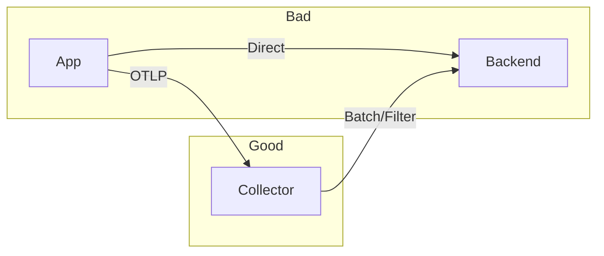

# OpenTelemetry Best Practices

A guide to running OpenTelemetry in production environments efficiently and reliably.

---

## Instrumentation Strategy

### 1. Start with Auto-Instrumentation

Don't write manual instrumentation until you need it.

- **Pros:** Immediate value, low effort, broad coverage.
- **Cons:** Generic spans, might miss business logic.
- **Recommendation:** Use auto-instrumentation for frameworks (Flask, Django, Spring) and libraries (SQLAlchemy, Redis, Kafka), then add manual spans for critical business logic.

```python
# Start with this
opentelemetry-instrument python app.py

# Add this later when needed
with tracer.start_as_current_span("critical_business_logic"):
    # ...
```

### 2. Semantic Conventions

Always follow standard naming schemes.

- **Service Names:** `service.name`, `service.version`, `deployment.environment`
- **HTTP:** `http.method`, `http.route`, `http.status_code`
- **DB:** `db.system`, `db.operation`, `db.statement` (redacted)

**Why?** Backends like Jaeger, Datadog, and Honeycomb rely on these specific attribute names to build service maps and dashboards.

### 3. Manage Cardinality

High cardinality (too many unique values) kills performance and increases cost.

| Good (Low Cardinality) | Bad (High Cardinality) |
|------------------------|------------------------|
| `http.status_code` | `user.email` |
| `customer.tier` | `session_id` |
| `region` | `request.id` |
| `error.type` | `error.message` (if variable) |

### 4. Span Granularity

Don't trace everything.

- **Too Detailed:** Tracing every getter/setter or loop iteration. Result: overhead + noise.
- **Too Sparse:** One span for the whole request. Result: no visibility.
- **Sweet Spot:** Trace IO operations (DB, HTTP, Disk) and major business logic blocks.

---

## Collector Configuration

### 5. Use the Collector

Never send telemetry directly from apps to backends in production.



**Benefits:**

- Offloads compression/retry logic from app.
- Central place to manage secrets (API keys).
- Allows changing backends without redeploying apps.

### 6. Processors are Critical

Always configure these processors in this order:

1. **Memory Limiter:** Prevents Collector from crashing (OOM).
2. **Batch:** Aggregates data to reduce network calls.
3. **Attributes/Filter:** (Optional) modifying data.
4. **Exporters:** Sending data.

```yaml
processors:
  memory_limiter:
    check_interval: 1s
    limit_mib: 1000
    spike_limit_mib: 200
  batch:
    send_batch_size: 1000
    timeout: 10s
```

### 7. Filter Sensitive Data

Ensure PII (Personally Identifiable Information) doesn't leak into logs/traces.

```yaml
processors:
  attributes:
    actions:
      - key: credit_card
        action: delete
      - key: user.email
        action: hash
```

---

## Sampling Strategies

### 8. Sampling is Mandatory at Scale

You cannot (and should not) store 100% of traces for high-throughput systems.

- **Head Sampling:** Decision made at the start of the trace (in the app).
  - Lightweight.
  - Misses interesting errors if they happen late.
  - *Recommendation:* Start with 10% (`TraceIdRatioBased(0.1)`).

- **Tail Sampling:** Decision made after the trace is complete (in the Collector).
  - Heavy resource usage (must hold trace in memory).
  - Allows "Keep all errors and slow traces, sample 1% of success".
  - *Recommendation:* Use for critical services where errors are rare but important.

---

## Security

### 9. Secure the Pipeline

- **TLS:** enabling TLS for OTLP receivers and exporters is mandatory in production.
- **Authentication:** Use OIDC or simple Bearer auth.
- **Network:** Don't expose OTel ports (4317/4318) to the public internet.

---

## Performance Tuning

### 10. Context Propagation

Ensure context propagation works across all your services. If one service breaks the chain, you lose the end-to-end trace.

- Standardize on **W3C Trace Context** (`traceparent`, `tracestate`).
- Avoid proprietary headers if possible.

### 11. Async & Threads

Context doesn't automatically propagate to new threads or async tasks in some languages.

**Python:**

```python
# Automatic in asyncio, but manual in threads
from opentelemetry import context

# In thread
token = context.attach(parent_context)
try:
    do_work()
finally:
    context.detach(token)
```

---

## Observability Maturity Checklist

- [ ] **Level 1:** Auto-instrumentation enabled for key services.
- [ ] **Level 2:** OTel Collector deployed (Agent or Gateway mode).
- [ ] **Level 3:** Correlated Logs and Traces (trace_id in logs).
- [ ] **Level 4:** Metrics generated from Spans (RED metrics).
- [ ] **Level 5:** Alerts based on SLOs derived from metrics.
- [ ] **Level 6:** Tail sampling to capture interesting traces only.
