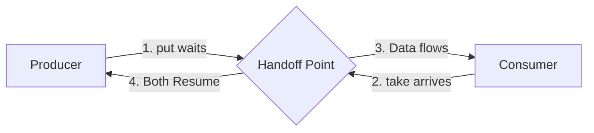

# BlockingQueue: The Producer-Consumer Pattern

A **BlockingQueue** is a thread-safe queue that supports operations that wait for the queue to become non-empty when retrieving an element, and wait for space to become available when storing an element.

It is the foundation of the **Producer-Consumer** pattern.

> **Run Code Example**: [`BlockingQueueDemo.java`](../../src/main/java/com/ashish/thread/BlockingQueueDemo.java)

## 1. The Concept

- **Producer**: Generates data and puts it into the queue. If the queue is full, it **blocks** (waits).
- **Consumer**: Takes data from the queue. If the queue is empty, it **blocks** (waits).

```mermaid
graph LR
    subgraph "Producer Thread"
        P[Generate Data]
    end
    
    subgraph "Blocking Queue (Capacity: 2)"
        Q1[Item 1]
        Q2[Item 2]
    end
    
    subgraph "Consumer Thread"
        C[Process Data]
    end
    
    P -->|put() waits if full| Q1
    Q2 -->|take() waits if empty| C
    
    style Q1 fill:#dfd
    style Q2 fill:#dfd
```

## 2. Key Methods

Each operation has 4 forms depending on how handling failure/full/empty situations:

| Type | **Throws Exception** | **Returns Special Value** | **Blocks** (Waits indefinitely) | **Times Out** |
| :--- | :--- | :--- | :--- | :--- |
| **Insert** | `add(e)` | `offer(e)` | **`put(e)`** (Standard) | `offer(e, time, unit)` |
| **Remove** | `remove()` | `poll()` | **`take()`** (Standard) | `poll(time, unit)` |
| **Examine** | `element()` | `peek()` | N/A | N/A |

> **Best Practice**: For concurrency, mostly use **`put()`** and **`take()`** because they handle the blocking logic for you.

## 3. Implementations

### A. General Purpose

- **`ArrayBlockingQueue`**: Fixed size array. Low overhead. Fairness optional.
- **`LinkedBlockingQueue`**: Optional bound. Separate locks for head/tail (higher throughput).

### B. Specialized Queues (Advanced)

> **Run Code Example**: [`AdvancedQueuesDemo.java`](../../src/main/java/com/ashish/thread/AdvancedQueuesDemo.java)

#### 1. SynchronousQueue (The Handoff)

Has **0 capacity**. A put *must* block until a take arrives.

- **Use Case**: Thread Pools (`Executors.newCachedThreadPool()`) to hand off tasks to idle threads instantly.



#### 2. DelayQueue (The Scheduler)

Unbounded. Elements implement `Delayed`. They can only be taken when their delay expires.

- **Use Case**: Retry logic, session timeouts, scheduled tasks.

#### 3. LinkedTransferQueue (The Receipt)

A "Super Queue" that combines logic of Blocking, Concurrent, and Synchronous queues.

- `transfer(e)`: **Blocks** until a consumer actually receives the element (like a delivery receipt).
- **Use Case**: When you need confirmation of processing.

#### 4. PriorityBlockingQueue (The VIP)

Unbounded. Returns elements ordered by `Comparable` or `Comparator`.

- **Use Case**: Task scheduling where high-priority jobs must run first.

## 4. Example

```java
BlockingQueue<String> queue = new ArrayBlockingQueue<>(10);

// Producer
new Thread(() -> {
    try {
        queue.put("Job 1"); // Blocks if full
        System.out.println("Produced Job 1");
    } catch (InterruptedException e) {
        Thread.currentThread().interrupt();
    }
}).start();

// Consumer
new Thread(() -> {
    try {
        String job = queue.take(); // Blocks if empty
        System.out.println("Consumed " + job);
    } catch (InterruptedException e) {
        Thread.currentThread().interrupt();
    }
}).start();
```
