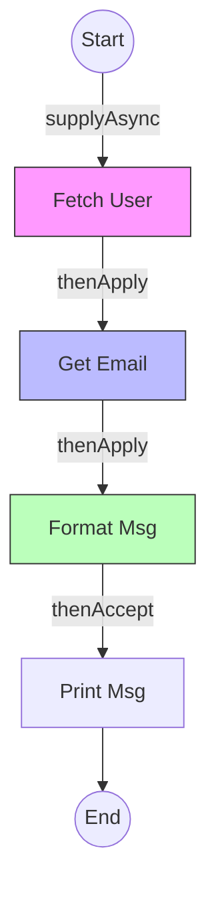

# CompletableFuture

`CompletableFuture` (Java 8) introduced true **asynchronous programming** to Java. It allows you to build non-blocking pipelines, chaining steps together without blocking threads.

> **Run Code Example**: [`CompletableFutureDemo.java`](../../src/main/java/com/ashish/thread/CompletableFutureDemo.java)

## 1. Why `Future` was not enough

The old `Future<T>` (Java 5) had a major flaw: to get the result, you had to call `future.get()`, which **blocks** the current thread.

```java
// OLD WAY: Blocking
Future<String> future = executor.submit(() -> heavyTask());
String result = future.get(); // Main thread stops here! (BAD)
```

**CompletableFuture** allows you to say: *"When this task finishes, automatically trigger this next task, then this one..."*

## 2. Creating an Async Task

You don't need an `ExecutorService` explicitly (though you can provide one). By default, it uses the global `ForkJoinPool.commonPool()`.

```java
// Run something asynchronously (No return value)
CompletableFuture.runAsync(() -> System.out.println("Job started"));

// Run something and return a value (Supply)
CompletableFuture<String> future = CompletableFuture.supplyAsync(() -> {
    sleep(1000);
    return "Hello";
});
```

## 3. Chaining (The Pipeline)

The power lies in chaining methods.

- **`thenApply`**: Map the result (like Stream.map).
- **`thenAccept`**: Consume the result (like Stream.forEach).
- **`thenCompose`**: Flatten nested Futures (like Stream.flatMap).

```java
CompletableFuture.supplyAsync(() -> getUser(123))    // Returns User
    .thenApply(user -> user.getEmail())              // Returns String (Email)
    .thenApply(email -> "Sending to " + email)       // Returns String (Message)
    .thenAccept(msg -> System.out.println(msg));     // Returns Void
```

*Note: None of this blocks! The main thread continues immediately.*



## 4. Handling Errors

You can attach error handlers at any stage.

```java
CompletableFuture.supplyAsync(() -> riskyOperation())
    .exceptionally(ex -> {
        System.err.println("Failed: " + ex);
        return "Default Value"; // Recover with a fallback
    })
    .thenAccept(System.out::println);
```

## 5. Combining Futures

Run tasks in parallel and wait for them.

### `allOf` (Wait for all)

```java
var f1 = CompletableFuture.supplyAsync(() -> "A");
var f2 = CompletableFuture.supplyAsync(() -> "B");

CompletableFuture.allOf(f1, f2).join(); // Blocks until BOTH are done
```

### `anyOf` (First winner)

```java
CompletableFuture.anyOf(f1, f2).thenAccept(res -> System.out.println("First result: " + res));
```

## 6. Executor Control

By default, async tasks run in `ForkJoinPool.commonPool()`. You should provide your own executor for I/O tasks.

```java
ExecutorService pool = Executors.newFixedThreadPool(10);

CompletableFuture.supplyAsync(() -> dbCall(), pool) // <--- Pass executor here
    .thenApplyAsync(res -> process(res), pool);     // <--- Control where next step runs
```

## 7. `join()` vs `get()`

- `get()`: Throws checked `ExecutionException`.
- `join()`: Throws unchecked `CompletionException`. Preferred in lambdas.
