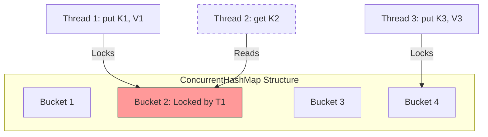

# Concurrent Collections

Standard collections (`HashMap`, `ArrayList`) are **not** thread-safe. Using them in concurrent environments leads to race conditions or `ConcurrentModificationException`.

> **Run Code Example**: [`ConcurrentCollectionsDemo.java`](../../src/main/java/com/ashish/thread/ConcurrentCollectionsDemo.java)

Using `Collections.synchronizedMap()` is a blunt instrument—it locks the *entire* map for every read/write, killing performance.

## 1. ConcurrentHashMap

This is the gold standard for concurrent maps.

- **Non-blocking Reads**: Reads (`get`) never lock. They are extremely fast.
- **Micro-lock Writes**: Writes (`put`) lock only the specific "bucket" (node) where the collision happens, not the whole map.

### Key Methods

- `putIfAbsent(key, value)`: Atomic check-and-set.
- `compute(key, remappingFunction)`: Atomically compute a new value.

### When to use

Always, if you need a shared map in a multithreaded environment.

## 2. CopyOnWriteArrayList

A thread-safe variant of `ArrayList`.

- **Mechanism**: Every time you modify it (`add`, `set`, `remove`), it makes a fresh copy of the *entire* underlying array.
- **Reads**: Extremely fast. They read from the current "snapshot" array without locks.
- **Writes**: Expensive.

### Usage

- **Read-Heavy / Write-Rarely**: Event Listener lists, Configuration lists.
- **Avoid** if you write frequently (the copying cost is O(N)).

## 3. ConcurrentSkipListMap

A thread-safe sorted map (like `TreeMap`).

- Uses a **Skip List** algorithm (probabilistic data structure).
- Provides `O(log n)` time cost for most operations.
- Lock-free implementation (uses CAS).

## Summary Table

| Interface | Single Threaded | Thread Safe (Blocking) | Thread Safe (Concurrent/Fast) |
| :--- | :--- | :--- | :--- |
| **List** | `ArrayList` | `Collections.synchronizedList` | `CopyOnWriteArrayList` |
| **Map** | `HashMap` | `Collections.synchronizedMap` | `ConcurrentHashMap` |
| **SortedMap** | `TreeMap` | `Collections.synchronizedSortedMap` | `ConcurrentSkipListMap` |
