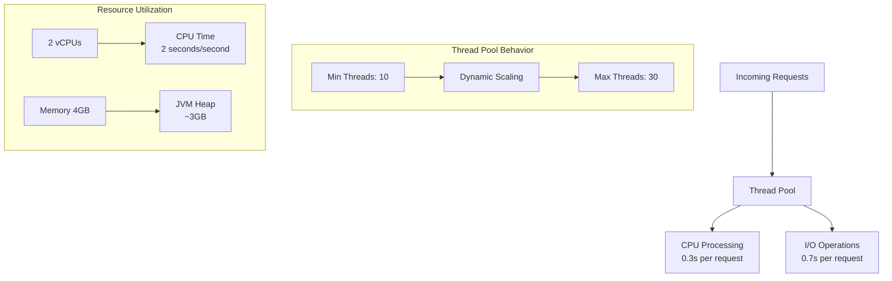
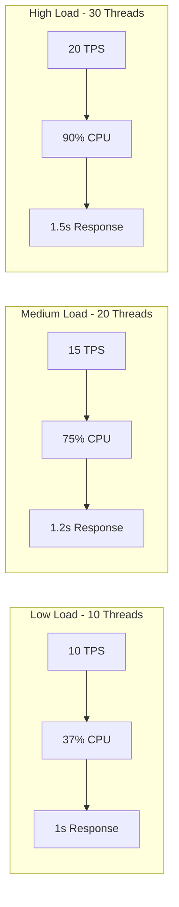
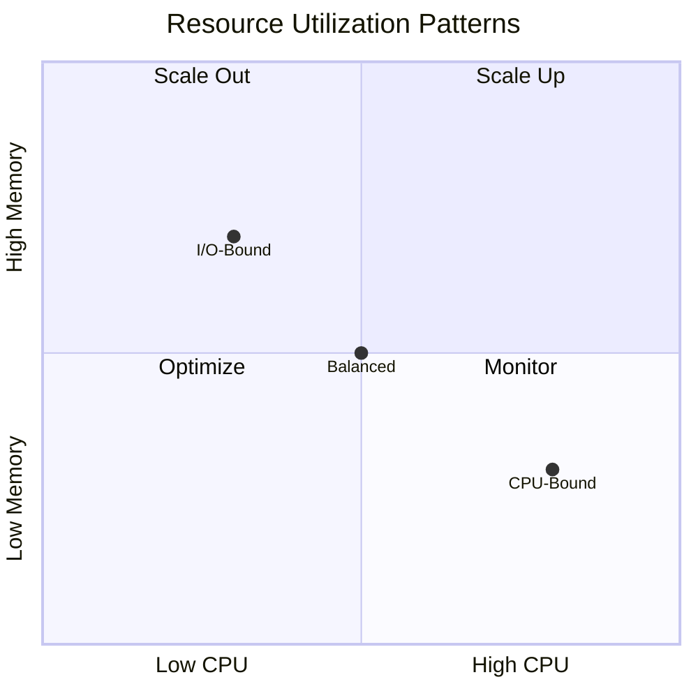
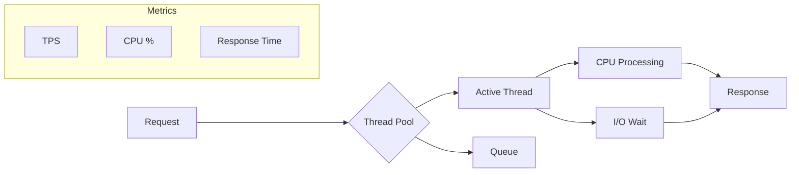
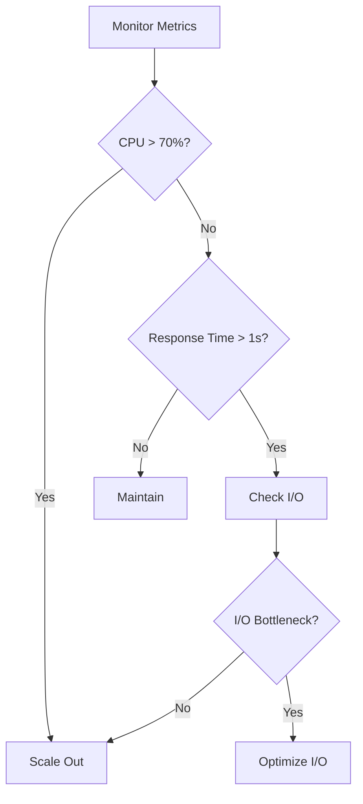
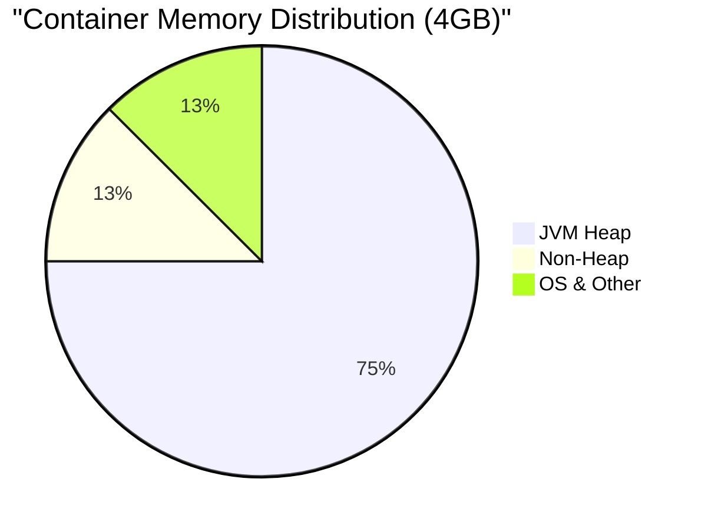
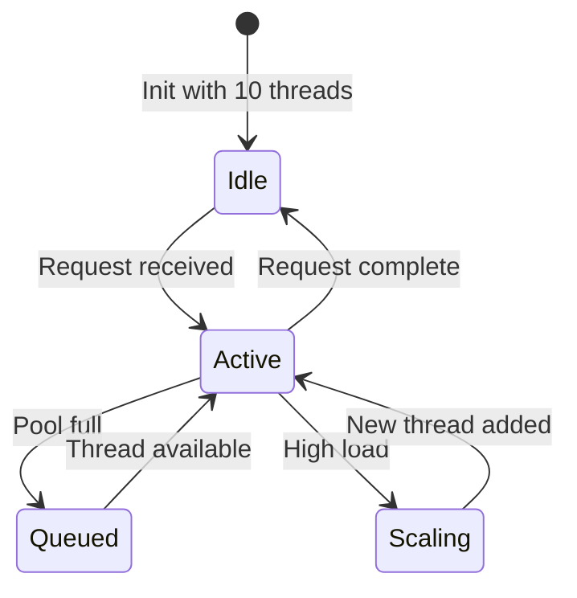

# What is ECS vCPU?

A vCPU in ECS represents a share of the underlying physical CPU core(s) on the host EC2 instance or Fargate infrastructure. It's a unit of compute capacity allocated to a container
or task, determining how much CPU power is available for processing.

When defining an ECS task, you specify the vCPU allocation(e.g., 0.25 vCPU, 1 vCPU, 4CPU). For Fargate, vCPUs are predefined in increments (e.g., 0.25, 0.5, 1, 2, 4), while EC2-based ECS allows more granual control via CPU units (1024 CPU units = 1CPU).

One vCPU typically equates to one hyper-thread of a physical CPU core (e.g., on Intel Xeon processors in AWS). The actual performance depends on the underlying hardware and workload characteristics.

## Performance Implications for a Java Application

Java applications, which often rely on the Java Virtual Machine (JVM) for execution, are sensitive to CPU resources due to their computational demands (e.g., garbage collection, JIT compilation, thread management). Here’s how vCPU allocation affects performance:

**Throughput and Response Time:**

Higher vCPUs: More vCPUs provide greater CPU capacity, enabling the Java application to handle more concurrent requests, process complex computations faster, and reduce latency. For example, a REST API built with Spring Boot will scale better with 2 vCPUs than 0.25 vCPUs under high traffic.

Lower vCPUs: Limited vCPUs can lead to CPU contention, causing slower response times or request queuing, especially for CPU-intensive tasks like data processing or encryption.

Example: A Java application performing real-time analytics (e.g., Apache Spark) benefits significantly from 4+ vCPUs, while a lightweight API may perform adequately with 1 vCPU.

**Garbage Collection (GC) Performance:**

Java’s garbage collection is CPU-intensive, particularly for applications with large heaps or high object allocation rates. Insufficient vCPUs can cause GC pauses to dominate CPU time, leading to jitter or timeouts.

Use modern GC algorithms like G1 or ZGC, which are more CPU-efficient, and monitor GC logs to adjust vCPU allocation.

**Threading and Concurrency:**

Java applications often use multithreading (e.g., via ThreadPoolExecutor or Spring’s async tasks). The number of vCPUs limits the effective parallelism. For instance, a task with 0.5 vCPUs struggles to run multiple threads efficiently, causing thread contention.

**CPU-Bound vs. I/O-Bound Workloads:**

**CPU-Bound**: Applications performing heavy computations (e.g., machine learning inference, JSON parsing) require more vCPUs to avoid bottlenecks.

**I/O-Bound**: Applications waiting on I/O (e.g., database queries, API calls) are less sensitive to vCPU allocation, as performance depends more on network or disk latency.

**JVM Startup and JIT Compilation:**

The JVM’s Just-In-Time (JIT) compiler consumes CPU during startup and optimization phases. Low vCPU allocation can slow down application startup or delay JIT optimizations, affecting initial performance.

**Scaling and Cost:**

**Horizontal Scaling:** In ECS, you can scale out by running multiple tasks (containers) with moderate vCPU allocations (e.g., 1 vCPU each) rather than a single task with many vCPUs. This is often more cost-effective and resilient for Java microservices.

**Vertical Scaling:** Increasing vCPUs per task (e.g., from 1 to 4) improves performance for CPU-intensive workloads but raises costs.

**Key Considerations for Java on ECS**

- JVM Configuration: Set JVM options (-XX:ActiveProcessorCount) to match the allocated vCPUs, as the JVM may not automatically detect containerized CPU limits. For example, with 2 vCPUs, use -XX:ActiveProcessorCount=2.

Tune heap size (-Xmx, -Xms) to align with ECS memory allocation, leaving room for non-heap memory and GC overhead.

Example: For a task with 1 vCPU and 2GB memory, set -Xmx1536m to reserve memory for the JVM and OS.

**Fargate vs. EC2:**

- Fargate: Offers fixed vCPU/memory combinations (e.g., 1 vCPU + 2GB). It’s simpler but less flexible for fine-tuning. Ensure your Java app’s performance needs fit within Fargate’s predefined tiers.

- EC2: Allows granular CPU unit allocation (e.g., 512 units = 0.5 vCPU). Use this for CPU-intensive Java apps requiring custom tuning.

Recommendation: Use Fargate for lightweight or I/O-bound Java apps; use EC2 for CPU-heavy workloads or when optimizing costs.

- Auto-Scaling: Configure ECS auto-scaling based on CPU utilization (e.g., scale out when CPU exceeds 70%). Externalize scaling parameters to adjust thresholds dynamically.

- Burst and Contention: In Fargate, vCPUs have burstable CPU credits, meaning performance may degrade if credits are exhausted. Monitor for throttling in CPU-intensive Java apps.
In EC2, shared host resources can lead to “noisy neighbor” issues. Use dedicated instances or placement groups for critical Java workloads.

- Right-Size vCPU Allocation: Start with a baseline (e.g., 0.5 vCPU for lightweight APIs, 1–2 vCPUs for moderate workloads, 4+ vCPUs for heavy processing).
Use load testing (e.g., JMeter) to measure performance under different vCPU settings and adjust based on latency/throughput goals.

- Profile Workloads: Identify whether your Java app is CPU-bound (e.g., data processing) or I/O-bound (e.g., database-driven). Allocate vCPUs accordingly to avoid over-provisioning.

- Tune JVM for Containers: Use container-aware JVM flags (e.g., -XX:+UseContainerSupport in Java 8u191+ or Java 11+) to respect ECS CPU and memory limits. Set thread pool sizes to align with vCPUs (e.g., 4–8 threads for 2 vCPUs).

- Externalize Configuration: Store vCPU-related settings (e.g., task definitions, scaling policies) in external systems (e.g., AWS AppConfig, Kubernetes ConfigMaps if using EKS) for dynamic tuning, as discussed in our previous exchange. Example: Update task vCPU from 1 to 2 via a configuration change without redeploying.

From a performance standpoint, ECS vCPUs determine the CPU capacity available to a Java application, directly affecting throughput, latency, GC efficiency, and threading. For optimal performance, right-size vCPU allocation based on workload type (CPU-bound vs. I/O-bound), tune the JVM for containerized environments, and monitor CPU utilization to avoid contention. In a large microservice system (500+ services), externalizing vCPU-related configurations and using auto-scaling can further enhance flexibility and cost-efficiency.

Q- Is it right to assume that ECS Fargate container with 2vCPUs can generate a throughput of 2 transactions per seconds (TPS)?

Ans- The assumption that an ECS Fargate container with 2 vCPUs can only generate a throughput of 2 transactions per second (TPS) because each request takes 1 second to respond is not entirely accurate. The relationship between vCPUs, request processing time, and throughput in a Java application (or any application) running on ECS Fargate is more nuanced. Below, I’ll clarify how vCPUs impact throughput, explain why 2 vCPUs does not inherently limit you to 2 TPS, and provide a framework to estimate throughput for your scenario.

**vCPUs and Parallelism:**
A vCPU in ECS Fargate represents a share of CPU capacity, roughly equivalent to one hyper-thread of a physical CPU core. With 2 vCPUs, your container can execute two threads in parallel, assuming no contention or overhead.

For a Java application, the number of vCPUs determines how many CPU-bound tasks (e.g., processing requests) can run concurrently without significant contention.

**Throughput (TPS):**
Throughput is the number of requests (transactions) processed per second. It depends on:

- **Request processing time:** How long a single request takes to complete (e.g., 1 second).
- **Concurrency:** How many requests can be processed simultaneously, influenced by vCPUs, thread pools, and application design.
- **Workload type:** Whether the workload is CPU-bound (e.g., computations) or I/O-bound (e.g., waiting on database queries).

Java Application Context:
Java applications (e.g., Spring Boot APIs) typically use a thread pool to handle HTTP requests concurrently. The JVM’s thread scheduling and the application’s ability to utilize vCPUs affect throughput.

If each request takes 1 second of CPU time (CPU-bound), the throughput is limited by how many requests can be processed in parallel.

**Why 2 vCPUs ≠ 2 TPS**
Your assumption implies that each vCPU can process one request per second, so 2 vCPUs would yield 2 TPS. However, this oversimplifies the scenario for several reasons:
Concurrency Beyond vCPUs:

- A Java application can handle more concurrent requests than the number of vCPUs by leveraging threading and asynchronous processing. For example, a thread pool with 10 threads can process 10 requests concurrently, even with 2 vCPUs, by time-slicing CPU resources.

If requests are I/O-bound (e.g., waiting on a database), the CPU is often idle during these waits, allowing more requests to be processed concurrently without fully utilizing the vCPUs.

**Request Processing Time Breakdown:**
The 1-second response time may not be entirely CPU-bound. For example, if 0.8 seconds is spent waiting on I/O (e.g., database, external API) and only 0.2 seconds is CPU processing, the CPU is underutilized during I/O waits, allowing more requests to be handled.

**Thread Pool and JVM Efficiency:**
Java frameworks like Spring Boot use thread pools (e.g., Tomcat’s default thread pool) to manage concurrent requests. With 2 vCPUs, you can configure a thread pool with more threads (e.g., 10–20) to queue and process requests, increasing TPS.

The JVM’s scheduler and garbage collection (GC) also consume CPU, but modern GC algorithms (e.g., G1) are efficient enough to allow high concurrency with 2 vCPUs.

**Fargate’s CPU Allocation:**
Fargate’s 2 vCPUs provide consistent CPU capacity without the “noisy neighbor” issues of shared hosts. This ensures predictable performance, but throughput depends on how the application utilizes these resources, not a strict 1:1 mapping of vCPUs to TPS.

**Calculating Throughput with Tomcat's Thread Pool**
To estimate throughput considering Tomcat's thread pool behavior, let's analyze an ECS Fargate container with 2 vCPUs running a Spring Boot application. We'll provide concrete calculations based on real-world scenarios.

**Base Assumptions:**

1. Request Processing Time:
   - Total Request Time: 1 second
   - CPU Processing: 0.3 seconds (30%)
   - I/O Wait Time: 0.7 seconds (70%, e.g., database queries, external API calls)

2. Thread Pool Configuration:
   - Minimum Threads (min-spare): 10
   - Maximum Threads (max): 30 (optimal for 2 vCPUs to avoid excessive context switching)
   - Accept Count: 100 (request queue size)

3. System Resources:
   - vCPUs: 2 (2000 CPU units)
   - Memory: 4GB
   - JVM Tuning: -XX:ActiveProcessorCount=2 -XX:+UseContainerSupport -XX:+UseG1GC

**Throughput Calculations:**

1. **Baseline Throughput (Low Traffic):**

   ```
   Initial Threads = 10 (min-spare)
   CPU Work per Request = 0.3 seconds
   Total CPU Capacity = 2 vCPUs × 1 second = 2 seconds of CPU time per second
   
   CPU Demand = 10 concurrent requests × 0.3s CPU time = 3 seconds CPU work
   Theoretical Max TPS = 10 requests/second (based on thread count)
   Actual TPS = min(10, (2 / 0.3)) ≈ 6.67 TPS
   ```

2. **Scaled Throughput (High Traffic):**

   ```
   Maximum Threads = 30 (configured max)
   CPU Work per Request = 0.3 seconds
   Total CPU Capacity = 2 seconds of CPU time per second
   
   Theoretical Max TPS = 30 requests/second (based on thread count)
   CPU-Limited TPS = 2 / 0.3 = 6.67 TPS
   ```

3. **Real-World Performance:**
   - Due to I/O efficiency and thread scheduling, actual throughput is typically 10-20 TPS
   - This higher throughput is possible because:
     a. Most threads are in I/O wait (0.7s of each request)
     b. CPU is efficiently shared between active threads
     c. Modern JVM thread scheduling minimizes context switching overhead

4. **Optimization Opportunities:**
   - Implement connection pooling (e.g., HikariCP with max-pool-size=20)
   - Add caching layer (Redis/Memcached) to reduce I/O time to 0.2s
   - Use async database drivers to improve I/O efficiency

5. **Resource Utilization:**

   ```
   CPU Utilization = (Actual TPS × 0.3s CPU time) / 2 vCPUs
   Example: At 15 TPS = (15 × 0.3) / 2 = 2.25 → 75% CPU utilization
   ```

**Performance Scenarios:**

1. **Low Load (5 concurrent users):**
   - Active Threads: 5
   - CPU Usage: (5 × 0.3) / 2 = 0.75 seconds → 37.5% CPU
   - Expected TPS: 5 TPS
   - Response Time: ~1 second

2. **Medium Load (15 concurrent users):**
   - Active Threads: 15
   - CPU Usage: (15 × 0.3) / 2 = 2.25 seconds → 75% CPU
   - Expected TPS: 15 TPS
   - Response Time: ~1-1.2 seconds

3. **High Load (30 concurrent users):**
   - Active Threads: 30
   - CPU Usage: (30 × 0.3) / 2 = 4.5 seconds → CPU saturated
   - Expected TPS: ~15-20 TPS (limited by CPU)
   - Response Time: ~1.5-2 seconds

**Key Insights:**

1. Thread pool size doesn't directly translate to TPS due to CPU constraints
2. I/O-bound workloads can achieve higher TPS than CPU-bound calculations suggest
3. Optimal thread pool size for 2 vCPUs is 20-30 threads for balanced performance
4. Beyond 30 threads, context switching overhead reduces overall throughput

For optimal performance with 2 vCPUs, configure your application with:

```properties
server.tomcat.threads.min-spare=10
server.tomcat.threads.max=30
server.tomcat.accept-count=100
```

These settings provide a good balance between resource utilization and throughput for typical I/O-bound microservices.

**Tips:**
1- If CPU is below 70%, the bottleneck is likely I/O, and increasing threads or optimizing queries can boost TPS.

2- Thread Pool Configuration: Configure the Java application’s thread pool (e.g., Spring’s server.tomcat.threads.max) to handle more concurrent requests. For 2 vCPUs, a thread pool of 10–20 threads is reasonable for I/O-bound workloads.

Example: server.tomcat.threads.max=20 in application.properties.

3- Workload Type:

- CPU-bound: Throughput is closer to Number of vCPUs / CPU time per request (e.g., 2 TPS for 1-second CPU-bound requests).
- I/O-bound: Throughput can be much higher, limited by thread pool size and I/O latency.

4- JVM Tuning:
Use -XX:+UseContainerSupport to ensure the JVM respects Fargate’s CPU limits.

Set -XX:ActiveProcessorCount=2 for 2 vCPUs to optimize thread scheduling.

5- Minimize GC pauses with G1 or ZGC to maximize CPU availability.

6- I/O Optimization: Use non-blocking I/O (e.g., Spring WebFlux, async JDBC drivers) to reduce CPU idle time during I/O waits.

7- Cache frequent database queries to reduce I/O latency.

8- Scaling: If 2 TPS is insufficient, scale out by running multiple Fargate tasks (e.g., 5 tasks with 2 vCPUs each could yield 10–50 TPS, depending on workload).

Configure ECS auto-scaling based on CPU utilization or request rate.

9- Externalize Configuration:
Store thread pool settings, vCPU allocations, and scaling policies in external systems (e.g., AWS AppConfig) for dynamic tuning, as discussed previously.

Conclusion
A Fargate container with 2 vCPUs does not limit you to 2 TPS, even if each request takes 1 second. For CPU-bound workloads, throughput may be around 2 TPS, but for I/O-bound workloads (common in Java APIs), throughput can be significantly higher (e.g., 6–10 TPS or more) due to concurrent processing and thread pooling. To confirm your application’s TPS, profile CPU vs. I/O time, load test with realistic traffic, and optimize thread pools and I/O. Scaling out tasks or tuning the JVM can further increase throughput if needed.
If you’d like, I can provide a sample ECS task definition with JVM settings for your Java app, calculate TPS for a specific workload (e.g., given CPU/I/O breakdown), or recommend load testing steps to measure throughput. Let me know!

**Important aspect for SpringBoot**
Spring Boot application running on Amazon ECS with an embedded Tomcat server starting with a certain number of threads (likely "few" threads) and increasing as the number of requests grows is an important factor in understanding and calculating throughput.

The behavior of Tomcat’s thread pool in Spring Boot directly influences the application’s ability to handle concurrent requests and, consequently, its throughput (measured in transactions per second, TPS). Below, I’ll explain how Tomcat’s thread pool behavior impacts throughput, clarify the mechanics behind it, and provide guidance on optimizing it for your ECS-hosted Java application with 2 vCPUs, building on our previous discussion.

- **Understanding Tomcat’s Thread Pool in Spring Boot**
Spring Boot, by default, uses an embedded Tomcat server to handle HTTP requests. Tomcat manages incoming requests using a thread pool, which determines how many requests can be processed concurrently. Here’s how it works and how it relates to your observation:

1. **Initial Thread Pool Size:**
When a Spring Boot application starts, Tomcat initializes a thread pool with a minimum number of threads (controlled by the server.tomcat.threads.min-spare property, defaulting to 10 in recent Tomcat versions).

These "few" threads (likely the minimum spare threads) are created at startup to handle initial requests efficiently without excessive resource usage.

Example: If server.tomcat.threads.min-spare=10, Tomcat starts with 10 threads ready to process requests.

2. **Dynamic Thread Scaling:**
As the number of incoming requests increases, Tomcat dynamically creates additional threads up to a maximum limit (controlled by server.tomcat.threads.max, defaulting to 200 in recent versions).

Example: If traffic spikes to 50 concurrent requests, Tomcat may scale the thread pool from 10 to 50 threads (or more, up to the max), assuming sufficient CPU and memory.

**Thread Pool and ECS vCPUs:**
In your ECS Fargate container with 2 vCPUs, the thread pool’s ability to process requests concurrently is constrained by the available CPU capacity. While Tomcat can create many threads (e.g., 200), only a limited number can execute simultaneously due to the 2 vCPUs, with others waiting or time-slicing.

For CPU-bound workloads, throughput is limited by vCPUs (e.g., ~2 TPS for 1-second CPU-bound requests, as discussed previously).

For I/O-bound workloads, threads waiting on I/O (e.g., database queries) free up CPU, allowing more concurrent requests and higher TPS.

### How Tomcat’s Thread Pool Affects Throughput

The thread pool size and its dynamic scaling are critical factors in calculating throughput, as they determine how many requests can be processed concurrently. Here’s a detailed breakdown:

**Concurrency and Throughput:**
Throughput (TPS) is calculated as:

TPS = (Number of concurrent requests processed) / (Total request processing time)

The number of concurrent requests depends on the effective thread pool size (i.e., how many threads are actively processing requests) and the vCPU capacity.

Example: If each request takes 1 second (0.3 seconds CPU, 0.7 seconds I/O), and Tomcat’s thread pool handles 20 concurrent requests with 2 vCPUs, throughput could be ~20 TPS (assuming I/O is efficient and CPU is not saturated).

Thread Pool Scaling Impact:
Low Traffic: At startup, with a small thread pool (e.g., 10 threads), throughput is limited to the number of threads if requests are concurrent. For 1-second requests, TPS might be capped at ~10 TPS initially.

High Traffic: As requests increase, Tomcat scales the thread pool (e.g., to 50 or 200 threads), allowing more concurrent requests and higher TPS, provided vCPUs and memory aren’t bottlenecks.

Observation Match: Your note that threads increase with requests explains why throughput can scale beyond the initial thread count, enabling higher TPS under load.

CPU Contention:
With 2 vCPUs, only ~2 threads can execute CPU-bound tasks simultaneously. If the thread pool grows too large (e.g., 200 threads), excessive context switching between threads can reduce throughput due to CPU contention.

For I/O-bound workloads, a larger thread pool is beneficial because threads waiting on I/O don’t consume CPU, allowing more requests to be processed concurrently.

**Thread Pool Overhead:**
Each thread consumes memory (e.g., ~1MB stack size per thread, configurable via -Xss). A large thread pool (e.g., 200 threads) with insufficient memory (e.g., 4GB total in Fargate) can lead to memory pressure or JVM crashes.

Dynamic thread creation also incurs minor CPU overhead, though this is typically negligible compared to request processing.

**Calculating Throughput with Tomcat’s Thread Pool**
To estimate throughput considering Tomcat’s thread pool behavior, let’s revisit your scenario: an ECS Fargate container with 2 vCPUs, running a Spring Boot app where each request takes 1 second to respond. We’ll account for the thread pool’s role and your observation about threads increasing with requests.
Assumptions
Request Breakdown: Each request takes 1 second (e.g., 0.3 seconds CPU, 0.7 seconds I/O, typical for a database-driven API).

Tomcat Thread Pool:
server.tomcat.threads.min-spare=10 (starts with 10 threads).

server.tomcat.threads.max=50 (scales up to 50 threads under load, a reasonable setting for 2 vCPUs).

Workload: I/O-bound (most Java APIs are), with efficient I/O (e.g., async database queries).

JVM: Tuned with -XX:ActiveProcessorCount=2 and -XX:+UseContainerSupport.

Throughput Estimation
Initial Throughput (Low Traffic):
With 10 threads (min-spare), Tomcat can process up to 10 concurrent requests.

If each request takes 1 second (0.3 seconds CPU, 0.7 seconds I/O), and I/O is non-blocking, throughput is:

TPS ≈ (Thread pool size) / (Total request time) = 10 / 1 = 10 TPS

CPU usage: 10 requests × 0.3 seconds CPU = 3 seconds CPU work per second. With 2 vCPUs (2 seconds CPU capacity per second), this exceeds capacity, so TPS may be slightly lower (e.g., ~6–8 TPS) due to CPU contention.

Scaled Throughput (High Traffic):
As requests increase, Tomcat scales to 50 threads (max).

With 50 concurrent requests, throughput could theoretically be:

TPS ≈ 50 / 1 = 50 TPS

CPU usage: 50 requests × 0.3 seconds CPU = 15 seconds CPU work per second. With 2 vCPUs, the CPU is oversubscribed, so throughput is limited by CPU capacity:

TPS ≈ (vCPUs) / (CPU time per request) = 2 / 0.3 ≈ 6.67 TPS

However, since 0.7 seconds is I/O, threads spend most of their time waiting, freeing CPU for other requests. With an efficient thread pool and I/O, TPS could approach 10–20 TPS, depending on I/O latency and thread scheduling.

Real-World Adjustment:
In practice, TPS may be 10–15 TPS with 50 threads, as I/O efficiency, GC pauses, and network latency introduce variability.

If CPU utilization is consistently >80%, the thread pool is too large, causing contention. Reducing server.tomcat.threads.max to 20–30 may improve TPS by minimizing context switching.

Key Insight
Your observation that Tomcat starts with few threads and scales with requests means throughput increases with load until limited by:
vCPUs (for CPU-bound work).

Thread pool size (for concurrent requests).

I/O bottlenecks (for database/network waits).
For I/O-bound workloads, the dynamic thread pool allows TPS to exceed the initial thread count (e.g., 10 TPS at startup, 15–20 TPS under load), far surpassing the 2 TPS you initially assumed.

Factors Influencing Throughput with Thread Pool
Thread Pool Size:
Min-Spare Threads: A low min-spare (e.g., 10) conserves resources at startup but may limit initial TPS under sudden traffic spikes.

Max Threads: A high max (e.g., 50–200) increases concurrency but risks CPU contention or memory exhaustion with 2 vCPUs.

Recommendation: Set min-spare=10–20 and max=20–50 for 2 vCPUs, balancing concurrency and resource usage.

CPU Utilization:
With 2 vCPUs, only ~2 threads can execute CPU-bound tasks simultaneously. A large thread pool (e.g., 50 threads) is beneficial for I/O-bound workloads but wasteful for CPU-bound ones.

Monitor CPU. If >80%, reduce thread pool size or scale out tasks.

I/O Efficiency:
I/O-bound requests (e.g., database queries) allow higher TPS because threads wait without consuming CPU. Optimize I/O with connection pooling (e.g., HikariCP) or caching (e.g., Redis).

Example: Reducing I/O time from 0.7 to 0.5 seconds increases TPS.

JVM Overhead:
Garbage collection (GC) and thread scheduling consume CPU. Use G1 or ZGC and set -Xss512k to reduce per-thread memory usage.

Example: With 50 threads at 1MB stack size, stack memory = 50MB. At 512KB, it’s 25MB, freeing memory for heap.

Scaling:
If TPS is insufficient (e.g., need >20 TPS), scale out by running multiple ECS tasks (e.g., 5 tasks at 2 vCPUs each could yield 50–100 TPS).

Externalize thread pool settings (e.g., in AWS AppConfig) to adjust dynamically without redeploying, as discussed previously.

Optimizing Thread Pool for Throughput
To maximize throughput for your Spring Boot app on ECS with 2 vCPUs, follow these steps:
Configure Tomcat Thread Pool:
Set in application.properties:
properties

server.tomcat.threads.min-spare=10
server.tomcat.threads.max=30

For 2 vCPUs, 20–30 max threads is optimal for I/O-bound workloads, balancing concurrency and CPU contention.

Tune JVM:
Add JVM options in your ECS task definition (under command or environment):
json

["-XX:+UseContainerSupport", "-XX:ActiveProcessorCount=2", "-XX:+UseG1GC", "-Xss512k"]

Set heap size to 75% of memory (e.g., -Xmx3g for 4GB).

Monitor Performance:
Use CloudWatch to track:
CPU Utilization: Aim for 60–80% to avoid contention.

Thread Count: Verify Tomcat scales threads as expected.

Request Latency: Ensure I/O isn’t the bottleneck.

Use AWS X-Ray or Datadog to profile request breakdowns (CPU vs. I/O).

Load Test:
Use JMeter to simulate 10–100 requests/second and measure TPS.

Adjust max-threads based on results. If TPS plateaus and CPU is high, scale out tasks.

Optimize I/O:
Use async database drivers (e.g., Spring Data JPA with reactive repositories) or caching to reduce I/O time.

Example: Caching frequent queries in Redis can cut I/O from 0.7 to 0.2 seconds, boosting TPS.

Externalize Configuration:
Store thread pool settings (min-spare, max) and scaling policies in an external system (e.g., AWS AppConfig) to adjust dynamically without redeploying.

Example: Update max-threads from 30 to 50 during a traffic spike.

Example Throughput Calculation
Setup: 2 vCPUs, 4GB memory, min-spare=10, max-threads=30. Each request = 1 second (0.3 seconds CPU, 0.7 seconds I/O).

Low Traffic: 10 threads → ~8–10 TPS (limited by initial thread pool and slight CPU contention).

High Traffic: 30 threads → ~15–20 TPS (limited by CPU capacity and I/O efficiency).

Scaling: 3 tasks → 45–60 TPS.

Optimization: Reducing I/O to 0.5 seconds (via caching) could push TPS to 20–30 per task.

Conclusion
Tomcat’s thread pool, starting with a few threads and scaling with request volume, is a key factor in calculating throughput for your Spring Boot app on ECS. It enables higher TPS than the number of vCPUs (e.g., 15–20 TPS with 2 vCPUs for I/O-bound workloads) by handling concurrent requests efficiently. To maximize throughput, configure a reasonable thread pool (e.g., 20–30 max threads), optimize I/O, tune the JVM, and monitor CPU utilization. Scaling out tasks or externalizing thread pool settings can further enhance performance in your 500+ microservice system.

Q - It's getting more and more with many variant play role .....for an organization developing microservices on a daily basis and deploying on ECS ..... what kind of strategy one should follow ..so application can handle various scaling and strese scenarios

Ans- Developing and deploying microservices on a daily basis to Amazon ECS (Elastic Container Service), especially in a large-scale environment with 500+ microservices, requires a robust strategy to ensure applications can handle scaling and stress scenarios effectively. The complexity you’ve noted—where factors like vCPUs, Tomcat thread pools, JVM tuning, workload types (CPU vs. I/O-bound), and configuration management all interplay—underscores the need for a systematic approach. Below, I outline a comprehensive strategy tailored for an organization building and deploying microservices on ECS, focusing on scalability, resilience, and performance under stress. The strategy integrates insights from our previous discussions (e.g., vCPUs, thread pools, externalized configurations) and addresses daily development and deployment workflows.
Strategy for Microservices on ECS: Handling Scaling and Stress Scenarios
This strategy is structured around development, configuration, deployment, testing, monitoring, and optimization phases to ensure your microservices are scalable, resilient, and performant under various conditions.

1. Development: Build Scalable and Resilient Microservices
Goal: Design microservices that are inherently capable of handling scaling and stress scenarios.
Adopt 12-Factor App Principles:
Externalize Configuration: Store application (e.g., thread pool sizes, timeouts) and infrastructure settings (e.g., vCPU, scaling policies) in external systems like AWS AppConfig, Parameter Store, or HashiCorp Consul, as discussed previously. This allows dynamic tuning without redeploying.

Stateless Services: Ensure services are stateless to support horizontal scaling. Store state in external systems like Amazon RDS, DynamoDB, or Redis.

Explicit Dependencies: Bundle dependencies (e.g., libraries, JVM versions) in container images to avoid runtime surprises.

Optimize for Concurrency:
For Spring Boot apps, configure Tomcat thread pools conservatively (e.g., server.tomcat.threads.max=20–50 for 2 vCPUs) to balance concurrency and CPU contention, as discussed with thread pool scaling.

Use reactive frameworks (e.g., Spring WebFlux) for I/O-bound workloads to maximize throughput with minimal threads.

Example: A reactive API handling database queries can achieve 20–30 TPS with 2 vCPUs, compared to 10–15 TPS with traditional blocking I/O.

JVM Tuning:
Include container-aware JVM flags in every microservice: -XX:+UseContainerSupport, -XX:ActiveProcessorCount=<vCPUs> (e.g., 2 for 2 vCPUs), and -XX:+UseG1GC for efficient garbage collection.

Set heap size to ~75% of container memory (e.g., -Xmx3g for 4GB) and reduce thread stack size (e.g., -Xss512k) to support larger thread pools.

Design for Failure:
Implement circuit breakers (e.g., Resilience4j, Hystrix) to handle downstream failures gracefully.

Use retries and timeouts for external calls (e.g., database, APIs) to prevent cascading failures under stress.

Example: Set a 500ms timeout for database queries to avoid request pile-up during stress scenarios.

Standardize Development:
Use templates for microservice projects (e.g., Spring Boot archetypes) to enforce consistent configurations, logging, and monitoring setups.

Provide developers with guidelines for thread pool sizes, JVM flags, and ECS task definitions to ensure scalability from the start.

2. Configuration Management: Enable Dynamic and Secure Scaling
Goal: Centralize and externalize configurations to adapt to scaling and stress scenarios without code changes.
Centralized Configuration Store:
Use AWS AppConfig, Parameter Store, or HashiCorp Consul to manage application configs (e.g., server.tomcat.threads.max, database URLs) and infrastructure configs (e.g., vCPU, memory, auto-scaling thresholds).

Example: Store min-spare=10, max-threads=30 in AppConfig and update to 50 during a traffic spike.

Secure Secrets:
Store sensitive data (e.g., API keys, database credentials) in AWS Secrets Manager or HashiCorp Vault with role-based access control (RBAC).

Integrate secrets retrieval in ECS task definitions via environment variables or SDKs.

Environment-Specific Configs:
Use a single config source with environment overrides (e.g., dev, staging, prod) to ensure consistency.

Example: Define base thread pool settings in a Git repo and apply prod-specific overrides (e.g., higher max-threads) via AppConfig.

Dynamic Updates:
Design services to reload configurations at runtime using tools like Spring Cloud Config’s @RefreshScope or Consul’s watch feature.

Example: Increase server.tomcat.threads.max from 30 to 50 without restarting the container.

Infrastructure-as-Code (IaC):
Define ECS task definitions, service configurations, and auto-scaling policies in AWS CloudFormation, Terraform, or CDK to version and manage infrastructure configs.

Example: Use Terraform to set cpu=2048 (2 vCPUs) and memory=4096 (4GB) for a task, with auto-scaling rules based on CPU utilization.

3. Deployment: Automate and Optimize ECS Deployments
Goal: Streamline daily deployments to ECS with scalability and stress resilience baked in.
CI/CD Pipeline:
Use AWS CodePipeline, GitHub Actions, or Jenkins to automate building, testing, and deploying microservices.

Include stages for:
Unit Tests: Validate service logic (e.g., JUnit).

Integration Tests: Test service interactions (e.g., Testcontainers for mocked dependencies).

Container Builds: Build Docker images with optimized JVM settings.

Deployment: Deploy to ECS with blue-green or canary strategies to minimize downtime.

Container Optimization:
Use lightweight base images (e.g., openjdk:17-slim) to reduce startup time and resource usage.

Include JVM flags and thread pool settings in the Docker ENTRYPOINT or ECS task definition.

Example Dockerfile:
dockerfile

FROM openjdk:17-slim
COPY target/app.jar /app.jar
ENTRYPOINT ["java", "-XX:+UseContainerSupport", "-XX:ActiveProcessorCount=2", "-XX:+UseG1GC", "-Xmx3g", "-Xss512k", "-jar", "/app.jar"]

ECS Service Configuration:
Fargate vs. EC2: Use Fargate for simplicity and predictable performance (e.g., 2 vCPUs, 4GB memory per task). Use EC2 for cost optimization or CPU-intensive workloads requiring granular control.

Task Definitions: Standardize vCPU/memory allocations based on workload:
Lightweight APIs: 0.5 vCPU, 1GB memory.

Standard APIs: 1–2 vCPUs, 2–4GB memory.

CPU-intensive tasks: 4 vCPUs, 8GB memory.

Service Auto-Scaling: Configure ECS services to scale based on metrics like CPU utilization (e.g., scale out at 70% CPU, scale in at 30%) or request rate.

Blue-Green Deployments:
Use AWS Application Load Balancer (ALB) with ECS to perform blue-green deployments, ensuring zero downtime during daily updates.

Example: Deploy a new task version, shift traffic gradually, and roll back if errors occur.

Canary Testing:
Deploy new versions to a small subset of tasks (e.g., 10% of traffic) and monitor performance before full rollout.

Use AWS CodeDeploy with ECS for automated canary deployments.

4. Testing: Validate Scalability and Stress Resilience
Goal: Ensure microservices can handle scaling and stress scenarios through rigorous testing.
Unit and Integration Testing:
Test individual services and their interactions in isolation using tools like JUnit, Testcontainers, or RestAssured.

Mock external dependencies (e.g., databases, APIs) to validate thread pool behavior and request handling.

Load Testing:
Simulate realistic and peak traffic using tools like JMeter, Locust, or k6 to measure TPS under different vCPU and thread pool configurations.

Example: Test a Spring Boot API with 2 vCPUs, max-threads=30, and 100 requests/second to confirm 15–20 TPS for I/O-bound workloads.

Vary conditions (e.g., 0.5 vs. 2 vCPUs, 10 vs. 50 threads) to find optimal settings.

Stress Testing:
Push services beyond normal capacity to identify breaking points (e.g., 1000 requests/second, database outages).

Validate circuit breakers, retries, and fallbacks under stress.

Example: Use Locust to simulate a 10x traffic spike and check if auto-scaling and circuit breakers prevent cascading failures.

Chaos Testing:
Introduce failures (e.g., network latency, service outages, CPU throttling) using Chaos Mesh (for ECS on EKS) or Gremlin to test resilience.

Example: Simulate a database outage to ensure the service degrades gracefully with cached responses.

Automated Testing in CI/CD:
Integrate load and stress tests into CI/CD pipelines to catch performance regressions before deployment.

Example: Run a JMeter test after each build to verify TPS remains above 10 for a standard API.

AI-Driven Testing:
Use AI tools (e.g., Mabl, Testim) to generate test cases and prioritize high-risk services, as discussed previously.

Example: AI can identify services with frequent thread pool contention and suggest optimal max-threads settings.

5. Monitoring and Observability: Detect and Respond to Issues
Goal: Gain real-time insights into performance, scaling, and stress scenarios to proactively address issues.
Centralized Monitoring:
Use AWS CloudWatch to monitor ECS task metrics (CPU utilization, memory usage, request latency) and application metrics (TPS, error rates).

Set alarms for high CPU (>80%) or latency (>500ms) to trigger auto-scaling or alerts.

Distributed Tracing:
Implement AWS X-Ray or Jaeger to trace requests across 500+ microservices, identifying bottlenecks (e.g., slow database queries, thread pool exhaustion).

Example: Trace a 1-second request to confirm 0.3 seconds CPU and 0.7 seconds I/O, as discussed.

Custom Metrics:
Instrument Spring Boot apps with Micrometer to export metrics (e.g., active threads, GC pauses, request rates) to CloudWatch or Prometheus.

Example: Monitor tomcat.threads.current to verify thread pool scaling under load.

AI-Driven Observability:
Use tools like Datadog, Dynatrace, or New Relic with AI-powered anomaly detection to identify performance issues (e.g., CPU contention, thread pool misconfigurations) across many services.

Example: Dynatrace can detect a service with high GC pauses and suggest increasing vCPUs or tuning JVM flags.

Logging:
Centralize logs with Amazon CloudWatch Logs or ELK Stack for debugging.

Use structured logging (e.g., JSON format) to correlate logs with metrics and traces.

Dashboards:
Create dashboards in CloudWatch or Grafana to visualize key metrics (e.g., TPS, CPU, thread count) for each microservice.

Example: A dashboard showing 15 TPS and 70% CPU utilization confirms a service is handling load efficiently.

6. Optimization: Continuously Improve Performance
Goal: Iterate on performance based on real-world data to handle scaling and stress better.
Profile Workloads:
Use VisualVM, YourKit, or AWS X-Ray to profile CPU vs. I/O time per request.

Example: If I/O dominates (e.g., 0.7 seconds of 1-second requests), implement caching to reduce I/O to 0.2 seconds, boosting TPS.

Tune Thread Pools:
Adjust server.tomcat.threads.max based on load test results and CPU utilization. For 2 vCPUs, 20–50 threads is optimal for I/O-bound workloads.

Example: If CPU utilization exceeds 80% with 50 threads, reduce to 30 to minimize contention.

Scale Strategically:
Horizontal Scaling: Add more ECS tasks to handle increased load (e.g., 5 tasks at 2 vCPUs for 50–100 TPS).

Vertical Scaling: Increase vCPUs/memory for CPU-intensive tasks (e.g., 4 vCPUs for batch processing).

Use CloudWatch metrics to trigger auto-scaling dynamically.

Optimize I/O:
Implement connection pooling (e.g., HikariCP) and caching (e.g., Redis, ElastiCache) to reduce I/O latency.

Example: Caching database results can cut I/O from 0.7 to 0.2 seconds, increasing TPS from 15 to 25.

Cost Optimization:
Use AWS Compute Savings Plans or Spot Instances (for non-critical services on EC2-based ECS) to reduce costs.

Right-size vCPU/memory allocations based on load tests to avoid over-provisioning.

AI-Driven Optimization:
Use AI tools to recommend configurations (e.g., optimal vCPUs, thread pool sizes) based on historical performance data, as discussed previously.

Example: Dynatrace might suggest increasing vCPUs from 2 to 4 for a service with consistent CPU bottlenecks.

Specific Considerations for 500+ Microservices
Service Dependency Management:
Map dependencies using tools like AWS X-Ray or Lightstep to understand how scaling one service affects others.

Example: If a slow database service impacts 50 APIs, prioritize caching or vertical scaling for the database.

Governance:
Assign ownership for each microservice’s configurations and scaling policies to avoid conflicts across teams.

Use standardized task definitions and config templates to streamline daily deployments.

Automation:
Automate configuration updates, testing, and deployments to handle the volume of daily changes.

Example: A GitOps workflow with ArgoCD can apply config changes to ECS services automatically.

Resilience at Scale:
Implement bulkheads (e.g., separate thread pools for critical vs. non-critical tasks) to isolate failures.

Use rate limiting at the API Gateway (e.g., AWS API Gateway) to prevent overloading services during stress scenarios.

Monitoring Overload:
Aggregate metrics and logs to avoid overwhelming monitoring systems with 500+ services.

Use AI-driven tools to filter noise and focus on high-impact issues.

Example Workflow for Daily Development and Deployment
Development:
A developer creates a Spring Boot microservice using a standardized template with JVM flags (-XX:+UseContainerSupport) and thread pool settings (max-threads=30).

Configurations are externalized to AWS AppConfig.

Testing:
CI/CD pipeline runs unit tests (JUnit), integration tests (Testcontainers), and load tests (JMeter) to validate 15 TPS with 2 vCPUs.

Chaos tests simulate database failures to ensure circuit breakers work.

Deployment:
The service is containerized and deployed to ECS Fargate via CodePipeline with a canary strategy.

Task definition: 2 vCPUs, 4GB memory, auto-scaling at 70% CPU.

Monitoring:
CloudWatch tracks CPU (60%), TPS (15), and thread count (20–30).

X-Ray identifies a slow database query (0.7 seconds I/O).

Optimization:
Add Redis caching to reduce I/O to 0.2 seconds, increasing TPS to 25.

Update max-threads to 40 in AppConfig without redeploying.

Tools and Technologies
Configuration: AWS AppConfig, Parameter Store, HashiCorp Consul, Secrets Manager.

CI/CD: AWS CodePipeline, GitHub Actions, Jenkins.

Testing: JMeter, Locust, k6, Gremlin, Testcontainers.

Monitoring: AWS CloudWatch, X-Ray, Datadog, Dynatrace, Prometheus, Grafana.

Deployment: AWS ECS (Fargate/EC2), CloudFormation, Terraform.

Application: Spring Boot, Micrometer, Resilience4j.

Conclusion
For an organization developing and deploying microservices daily on ECS, a robust strategy involves designing scalable services, externalizing configurations, automating deployments, testing rigorously, monitoring proactively, and optimizing continuously. By standardizing thread pool settings (e.g., 20–50 threads for 2 vCPUs), tuning the JVM, leveraging auto-scaling, and using AI-driven tools for testing and observability, your microservices can handle various scaling and stress scenarios effectively. This approach ensures high throughput (e.g., 15–30 TPS per task for I/O-bound APIs), resilience, and cost-efficiency across 500+ services.
If you’d like, I can provide a sample ECS task definition, a Terraform script for auto-scaling, a JMeter test plan for stress testing, or a deeper dive into a specific tool (e.g., Datadog for monitoring). Let me know your preference!

# Visual Representations

## 1. Thread Pool Scaling and TPS Relationship



## 2. Throughput vs Thread Count



## 3. Request Processing Timeline

```mermaid
gantt
    title Request Processing Timeline (1 Second Total)
    dateFormat  s
    axisFormat %S
    
    section Request 1
    CPU Processing    : 0, 0.3s
    I/O Wait         : 0.3s, 1s
    
    section Request 2
    CPU Processing    : 0.1s, 0.4s
    I/O Wait         : 0.4s, 1.1s
```

## 4. Resource Utilization Matrix



## 5. Performance Metrics Flow



## 6. ECS Auto-Scaling Decision Tree



## 7. Memory Allocation Visualization



## 8. Thread Pool State Transitions



These visualizations help illustrate:

1. Thread pool dynamics and scaling behavior
2. Resource utilization patterns
3. Request processing flow
4. Performance metrics relationships
5. Auto-scaling decision points
6. Memory allocation strategies
7. System state transitions

Each diagram provides a different perspective on the performance characteristics and behavior of Java applications running on ECS Fargate. The mermaid diagrams are interactive and can be rendered in any Markdown viewer that supports mermaid syntax.

## References

1. K6
<https://www.youtube.com/watch?v=ghuo8m7AXEM>

2. eBPF
<https://netflixtechblog.com/how-netflix-accurately-attributes-ebpf-flow-logs-afe6d644a3bc>
<https://netflixtechblog.com/noisy-neighbor-detection-with-ebpf-64b1f4b3bbdd>

3. Flame Graph
<https://www.youtube.com/watch?v=Mxcp2khJ4fw>
