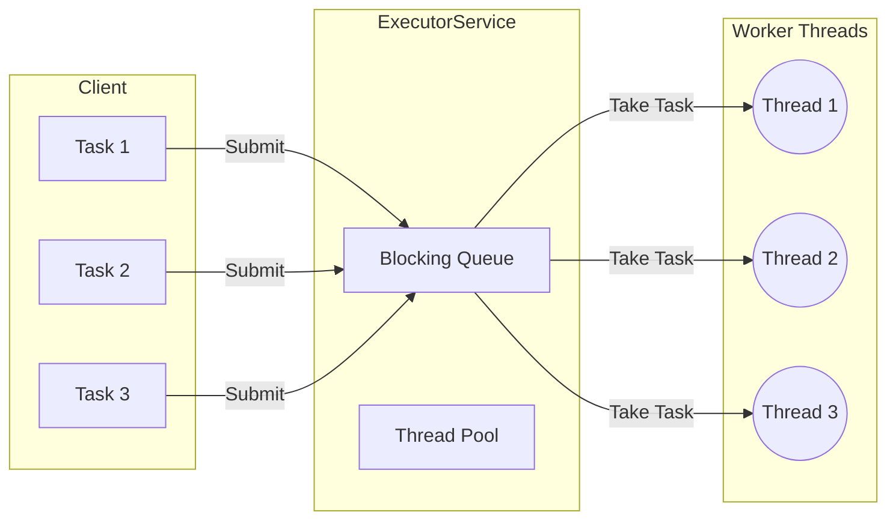

# ExecutorService & Thread Pools

Before Java 5, developers had to manually manage threads using `new Thread()`. This was error-prone and expensive (resource-wise). The **Executor Framework** (Java 5) introduced `ExecutorService` to decouple task submission from task execution.

> **Run Code Example**: [`ExecutorServiceDemo.java`](../../src/main/java/com/ashish/thread/ExecutorServiceDemo.java)

## 1. The Problem with `new Thread()`

- **High Creation Cost**: Creating a thread requires OS resources. Doing this for every short-lived task is inefficient.
- **No Regulation**: If you create thousands of threads, you can crash the JVM (Out of Memory).
- **Poor Management**: No built-in way to restart failed threads or wait for a group of threads to complete.

## 2. The Solution: Thread Pools

An `ExecutorService` manages a pool of threads. You just submit tasks, and the pool executes them using available threads.



```java
// OLD WAY
new Thread(() -> System.out.println("Job 1")).start();

// NEW WAY (ExecutorService)
ExecutorService executor = Executors.newFixedThreadPool(10);
executor.submit(() -> System.out.println("Job 1"));
```

## 3. Common Executors

The `Executors` factory class provides common configurations:

| Factory Method | Description | Use Case |
| :--- | :--- | :--- |
| `newFixedThreadPool(n)` | Reuses a fixed number of threads. If all are busy, tasks queue up. | Predictable load, servers. |
| `newCachedThreadPool()` | Creates new threads as needed, but reuses them if available. Threads die after 60s of idleness. | Short-lived asynchronous tasks. **Dangerous** for heavy loads (can spawn infinite threads). |
| `newSingleThreadExecutor()` | Uses a single worker thread. Tasks are guaranteed to execute sequentially. | Event loops, ensuring order. |
| `newScheduledThreadPool(n)` | Can schedule commands to run after a delay or periodically. | Background maintenance, poller. |
| `newVirtualThreadPerTaskExecutor()` | **(Java 21+)** Creates a new Virtual Thread for *every* task. No pooling. | High-concurrency I/O tasks. (See [VirtualThread.md](./VirtualThread.md)) |

## 4. Runnable vs Callable

- **`Runnable`**: Older interface. Returns `void`. Cannot throw checked exceptions.
- **`Callable<T>`**: Returns a result (`T`). Can throw exceptions.

```java
// Runnable
executor.submit(() -> System.out.println("Done"));

// Callable
Future<String> future = executor.submit(() -> {
    Thread.sleep(1000);
    return "Result";
});
```

## 5. The limit of `Future`

Submitting a `Callable` returns a `java.util.concurrent.Future`.

```java
Future<String> future = executor.submit(() -> compute());

// ... do other work ...

try {
    String result = future.get(); // BLOCKS! Waits until task is done
} catch (Exception e) {
    e.printStackTrace();
}
```

**Limitation**: `future.get()` is a **blocking** call. You cannot say "When this finishes, run that". This limitation led to the creation of **CompletableFuture** in Java 8.

## 6. Lifecycle Management

An `ExecutorService` stays alive until you explicitly shut it down. If you forget, your JVM might not exit!

```java
executor.shutdown(); // 1. Stop accepting new tasks

try {
    // 2. Wait for running tasks to finish
    if (!executor.awaitTermination(60, TimeUnit.SECONDS)) {
        executor.shutdownNow(); // 3. Force cancel if they take too long
    }
} catch (InterruptedException e) {
    executor.shutdownNow();
}
```

## 7. Best Practices

1. **Always Shutdown**: Use `try-finally` or (in Java 19+) utilize the `AutoCloseable` nature of Executors (but only for `newVirtualThreadPerTaskExecutor` usually, or structured concurrency). For legacy pools, ensure `shutdown()` is called.
2. **Name Your Threads**: Default names (`pool-1-thread-1`) are useless in logs. Use a customized `ThreadFactory`.

    ```java
    ThreadFactory factory = Thread.ofPlatform().name("worker-", 1).factory();
    ExecutorService executor = Executors.newFixedThreadPool(10, factory);
    ```

3. **Avoid CachedThreadPool in Prod**: Unbounded thread creation can crash your server. Use Fixed or Semaphore-bounded pools.
