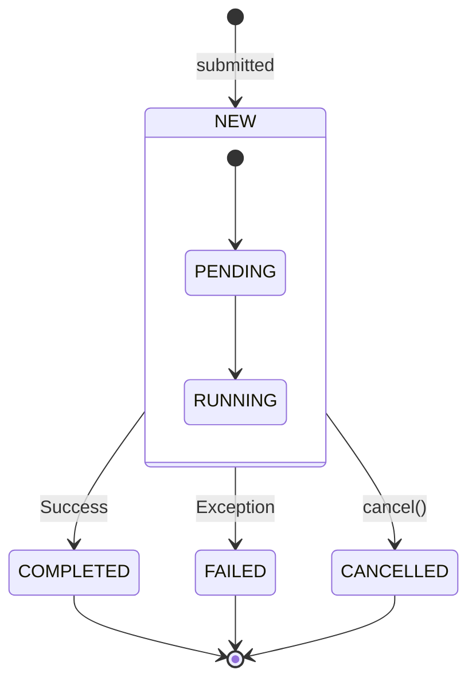

# Future: The Async Placeholder

A **Future** represents the result of an asynchronous computation. Since the task runs in a separate thread, we can't get the value immediately. The `Future` is a handle (a ticket) to retrieve that value once it's ready.

## 1. The Concept

Imagine ordering food at a restaurant.

1. You place an order.
2. The waiter gives you a **Receipt (Future)**.
3. You sit and wait (or do something else).
4. When food is ready, the waiter brings it to you (Completing the Future).



## 2. Using Future

You get a `Future` when you submit a `Callable` to an `ExecutorService`.

```java
ExecutorService executor = Executors.newFixedThreadPool(1);

Future<Integer> future = executor.submit(() -> {
    Thread.sleep(1000); // Simulate work
    return 42;
});

// Do other work here...
System.out.println("Waiting for result...");

try {
    Integer result = future.get(); // BLOCKS until ready
    System.out.println("Got: " + result);
} catch (Exception e) {
    e.printStackTrace();
}
```

## 3. Key Methods

| Method | Description |
| :--- | :--- |
| `get()` | **Blocks** the current thread until the result is available. Throws exceptions if the task failed. |
| `get(time, unit)` | Blocks only for the specified time, then throws `TimeoutException`. |
| `cancel(interrupt)` | Attempts to stop the task. |
| `isDone()` | Returns `true` if completed (success, failure, or cancellation). |
| `isCancelled()` | Returns `true` if it was cancelled before completion. |

## 4. The Limitation

The biggest issue with `java.util.concurrent.Future` (Java 5) is that `get()` is **blocking**.

- You cannot tell it: *"Run callback X when finished"*.
- You have to sit and wait, or constantly poll `isDone()`.

**Solution**: Use **[CompletableFuture](./CompletableFuture.md)** (Java 8) for non-blocking, callback-driven async flows.
