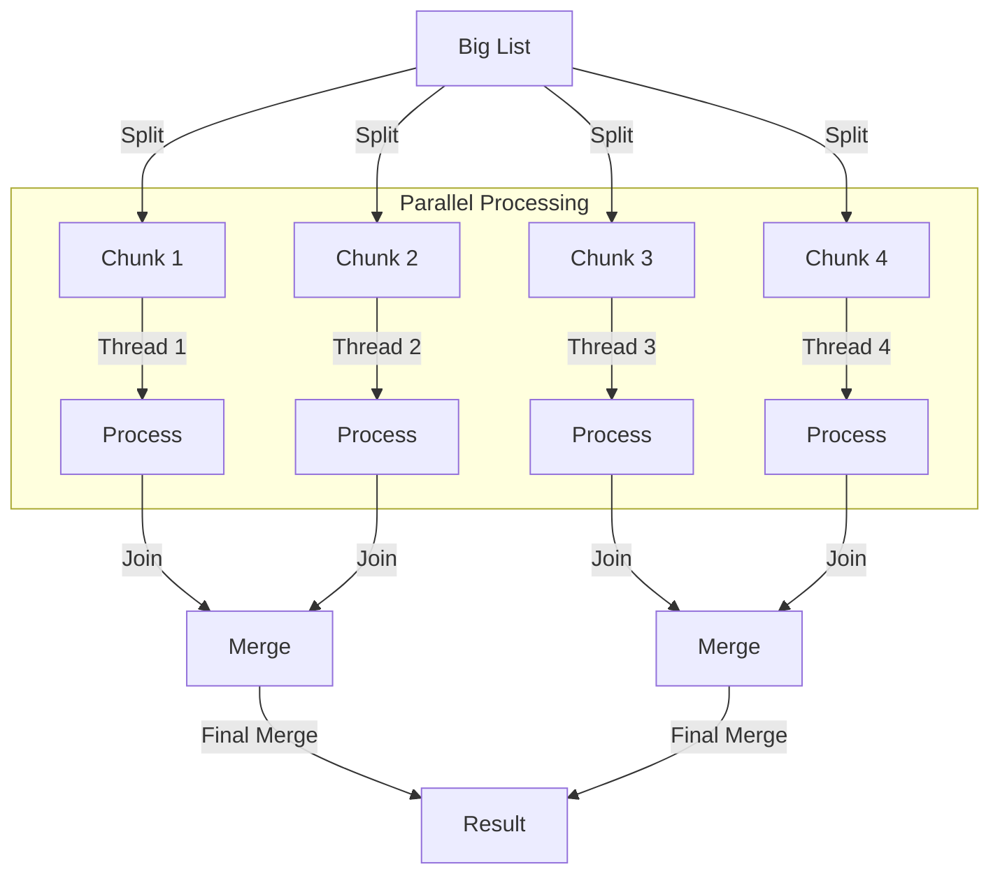

# Parallel Streams

Introduction in Java 8, `parallelStream()` allows you to process collections in parallel with a single method call. It is designed for **Data Parallelism** (doing the same thing to many items).

> **Run Code Example**: [`ParallelStreamDemo.java`](../../src/main/java/com/ashish/thread/ParallelStreamDemo.java)

## 1. The Magic of `.parallelStream()`

It splits the collection into chunks and processes them across available CPU cores.

```java
List<Integer> numbers = Arrays.asList(1, 2, 3, 4, 5, 6, 7, 8);

// Sequential
numbers.stream()
    .map(n -> slowSquare(n))
    .forEach(System.out::println);

// Parallel
numbers.parallelStream() // <--- The only change!
    .map(n -> slowSquare(n))
    .forEach(System.out::println);
```

## 2. Under the Hood: ForkJoinPool

Parallel Streams use the global `ForkJoinPool.commonPool()`.

- The number of threads defaults to `Runtime.getRuntime().availableProcessors() - 1`.
- It uses **Work Stealing**: If one thread finishes its chunk early, it steals work from others.



## 3. When to use Parallel Streams?

It is **NOT** always faster. Splitting and merging results takes time.

**Use it when:**

1. **NQ > 10,000**: Cost of operation (N * Q) is high. (N = number of elements, Q = cost per element).
2. **Stateless Operations**: Your functions (`map`, `filter`) do not depend on external mutable state.
3. **No Blocking**: You are doing CPU-intensive work (calculating primes, processing images).

**Avoid it when:**

1. **Small Data sets**: The overhead of splitting is slower than a simple loop.
2. **I/O Bound Tasks**: If you fetch data from a DB inside a parallel stream, you block the *common pool*, slowing down the entire application!
3. **Order Matters**: `forEach` order is not guaranteed. Use `forEachOrdered` (but that reduces parallelism).

## 4. The Common Pool Pitfall

Since all parallel streams share the **global** `ForkJoinPool.commonPool()`, one slow task anywhere in your app can starve all other parallel streams.

**Solution for blocking tasks:**
Use `CompletableFuture` with a custom Executor instead of `parallelStream()`.

## 5. Accumulators and Thread Safety

**NEVER** modify shared state inside a parallel stream.

```java
// BAD: Race Condition!
List<Integer> result = new ArrayList<>();
numbers.parallelStream().map(n -> doWork(n)).forEach(n -> result.add(n)); // CRASH or EXTINCT DATA

// GOOD: Use Collectors
List<Integer> result = numbers.parallelStream()
    .map(n -> doWork(n))
    .collect(Collectors.toList());
```
