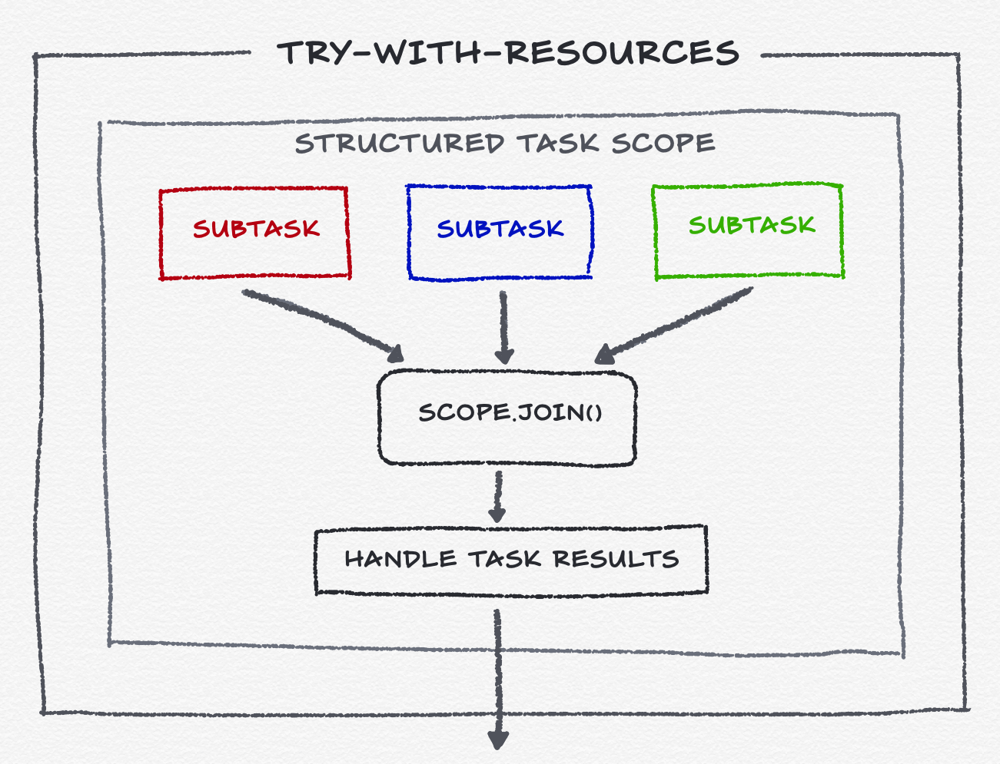

## Overview

**Note:** Structured Concurrency still a preview feature.

- Structured concurrency helps to groups of related tasks running in different threads as a single 
unit of work, this streamline error handling and cancellation, improve reliability, and enhancing 
observability.

- It's not replacing any of the concurrency constructs in the java.util.concurrent package, such 
as ExecutorService and Future.

- We Developers manage work by breaking a task into multiple subtasks.
  1. In single-threaded code, the subtasks execute sequentially.
  2. If the subtasks are sufficiently independent of each other, and if there are sufficient hardware 
  resources, then the overall task can be made to run faster (i.e., with lower latency) by executing 
  the subtasks concurrently. For example, a task that composes the results of multiple I/O operations
  will run faster if each I/O operation executes concurrently in its own thread. Let assume a case 
  of restaurant where customer has ordered 3 different dishes, if each can be prepared independently and 
  as all are ready you serve them to your customer in a single nice platter.
 

## Concurrency with ExecutorService

The java.util.concurrent.ExecutorService API, introduced in Java 5, helps developers execute subtasks concurrently.
The ExecutorService immediately returns a Future for each subtask, and executes the subtasks concurrently according to
the scheduling policy of the Executor.

Because the subtasks execute concurrently, each subtask can succeed or fail independently. (Failure, in this context,
means to throw an exception.) Often, a task should fail if any of its subtasks fail. Understanding the lifetimes of the
threads can be surprisingly complicated when failure occurs: Let see same with a code example

```code
Response handle() throws ExecutionException, InterruptedException {
    Future<Dish>  starter  = esvc.submit(() -> prepareStarter());
    Future<Dish> mainCourse = esvc.submit(() -> prepareStarter());
    Dish theStarter  = starter.get();   
    Dish theMainCourse = mainCourse.get();  
    return new Response(theStarter, theMainCourse);
}
```

1. If prepareStarter() throws an exception then handle() will throw an exception when calling starter.get() but prepareMainCourse() 
   will continue to run in its own thread. This is a thread leak which, at best, wastes resources; at worst, the prepareMainCourse()
   thread will interfere with other tasks.
2. If the thread executing handle() is interrupted, the interruption will not propagate to the subtasks. Both the
   prepareStarter() and prepareStarter() threads will leak, continuing to run even after handle() has failed.
3. If prepareStarter() takes a long time to execute, but prepareStarter() fails in the meantime, then handle() will wait
   unnecessarily for prepareStarter() by blocking on starter.get() rather than cancelling it. Only after prepareStarter() completes and
   starter.get() returns will mainCourse.get() throw an exception, causing handle() to fail.

In each case, the problem is that our program is logically structured with task-subtask relationships, but these
relationships exist only in the developer's mind.

Observability tools such as thread dumps, for example, will show handle(), prepareStarter(), and prepareStarter() on the call
stacks of unrelated threads, with no hint of the task-subtask relationship.

### What we are doing right now to handle such concerns (before structured concurrency)

1. Wrapping tasks with try-finally and calling the cancel(boolean) methods of the futures of the other tasks in the
   catch block for the failing task.
2. Use the ExecutorService inside a try-with-resources statement,

But all this can be very tricky to get right, and it often makes the logical intent of the code harder to discern.
Keeping track of the inter-task relationships, and manually adding back the required inter-task cancellation edges,
is asking a lot of developers.

Note:- The Java Platform already has an API for imposing structure on concurrent tasks, namely java.util.concurrent.ForkJoinPool,
which is the execution engine behind parallel streams. However, that API is designed for compute-intensive tasks rather than tasks which involve I/O.

## Structured Concurrency

Structured concurrency is an approach to concurrent programming that preserves the natural relationship between tasks
and subtasks, which leads to more readable, maintainable, and reliable concurrent code.

Structured concurrency derives from the simple principle that

**_If a task splits into concurrent subtasks then they all return to the same place, namely the task's code block._**

In structured concurrency, subtasks work on behalf of a task. The task awaits the subtasks' results and monitors them
for failures.

1. Well-defined entry and exit points for the flow of execution through a block of code.
2. A strict nesting of the lifetimes of operations in a way that mirrors their syntactic nesting in the code.

The principal class of the structured concurrency API is **StructuredTaskScope** in the java.util.concurrent package. This
class allows developers to structure a task as a family of concurrent subtasks, and to coordinate them as a unit.
Subtasks are executed in their own threads by forking them individually and then joining them as a unit and, possibly,
cancelling them as a unit. The subtasks' successful results or exceptions are aggregated and handled by the parent task.
StructuredTaskScope confines the lifetimes of the subtasks to a clear lexical scope in which all of a task's interactions
with its subtasks — forking, joining, cancelling, handling errors, and composing results — takes place.

```java
Response handle() throws ExecutionException, InterruptedException {
    try (var scope = new StructuredTaskScope.ShutdownOnFailure()) {
        Supplier<String>  user  = scope.fork(() -> findUser());
        Supplier<Integer> order = scope.fork(() -> fetchOrder());

        scope.join()            // here we are waiting for all task to finish
             .throwIfFailed();  // propagate errors if any of task failed

        // Here, control comes after join over and both subtasks have succeeded, so compose their results
        return new Response(user.get(), order.get());
    }
}
```

The use of StructuredTaskScope ensures a number of valuable properties:

1. Error handling with short-circuiting — If either the findUser() or fetchOrder() subtasks fail, the other is cancelled
   if it has not yet completed. (This is managed by the shutdown policy implemented by ShutdownOnFailure; for different 
   policies outcome could be different).
2. **Cancellation propagation** — If the thread running handle() is interrupted before or during the call to join(), both
   subtasks are cancelled automatically when the thread exits the scope.
3. **Clarity** — The above code has a clear structure: Set up the subtasks, wait for them to either complete or be cancelled,
   and then decide whether to succeed (and process the results of the child tasks, which are already finished) or fail
   (and the subtasks are already finished, so there is nothing more to clean up).
4. Observability — A thread dump, clearly displays the task hierarchy, with the threads running findUser() and
   fetchOrder() shown as children of the scope.

### Workflow

Workflow of code using StructuredTaskScope is:



1. Create a scope. The thread which creates the scope is its owner.
2. Use the fork(callable) method to fork subtasks in the scope. Each call to fork(..) starts a new thread
   to execute the subtask, which is by default a virtual thread.
3. At any point of time, any of subtasks or the the scope's owner, may call the scope's shutdown() method to
   cancel unfinished subtasks and prevent the forking of new subtasks.
4. Scope's owner joining the scope, i.e., all of its subtasks, as a unit. The owner can call the scope's join()
   method, to wait until all subtasks have either completed (successfully or not) or been cancelled via shutdown().
   Alternatively, it can call the scope's join until (java.time.Instant) method, to wait up to a deadline.
5. After joining, handle any errors in the subtasks and process their results.
6. Close the scope, usually implicitly via try-with-resources. This shutdown the scope, if it's not already
   shutdown, and waits for any subtasks that have cancelled but not yet completed to complete.


## Scope Policies

There are two policies provided by jdk as subclass of StructuredTaskScope.

1. **StructuredTaskScope.ShutdownOnSuccess**, captures the first successfully completed subtask result and shuts down the
scope afterward. This will interrupt any unfinished threads and wake up the scope’s owner. Choose this policy if you 
only need the result of a singular subtask.
2. **StructuredTaskScope.ShutdownOnFailure**, shuts down the scope on the first failed subtask. This policy ensures that
other subtasks get discarded if any of them fails.

Scopes can be nested, which creates a tree-like relationship. A thread started in a scope can create a nested scope of 
its own, with a parent-child relationship between them.

## Writing your own policy

