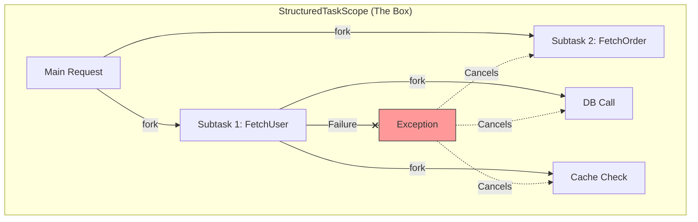

# Structured Concurrency in Java (JDK 21+ Preview)

> **Status**: Preview Feature (JEP 453 in JDK 21, JEP 480 in JDK 24). You must enable `--enable-preview` to use this.

> "If a task splits into concurrent subtasks, then they all return to the same place, namely the task's code block."

## 1. The Core Concept

Concurrency is often difficult because it breaks the simple, linear flow of logic we are used to.

- **Unstructured Concurrency**: "Fire and forget". You spawn a thread, and it flies off. If it fails, who knows? If you want to cancel it, do you have a handle? It's like a `GOTO` statement for threads.
- **Structured Concurrency**: "Scopes". You enter a block, spawn threads, and **you cannot leave the block** until all threads are done. It guarantees logical hierarchies.

### Visual Comparison




### Why it matters

1. **No Thread Leaks**: Threads are confined to the scope. Use `try-with-resources` to ensure they are cleaned up.
2. **Error Propagation**: If one subtask fails, should the others continue? Structured Concurrency lets you say "No, cancel everyone else immediately".
3. **Observability**: Thread dumps show the parent-child relationship clearly.

---

## 2. The Old Way (Unstructured)

Before Java 21, using `ExecutorService` often led to "Thread Leaks".

```java
// BAD: Unstructured
Future<String> user = executor.submit(() -> findUser());
Future<Order> order = executor.submit(() -> fetchOrder());

// If findUser() throws, fetchOrder() keeps running! (Leak)
String u = user.get(); 
Order o = order.get();
```

---

## 3. The New Way: `StructuredTaskScope`

Java 21 introduces `StructuredTaskScope` (Preview usage). It uses the `try-with-resources` block to enforce structure.

### Pattern A: "All or Nothing" (`ShutdownOnFailure`)

Use this when you need *all* subtasks to succeed (e.g., building a dashboard with User + Order data).

```java
Response handle() throws ExecutionException, InterruptedException {
    // 1. Open a Scope
    try (var scope = new StructuredTaskScope.ShutdownOnFailure()) {
        
        // 2. Fork subtasks (Virtual Threads by default!)
        Supplier<String>  user  = scope.fork(() -> findUser());
        Supplier<Integer> order = scope.fork(() -> fetchOrder());

        // 3. Join (Wait for all)
        scope.join();
        
        // 4. Handle Errors (If one failed, throw immediately)
        scope.throwIfFailed();

        // 5. Success! Both are ready.
        return new Response(user.get(), order.get());
    }
    // implicit close(): If we exited early (exception), ensure orphaned threads are cancelled.
}
```

### Pattern B: "First Winner" (`ShutdownOnSuccess`)

Use this when you need *any* subtask to succeed (e.g., fetching a price from 2 different airlines).

```java
Integer getBestPrice() throws ExecutionException, InterruptedException {
    try (var scope = new StructuredTaskScope.ShutdownOnSuccess<Integer>()) {
        
        // Race two tasks
        scope.fork(() -> fetchPriceFromAirlineA());
        scope.fork(() -> fetchPriceFromAirlineB());

        // Wait for the FIRST success, and automatically cancel the loser
        return scope.join().result();
    }
}
```

---

## 4. Handling Timeouts (Deadlines)

In production, you rarely want to wait forever. `StructuredTaskScope` provides a clean way to apply a deadline to the entire scope using `joinUntil(Instant)`.

```java
Response handleWithTimeout() {
    try (var scope = new StructuredTaskScope.ShutdownOnFailure()) {
        
        scope.fork(() -> slowTaskA());
        scope.fork(() -> slowTaskB());

        try {
            // Wait with a deadline
            scope.joinUntil(Instant.now().plusSeconds(2)); 
        } catch (TimeoutException e) {
            // Cancel all running tasks immediately
            scope.shutdown();
            throw new RuntimeException("Request timed out", e);
        }

        // Handle success
        return new Response(...);
    }
}
```

---

## 5. Passing Context (Scoped Values)

When using Structured Concurrency, you often need to pass implicit context (like User ID, Transaction ID) to the subtasks. **Scoped Values** (JEP 429/446/481) are the modern replacement for `ThreadLocal`.

> **Note**: Scoped Values are also a Preview feature.

```java
final static ScopedValue<String> USER_ID = ScopedValue.newInstance();

void serve() {
    ScopedValue.where(USER_ID, "user-123").run(() -> {
        // Inside this block, USER_ID is bound to "user-123"
        // It is automatically inherited by subtasks forked in a StructuredTaskScope!
        handle(); 
    });
}
```

This pairs perfectly with `StructuredTaskScope` because the scope automatically propagates bound Scoped Values to the forked threads.

---

## 6. Best Practices

1. **Use with [Virtual Threads](./VirtualThread.md)**: Structured Concurrency is designed for millions of threads. `fork()` uses Virtual Threads by default.
2. **Always use `try-with-resources`**: This ensures that `close()` is called, which waits for threads to finish shutting down.
3. **Don't ignore the `join()`**: You must call `join()` before accessing results.

---

## 7. Summary Checklist

- [ ] Replaced `ExecutorService` with `StructuredTaskScope` for complex workflows.
- [ ] Used `ShutdownOnFailure` for "User Page" style logic.
- [ ] Used `ShutdownOnSuccess` for "Fastest Response" logic.
- [ ] Enabled Preview features (`--enable-preview`) in your build.
