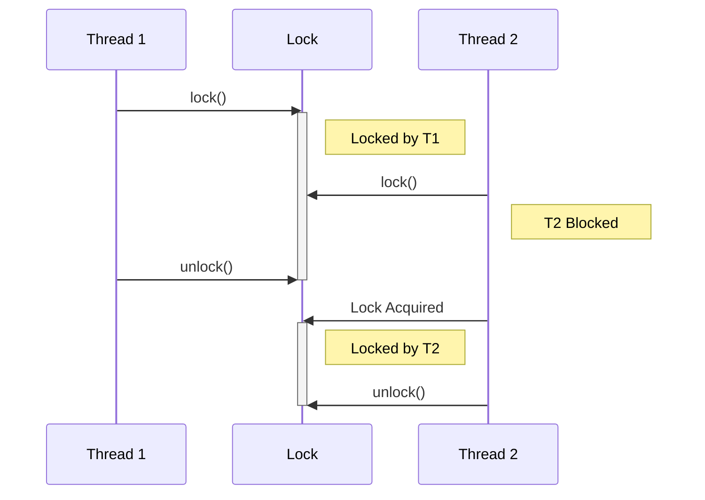
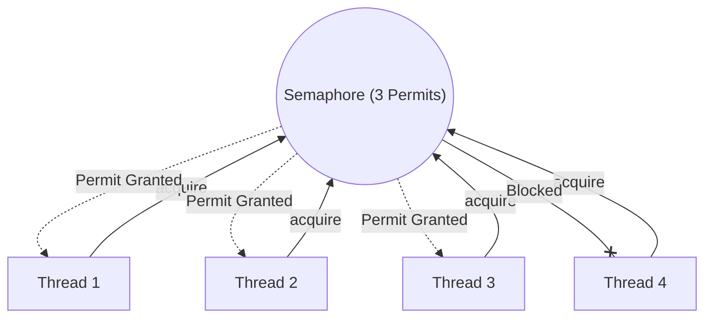

# Synchronization, Locks, and Coordination

Managing shared mutable state is the hardest part of concurrency. Java provides several levels of abstraction.

> **Run Code Examples**:
>
> - [`SynchronizationDemo.java`](../../src/main/java/com/ashish/thread/SynchronizationDemo.java) (Locks)
> - [`CoordinationDemo.java`](../../src/main/java/com/ashish/thread/CoordinationDemo.java) (Semaphores/Latches)

## 1. Intrinsic Locks (`synchronized`)

Every Java object has a built-in monitor lock.

```java
// Synchronized Method
public synchronized void increment() {
    count++;
}

// Synchronized Block (Better control)
public void increment() {
    synchronized(this) { 
        count++; 
    }
}
```

- **Pros**: Simple, built-in language keyword.
- **Cons**: Can cause infinite blocking (no timeout), only one condition queue (`wait/notify`).

## 2. Explicit Locks (`ReentrantLock`)

Provided by `java.util.concurrent.locks`.

```java
ReentrantLock lock = new ReentrantLock();

void safeMethod() {
    lock.lock();
    try {
        // Critical section
    } finally {
        lock.unlock(); // MUST use try-finally
    }
}
```

- **Features**: Timeouts (`tryLock`), multiple conditions, fairness policies.



## 3. ReadWriteLock

Used when you have **many readers** but **few writers**. Allows multiple threads to read simultaneously, but write is exclusive.

```java
ReadWriteLock rwLock = new ReentrantReadWriteLock();
// rwLock.readLock().lock();
// rwLock.writeLock().lock();
```

## 4. StampedLock (Optimistic Locking)

Introduced in Java 8, `StampedLock` is often faster than `ReadWriteLock` because it supports **Optimistic Reads**.

It does **not** implement the `Lock` interface and is not reentrant.

```java
StampedLock sl = new StampedLock();

// READER
long stamp = sl.tryOptimisticRead(); // 1. Try to read without locking
int x = currentX;
if (!sl.validate(stamp)) {           // 2. Validate if Write occurred during read
   stamp = sl.readLock();            // 3. Fallback to full Read Lock
   try {
       x = currentX;
   } finally {
       sl.unlockRead(stamp);
   }
}

// WRITER
long stamp = sl.writeLock();
try {
    currentX++;
} finally {
    sl.unlockWrite(stamp);
}
```

## 5. Semaphores (Permits)

A `Semaphore` maintains a set of permits. Threads block if no permits are available.

**Use Case**: Limiting access to a resource (Rate Limiting, Connection Pools).

```java
Semaphore semaphore = new Semaphore(3); // Only 3 threads allowed

try {
    semaphore.acquire();
    // Do specific restricted work
} catch (InterruptedException e) {
    // handle
} finally {
    semaphore.release();
}
```



## 5. Coordination Tools

### CountDownLatch

Wait for N events to happen. **Cannot be reused**.

```java
CountDownLatch latch = new CountDownLatch(3);
// Workers call latch.countDown();
latch.await(); // Main thread waits for count to reach 0
```

### CyclicBarrier

Wait for N threads to arrive at a common point. **Can be reused**.

```java
CyclicBarrier barrier = new CyclicBarrier(3, () -> System.out.println("All arrived!"));
// Threads call barrier.await()
```

## 6. Atomics

For simple counters or references, use Non-Blocking Synchronization (CAS - Compare And Swap).

```java
AtomicInteger count = new AtomicInteger(0);
count.incrementAndGet(); // Thread-safe, no locks!
```

- `AtomicBoolean`, `AtomicLong`, `AtomicReference`.
- Extremely fast for single variables.

## 7. Volatile

The `volatile` keyword guarantees **visibility**. It ensures that a change made by one thread is immediately visible to others. It **does not** guarantee atomicity (don't use it for counters).

```java
private volatile boolean running = true; // Safe for flag checking
```
