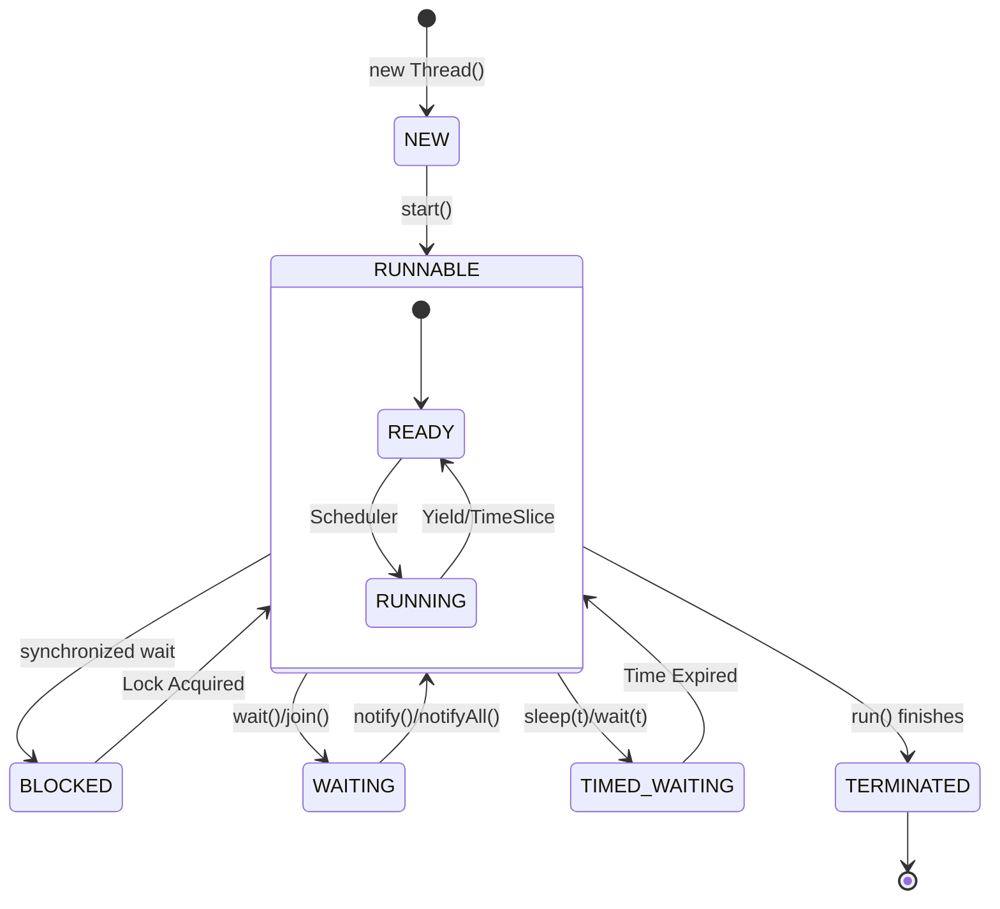

# Java Threading Fundamentals

> **Run Code Example**: [`ThreadLifecycleDemo.java`](../../src/main/java/com/ashish/thread/ThreadLifecycleDemo.java)

Threads are the fundamental unit of execution in Java. All other concurrency tools (Executors, Parallel Streams) are built upon threads.

## 1. Creating a Thread

There are two main ways to define code that runs in a thread:

### Implementing `Runnable` (Preferred)

Decouples the task from the runner.

```java
Runnable task = () -> {
    System.out.println("Running in: " + Thread.currentThread().getName());
};
Thread t = new Thread(task);
t.start(); // STARTS the thread. calling t.run() just runs it in the main thread!
```

### Extending `Thread`

Tightly couples your logic to the Thread mechanism.

```java
class MyThread extends Thread {
    public void run() {
        System.out.println("Running...");
    }
}
new MyThread().start();
```

## 2. Thread Lifecycle States

A thread can be in one of the following states (`Thread.State` enum):

1. **NEW**: Created but not yet started.
2. **RUNNABLE**: Executing in the JVM (might be waiting for CPU).
3. **BLOCKED**: Waiting for a monitor lock (`synchronized`).
4. **WAITING**: Waiting indefinitely for another thread (e.g., `Object.wait()`, `thread.join()`).
5. **TIMED_WAITING**: Waiting for another thread for a specified time (`Thread.sleep(1000)`).
6. **TERMINATED**: The `run()` method has exited.



## 3. Important Concepts

### Daemon vs User Threads

- **User Thread** (Default): The JVM keeps running as long as *any* user thread is alive.
- **Daemon Thread**: Verification/background threads (like GC). The JVM exits immediately if only Daemon threads are left.

```java
Thread t = new Thread(task);
t.setDaemon(true); // Must be set BEFORE start()
t.start();
```

### Thread Priorities

You can suggest a priority (1-10), but the OS often ignores it. **Do not rely on this** for logic.

### Thread Interruption

Java threads stop cooperatively. You can't force-kill a thread safely. You ask it to stop.

```java
// Controller
t.interrupt(); 

// Worker Thread
public void run() {
    while (!Thread.currentThread().isInterrupted()) {
        // do work...
    }
}
```

## 4. Next Steps

- Usage of Locks and Synchronization: [Synchronization.md](./Synchronization.md)
- Thread Pools: [ExecutorService.md](./ExecutorService.md)
- Virtual Threads: [VirtualThread.md](./VirtualThread.md)
