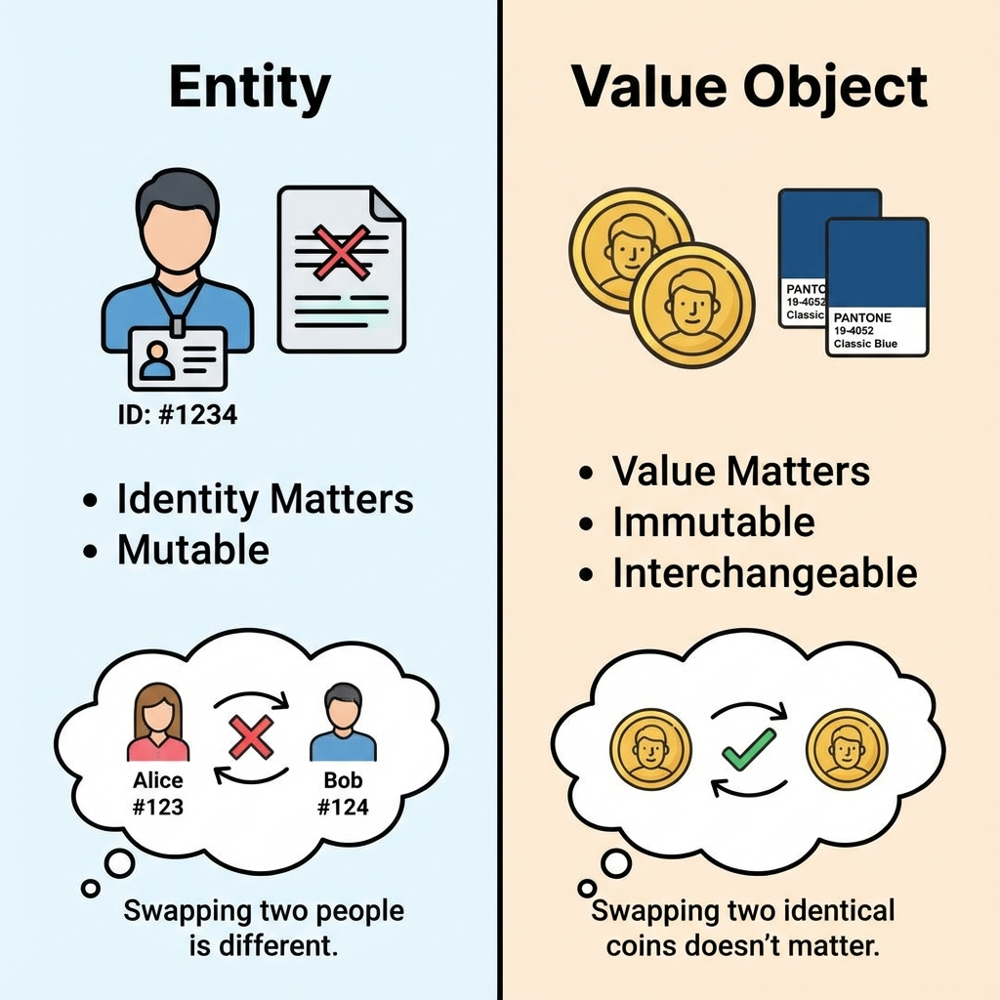

# Value Objects in Java: The Comprehensive Guide

> "A small object that represents a simple entity whose equality is not based on identity: i.e. two value objects are equal when they have the same value, not necessarily being the same object." — Martin Fowler

## 1. What is a Value Object?

In Domain-Driven Design (DDD), we distinguish between two main types of objects:

1. **Entities**: Objects defined by their **Identity** (who they are). If you change their name or address, they are still the same person/company.
2. **Value Objects**: Objects defined by their **Attributes** (what they are). If you change the value, it is a different object.

### The "Bill vs Coin" Analogy

- **Entity**: A `$100 Bill` has a unique serial number. If you swap it with your friend, you have a *different* bill.
- **Value Object**: A `$1 Coin` has no ID. If you swap it with your friend, it doesn't matter. It holds the same *value*.



### Key Characteristics

1. **Immutable**: Once created, it cannot be changed. You must create a new one to represent a new value.
2. **Identity-less**: Equality is based on fields (`.equals()`), not memory address (`==`).
3. **Self-Validating**: It should never exist in an invalid state. `new Money(-100)` should throw an exception immediately.

---

## 2. Why Use Them? (Avoiding "Primitive Obsession")

**Anti-Pattern: Primitive Obsession**
Using raw types (`String`, `int`) to represent domain concepts often leads to bugs and scattered logic.

```java
// BAD: Logic scattered everywhere
public void registerUser(String email) {
    if (email == null || !email.contains("@")) { // Validation repeated
        throw new IllegalArgumentException("Invalid email");
    }
    // ...
}
```

**Solution: Value Objects**
Encapsulate the logic in a dedicated class.

```java
// GOOD: Logic centralised
public void registerUser(EmailAddress email) {
    // email is guaranteed to be valid here
}
```

---

## 3. Implementation in Modern Java (Records)

Since Java 14, **Records** are the perfect tool for Value Objects. They provide immutability, `equals()`, `hashCode()`, and `toString()` out of the box.

### Example 1: Money

```java
public record Money(BigDecimal amount, String currency) {
    
    // Compact Constructor for Validation
    public Money {
        if (amount.compareTo(BigDecimal.ZERO) < 0) {
            throw new IllegalArgumentException("Money cannot be negative");
        }
        if (currency == null || currency.length() != 3) {
            throw new IllegalArgumentException("Invalid currency code");
        }
    }

    public Money add(Money other) {
        if (!this.currency.equals(other.currency)) {
            throw new IllegalArgumentException("Currency mismatch");
        }
        return new Money(this.amount.add(other.amount), this.currency);
    }
}
```

### Example 2: Email Address

```java
public record EmailAddress(String value) {
    public EmailAddress {
        if (value == null || !value.contains("@")) {
            throw new IllegalArgumentException("Invalid email format");
        }
    }

    @Override
    public String toString() {
        return value; // Unbox seamlessly
    }
}
```

---

## 4. The Future: Project Valhalla & `value class`

*Note: This section covers upcoming Java features (JEP 401).*

While `records` are great, they still have "Identity" in the JVM (monitor locks, memory address). This has a performance cost.
Project Valhalla introduces true **Value Classes** to the JVM.

### The Problem with Objects today

- **Pointer Chasing**: Objects are stored in the Heap. An array `Money[]` is actually an array of pointers to objects scattered in memory.
- **Header Overhead**: Every object has a header (12-16 bytes) for locking/GC, even if it just holds a single `byte`.

### The Solution: `value class`

In a future Java version, you will be able to declare:

```java
value record Color(byte red, byte green, byte blue) {}
```

**Benefits**:

1. **Flattened in Memory**: An array `Color[]` will store the bytes `rgb rgb rgb` directly, just like `int[]`. No pointers!
2. **No Identity**:
    - `==` compares values, not addresses.
    - No `synchronized` allowed.
    - No `null` (potentially).

### Summary of Differences (Future)

| Feature | Identity Class (Normal) | Value Class (Valhalla) |
| :--- | :--- | :--- |
| **Declaration** | `class` | `value class` |
| **Equality (`==`)** | Check same reference | Check same fields |
| **Sync Monitor** | Allowed | Throws `IdentityException` |
| **Memory Layout** | Pointer to Heap | Flattened / Inline |
| **Best For** | Services, Entities, mutable state | Points, Money, Dates, Colors |

---

## Summary Checklist

- [ ] Use **Records** for all your Value Objects today.
- [ ] Validate data in the **Compact Constructor**.
- [ ] Make them **Immutable**.
- [ ] Watch out for **Project Valhalla** for free performance boosts in the future.
