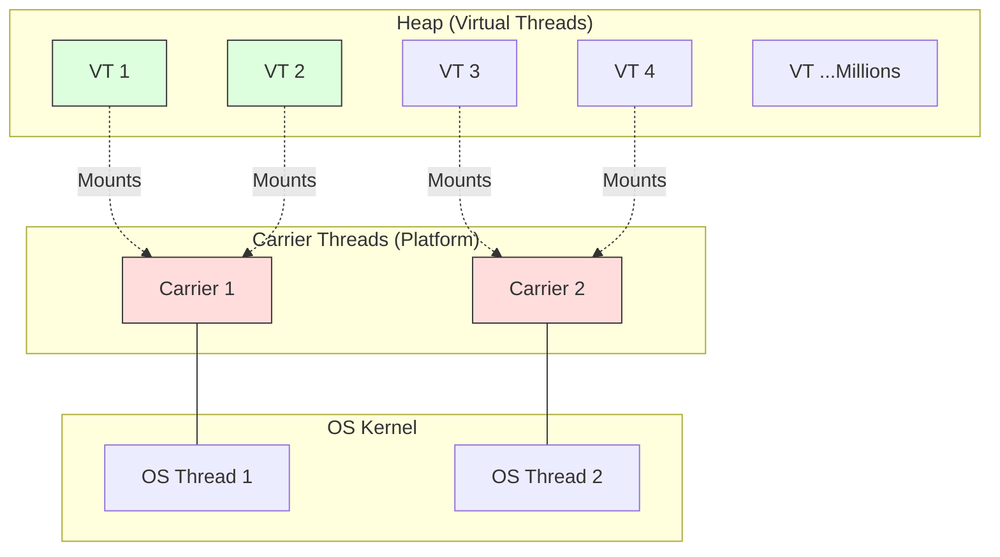
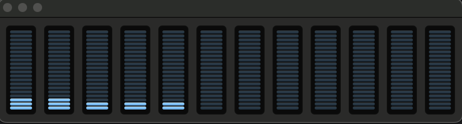
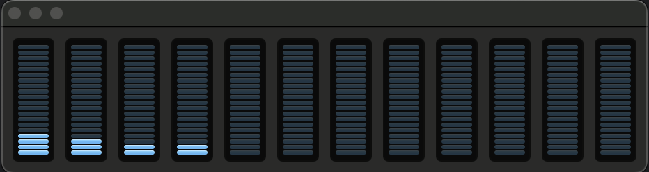
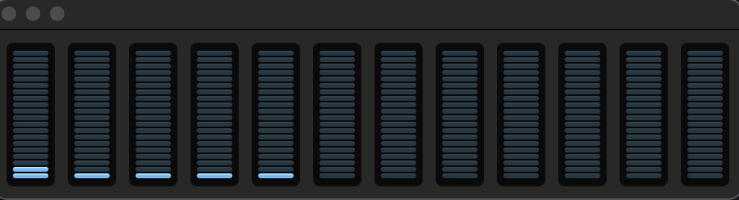

# Overview

Virtual Thread was released as a final feature in JDK 21 under [JEP 444](https://openjdk.org/jeps/444).
Subsequent improvements, such as removing pinning for `synchronized` blocks, were introduced in JDK 24.

## Background

The scalability of server applications is governed by Little's law.

```Example

Little's law

concurrency = throughput * latency

same can be written as
throughput = concurrency/latency

Now to increase throughput we have 2 options: either we reduce latency or increase concurrency.
Let's understand it better with below numbers

A server application  
        average latency =  50ms
        concurrency = 10 (roughly equivalent to platform threads available on machine)
        throughput =  10/0.050 = 200 requests per second

```

In order for that application to scale to a throughput of 2000 requests per second,
it will need to process 100 requests concurrently. If each request is handled in a thread
for the request's duration then, for the application to keep up, the number of threads must
grow as throughput grows.

Here the problem starts: the number of threads (platform threads) are limited as they are just wrappers
of OS threads. The JDK's current implementation of threads caps application throughput to a level
well below what the hardware can support.

To solve this scaling issue, we can also write non-blocking asynchronous code. Let's see how we are traditionally writing code
right now using ExecutorService

```java
import java.util.concurrent.TimeUnit;

ExecutorService es = ...;
var f1 = es.submit(api.a());
var f2 = es.submit(api.b());

var result = new Result(f1.get(1, TimeUnit.SECONDS), 
                        f2.get(1, TimeUnit.SECONDS));       
```

## How we are writing non-blocking code

Non-blocking via CompletableFuture

```java
public CompletableFuture<ABC> abc(String id){
    return supplyAsync(() -> api.a(id), executor)
        .thenCompose(a -> api.b(a))
            .thenCompose(b -> api.c(a, b))
                .thenApply(c -> new ABC(a, b, c));
}
```

Non-blocking with Reactive Programming

```java
public Mono<ABC> abc(int id) {
    return api.a(id)
        .flatMap(a -> api.b(a).flatMap(
                b -> api.c(a, b).map(
                        c -> new ABC(a, b, c))));
}
```

There are challenges with asynchronous style of code, which make it not so friendly for developers. It's hard to read and hard
to write. Most Java developers' minds are wired with the thread-per-request model, and the Java ecosystem (debuggers, etc.)
does not support asynchronous style natively.

- Each stage of a request might run on a different thread.
- Every thread runs stages belonging to different requests.
- Stack traces do not provide the usual context.
- Debuggers cannot step through request-handling logic.

## Let's understand virtual threads

Virtual Threads (Project Loom) are lightweight threads that significantly reduce the effort of writing, maintaining, and observing high-throughput concurrent applications.

> **Run Code Example**: [`VirtualThreadsDemo.java`](../../src/main/java/com/ashish/thread/VirtualThreadsDemo.java) are created to efficiently use the hardware resources at our disposal. As more and more
applications are moving to the cloud, every infrastructure resource is charged.

Language designers realized that this problem can be addressed at the language level only, as OS threads
are supposed to take care of n-number of use-cases (multiple languages, someone wanting to play music/video, others
wanting to do editing/designing, etc.)

Both virtual threads and platform threads (our old friend Thread) are instances of java.lang.Thread

- A virtual thread is not tied to a particular OS thread.
- A platform thread is our traditional thread, which is actually a wrapper of an OS thread.

Virtual threads preserve the thread-per-request style that is harmonious with the Java platform and optimize
hardware usage as well.

Virtual threads are a lightweight implementation of threads that is provided by the JDK rather than the OS. Virtual
threads employ M:N scheduling, where a large number (M) of virtual threads is scheduled to run on
a smaller number (N) of OS threads.

<table>
  <tr>
   <td>Parameter
   </td>
   <td>Platform threads
   </td>
   <td>Virtual threads
   </td>
  </tr>
  <tr>
   <td>stack size
   </td>
   <td>1 MB
   </td>
   <td>resizable
   </td>
  </tr>
  <tr>
   <td>startup time
   </td>
   <td>> 1000 µs
   </td>
   <td>1-10 µs
   </td>
  </tr>
  <tr>
   <td>context switching time
   </td>
   <td>1-10 µs
   </td>
   <td>~ 0.2 µs
   </td>
  </tr>
  <tr>
   <td>number
   </td>
   <td>&lt; 5000
   </td>
   <td>millions
   </td>
  </tr>
</table>




### Scheduling

For platform threads, the JDK relies on the scheduler available in the OS, but virtual threads are scheduled by the JDK only.
The JDK scheduler assigns virtual threads to platform threads. The platform threads are then scheduled by
the OS as usual.

The JDK's virtual thread scheduler is a work-stealing ForkJoinPool that operates in FIFO mode. The parallelism
of the scheduler is the number of platform threads available for the purpose of scheduling virtual
threads. By default, it is equal to the number of available processors.

We can create a very large number of virtual threads (in millions), but the same is not possible with platform threads:

- A virtual thread requires memory in KBs. Stacks of virtual threads are stored in the heap as stack chunk objects.
The stack grows and shrinks as the application runs.
- A platform thread requires about 1MB of stack memory.

### Pinning

There are 2 scenarios in which a virtual thread cannot be unmounted from its carrier during a blocking operation:

1. When it executes code inside a synchronized block or method, or
2. When it executes a native method or a foreign function.

Frequent pinning for long durations can harm the scalability of an application by capturing carriers.
**Note:** As of JDK 24, the limitation regarding `synchronized` blocks has been resolved (JEP 491). Virtual threads can now unmount even when holding a monitor, provided they are not inside a native frame. Pinnning due to native methods/foreign functions remains.

## API changes

There are a few changes made to the java.lang.Thread API:

1. New APIs added to create virtual threads:

- Via Thread.Builder interface

```java

        Thread.Builder builder = Thread.ofVirtual().name("MyVirtualThread");
        Runnable task = () -> {
            System.out.println("Running virtual thread");
        };
        Thread t = builder.start(task);
        t.join();

```

- Via Thread.ofVirtual

```java

Thread thread = Thread.ofVirtual().start(() -> System.out.println("Hello"));
thread.join();

```

- Via Executors

```java

try (var executor = Executors.newVirtualThreadPerTaskExecutor()) {
            IntStream.range(0, 10).forEach(i -> {
                executor.submit(() -> {
                    System.out.println("Thread Name: " + Thread.currentThread().toString());
                });
            });
        }

```

- Via Thread.startVirtualThread

```java
Thread vt = Thread.startVirtualThread(() -> System.out.println("Hello"));
        vt.join();
```

1. Thread.isVirtual() tests whether a thread is a virtual thread.

## Strengths of virtual threads

- Virtual threads can run any code that a platform thread can run. They support thread-local variables
and thread interruption just like platform threads.

## Pitfalls of virtual threads

- Pinning of virtual threads to platform threads when they block in native code.
- (Prior to JDK 24) Pinning when blocking in `synchronized` blocks. This is resolved in modern JDKs.
- If the JVM runs out of platform threads, it can let some virtual threads starve.
- Pinning of virtual threads to platform threads can produce deadlock conditions.
- It's a bad practice to mix CPU-intensive tasks with I/O-bound tasks.
- JDK's thread dump obtained with jstack or jcmd presents a flat list of threads. This is not
suitable for thousands or millions of virtual threads.
- Current limitation of virtual threads is that the G1 GC does not support humongous stack chunk objects.
If a virtual thread's stack reaches half the region size, which could be as small as 512KB, then a
StackOverflowError might be thrown.
- Stack traces could be very deep for frameworks like Spring Boot.
- GC needs to do more work, as virtual threads allocate memory on the heap.

## Important Points/Facts

- Virtual threads are cheap and plentiful, and thus should never be pooled.
- Virtual threads are not faster threads—they do not run code any faster than platform threads.
- As we talked about earlier with Little's law, virtual threads exist to provide throughput, not speed.
Virtual threads can significantly improve application throughput when:
  - The number of concurrent tasks is high (more than a few thousand) and
  - The workload is not CPU-bound, since having many more threads than processor cores cannot
      improve throughput in that case.
- Virtual threads should not be considered as a replacement for platform threads.
- Virtual threads are not aware of their carrier (platform thread). Thread.currentThread() always
returns the virtual thread itself.
- Stack traces of the carrier and virtual thread are separate. An exception thrown in the virtual thread
will not include the carrier's stack frames and vice-versa.
- Thread-local variables of the carrier are unavailable to the virtual thread.
- Virtual threads are not cooperative. Application code must not make assumptions about how or when
virtual threads are assigned to platform threads.
- The public Thread constructors cannot create virtual threads.
- Virtual threads are always daemon threads. Calling Thread.setDaemon(boolean) has no effect.
- Virtual threads have a fixed priority of Thread.NORM_PRIORITY. Calling Thread.setPriority(int) has no effect.
- Virtual threads are not active members of thread groups. Calling Thread.getThreadGroup() returns
a placeholder thread group with the name "VirtualThreads".
- Virtual threads have no permissions when running with a SecurityManager set.

## Some tests

### How will Thread.sleep behave with VT?

As we understand by now, virtual threads leverage platform threads whenever they need to do any work, and
whenever they (virtual threads) block, the Java scheduler allocates the platform thread to some other virtual thread.

The same can be observed with the Thread.sleep() method in case it is invoked on a virtual thread. Let's see
some code samples.

```java

try (executorService) {
            Duration sleep = Duration.ofSeconds( 12 );
            for ( int i = 0 ; i < limit ; i++ ) {
                executorService.submit(new Runnable() {
                            @Override
                            public void run ( )
                            {
                                try {Thread.sleep( sleep );} catch ( InterruptedException e ) {e.printStackTrace();}
                            }});
            }
        }

```

**Precondition** - I am running all my tests on a MacBook Pro having 12 cores (8 performance + 4 efficiency) (M2 chipset), so I will
safely assume 12 platform threads would be available to me without any hyper-threading.

1. Now let's see the output of the above code for both platform thread and virtual thread with 100 tasks (in above code limit=100)

> !!!! ExecutorService instance of fixedThreadPool(12)!!!!

- Time taken = 108 seconds
- CPU usage is almost nil, as most time platform threads are just waiting.


> !!!! ExecutorService instance of newVirtualThreadPerTaskExecutor()!!!!

- Time taken = 12 seconds
- CPU usage is almost nil, as virtual threads are getting blocked for 12 seconds. Note we are still running
100 tasks only


1. Now let's see the output of the above code for both platform thread and virtual thread with 10000 tasks (in above code limit=10000)

> !!!! ExecutorService instance of fixedThreadPool(12)!!!!

- Time taken = 1008 seconds for 1000 tasks... i was not having patience to run 10000 tasks on platform thread
and wait...if I do a simple math 100 task took 108seconds and 1000 tasks took 1008seconds so i can safely
assume 10000 tasks will take at least 10008seconds=166.8minutes=2.78hrs
- CPU usage is almost nil, as most time platform threads are just waiting.


> !!!! ExecutorService instance of newVirtualThreadPerTaskExecutor()!!!!

- Time taken = 12 seconds
- CPU usage is almost nil, as virtual threads are getting blocked for 12 seconds. Note we are still running
  10000 tasks only


1. Let's see if there is any difference when I increase the number of tasks to 1 million

> There is no point in running this for platform threads; my machine will definitely take days to complete,
and I don't have such patience.

> !!!! ExecutorService instance of newVirtualThreadPerTaskExecutor()!!!!

- Time taken = 25 seconds
- CPU usage is pretty good, as we have a huge number of tasks to execute. Platform threads were running some
tasks as carriers of virtual threads, keeping our CPU usage efficient.


That's the whole idea of introducing virtual threads: to keep our machines efficiently used.

**Learnings**

- Virtual threads are very efficient when:
   1. The application is supposed to perform a huge number of tasks, i.e., an application server
   needs to serve a large number of requests.
   2. Most of the tasks are blocking I/O operations, i.e., in a microservice architecture, a service will receive a
   request and pass it to another microservice via a REST API or call a database operation.

### Are VTs a good choice for CPU-intensive operations?

There are some operations naturally identified as CPU-intensive, i.e., video rendering/editing,
machine learning, scientific simulations, etc. Most applications developed by us developers
are not CPU-intensive in nature.

I simply copied the below code from the internet to test:

```java

    private static BigInteger factorial(int n) {
        BigInteger result = BigInteger.ONE;
        for (int i = 2; i <= n; i++) {
            result = result.multiply(BigInteger.valueOf(i));
        }
        return result;
    }

    //calling above method as factorial(100000) from platform and virtual thread
```

- Tasks executed via both platform and virtual threads:
  - For 100 tasks:
    - Platform thread - 24 seconds
    - Virtual thread - 27 seconds
  - For 1000 tasks:
    - Platform thread - 241 seconds
    - Virtual thread - 256 seconds

You can see there is no benefit to using virtual threads for CPU-intensive operations. In all cases here, all CPU cores were busy. One sample:


## Internal implementation details  

Virtual threads work on the **Continuation** programming technique.

> Please refer to [Continuation.md](./Continuation.md) for a detailed deep dive into how Continuations work internally.

In summary:

- The JDK uses a private `Continuation` API.
- When a virtual thread blocks, it yields its continuation.
- The stack is copied to the heap, and the carrier thread is released.

## Next Phase / Future Roadmaps (as of Java 21)

- Improved serviceability and troubleshooting
- Structured Concurrency and Scoped Values (Preview in JDK 24)
- **Resolved in JDK 24**: The "synchronized" pinning issue.

### Let's understand the Pinning Issue

Virtual threads can be pinned for multiple reasons. Let's first talk about the most prominent reason,
which is the usage of the synchronized keyword.

```java
synchronized byte[] getData() {
    byte[] buf = ...;
    int nread = socket.getInputStream().read(buf);    // Can block here
    ...
}
```

Here, getData is synchronized, so the JVM pins the virtual thread that is running getData to its carrier.
Pinning prevents the virtual thread from unmounting. Consequently, the read method blocks not only
the virtual thread but also its carrier, and hence the underlying OS thread.

Pinning not only raises scaling challenges but also introduces issues like:

1. Starvation - If all platform threads are pinned, virtual threads will not get a carrier and will starve.
2. Deadlock

**Reasons for Pinning (due to synchronized)**

1. For a thread to run a synchronized instance method, the thread first acquires the monitor associated
with the instance; when the method finishes, the thread releases the monitor.
As the virtual thread enters the synchronized method, its carrier thread acquires the monitor, not the
virtual thread. In the above example, both the virtual thread and its associated platform thread are blocked
until the data read operation is completed.

2. If a virtual thread invokes a synchronized instance method and the monitor associated with the
instance is held by another thread, then the virtual thread must block since only one thread
at a time may hold the monitor. We would like the virtual thread to unmount from its carrier
and release that platform thread to the JDK scheduler. Unfortunately, if the monitor is already
held by another thread, then the virtual thread blocks in the JVM until the carrier acquires the
monitor.

3. Moreover, when a virtual thread is inside a synchronized instance method and it invokes
Object.wait() on the object, then the virtual thread blocks in the JVM until awakened with
Object.notify() and the carrier re-acquires the monitor. The virtual thread is pinned because it
is executing inside a synchronized method, and further pinned because its carrier is blocked in
the JVM.

**Overcoming Pinning (due to synchronized)**

1. **Upgrade to JDK 24 or later**: The best solution is to use a recent JDK version where this issue is resolved.
2. **Use `java.util.concurrent` locks**: If on an older JDK (21-23), use `ReentrantLock` instead of `synchronized` to avoid pinning.

**How to know if your virtual threads are pinned?**

A ***jdk.VirtualThreadPinned*** event is recorded by JDK Flight Recorder (JFR) whenever a virtual
thread blocks inside a synchronized method. Use this to identify pinning and change the code towards
adopting java.util.concurrent locks.

As we talked about earlier, synchronized is not the only reason you can find the event in JDK Flight Recorder (JFR).
If a virtual thread calls native code, either through a native method or the Foreign Function &
Memory API, and that native code calls back to Java code that performs a blocking operation or
blocks on a monitor, then the virtual thread will be pinned.

### Updates on virtual thread pinning (JDK 24+)

With **JDK 24 (JEP 491)**, the "synchronized" pinning issue is **resolved**.

#### The Fix: JEP 491 Deep Dive

Prior to JDK 24, the JVM's implementation of `synchronized` (ObjectMonitor) assumed that the thread holding the lock was a platform thread. This tightly coupled the lock ownership to the OS thread, preventing the virtual thread from unmounting.

In JDK 24, the JVM implementation of ObjectMonitor has been completely rewritten to support virtual threads:

1. **Detach on Block**: When a virtual thread attempts to acquire a monitor (enter `synchronized`) and finds it locked, the JVM now **unmounts** the virtual thread from its carrier.
2. **Park Phase**: The virtual thread is "parked" (suspended) and stored in the heap, releasing the platform thread to do other work.
3. **Reschedule on Notify**: When the monitor is released (exit `synchronized`), the virtual thread is unparked and scheduled back onto a carrier thread to retry acquiring the lock.
4. **Wait/Notify Support**: Similarly, `Object.wait()` now unmounts the virtual thread, allowing it to wait for a notification without consuming an OS thread.

**Impact**:

- **Backward Compatibility**: You no longer need to rewrite `synchronized` blocks to `ReentrantLock`. Legacy code and libraries (like JDBC drivers) immediately become scalable.
- **Diagnostics**: The `jdk.tracePinnedThreads` property is removed. You should rely on JFR events (`jdk.VirtualThreadPinned`) which will now *only* fire for the remaining pinning cases (native code).

#### Remaining Constraints

Pinning is *not* completely gone. It still happens in one specific scenario:

- **Native Frames**: If a virtual thread calls a **Native Method** (JNI) or a Foreign Function (FFM), and *that* native code calls back into Java to perform a blocking operation (or uses a `synchronized` block), the thread will still be pinned. This is because the native C/C++ stack frame cannot be unmounted/moved by the JVM.

## Few questions

I will explain these in the near future. For now, let's treat them as food for thought.

Q: Is reactive programming still relevant after we have virtual threads? Any valid use cases?

Ans:
We are talking in the context of throughput only.

Q: Do we really need CompletableFuture now?
Q: How to share expensive resources between virtual threads?

## Code Samples

### Virtual thread code

<https://github.com/imagarg01/LearningStuff/blob/main/src/main/java/com/ashish/thread/PlayingWithVT.java>

### Structured Concurrency

For a detailed guide on managing groups of related virtual threads, see [StructuredConcurrency.md](./StructuredConcurrency.md).

Example code: <https://github.com/imagarg01/LearningStuff/blob/main/src/main/java/com/ashish/thread/PlayingWithSC.java>
