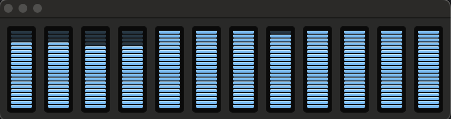
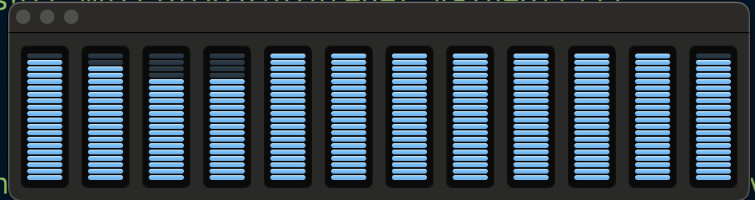

## Overview


Virtual Thread was released along with JDK 21 as finalize feature under [JEP 444](https://openjdk.org/jeps/444)


### Background
The scalability of server application are governed with the Little's law.

```Example

Little's law

concurrency = thorughput * latency

same can be written as
throughput = concurrency/latency

Now to incresae throughput we have 2 options either we reduce latency or increase concurrency.
Let's understand it better with below numbers

A server application  
        average latency =  50ms
        concurrency = 10 (roughly equivalent to latform thread available on machine)
        throughput =  10/.050 = 200 requests per second

```
In order for that application to scale to a throughput of 2000 requests per second, 
it will need to process 100 requests concurrently. If each request is handled in a thread 
for the request's duration then, for the application to keep up, the number of threads must 
grow as throughput grows.

Here the problem starts, number of threads (platform threads) are limited as they are just wrapper
of OS thread. The JDK's current implementation of thread cap's application throughput to a level 
below the hardware can support. 

To solve this scaling we also can write non-blocking asynchronous code.

## How we are writing non-blocking code 

Non blocking via Completable Future
```java
public CompletableFuture<ABC> abc(String id){
    return supplyAsync(()->api.a(id),executor)
        .thenCompose(a->api.b(a)
            .thenCompose(b->api.c(a,b)
                .thenCompose(c->new ABC(a,b,c))));
}
```

Non blocking with ReactiveProgramming
```java
public Mono<ABC> abc(int id)
    return api.a(id)
        .flatMap(a->api.b(a).flapMap(
                b->api.c(a,b).map(
                        c-> new ABC(a,b,c)));
```

There are chellenges with asynchrounous style of code, which make it not so friendly for developers.
Most of java developers mind are wired with thread per request model only also java ecosystem (bedugger etc.)
are not supporting asynchrounous style natively. 
- Each stage of a request might run on a different thread.
- Every thread run stages belongs to differnt request.
- Stack traces do not provide usual context
- Debuggers cannot step through request-handling logic

## Let's understand virtual thread

Virtualthread created to efficiently use hardware aware at our disposal. As we are taking more and more
application taking on cloud, every infra resource are charged. 

Language designer realized that this problem can be addressed at language level only as OS thread 
supposed to take care n-number of use-cases (multiple languages, somone want to play music/video, others
wants to editting/designing etc.)

Both Virtualthread and Platform Thread(our old friend thread) are instance of java.lang.Thread only
- A Virtualthread is not tied to particular OS thread.
- A PlatformThread is our traditional thread only which is actually a wrapper of OD thread.

Virtualthread preserve thread-per-request style, that is harmonious with java platform and optimize
the hardware usage as well.

Virtualthreads are a lightweight implementation of threads that is provided by JDK rather than OS.Virtual
threads employ M:N scheduling, where a larger number (M) of virtual threads is scheduled to run on 
a smaller number(N) of OS threads.


### Scheduling
For platform thread JDK relies on scheduler available in OS but virual thread are scheduled by jdk only.
JDK scheduler assigns virtual threads to platform threads. The platform threads are then scheduled by
the OS as usual.

JDK's virtual thread scheduler is a work-stealing ForkJoinPool that operates in FIFO mode. Parallelism
of the scheduler is the number of platform threads available for the purpose of scheduling virtual
threads. By default it is equal to number of available processors.

We can create a very large number of virtual thread (in millions) but same is not possible with platform thread
- A virtual thread require memory in kbs. Stacks of virtual thread are stored in heap as stack chunk object.
Stack grows and shrink as the application runs.
- A platform thread require memory in stack about 1Mb


### Pinning
There are 2 scenarios in which virtual thread cannot be unmounted from its carrier during blocking operation

1. When it executed code inside a synchronized block or method, or
2. When it executed a native method or a foreign function.

Frequent pinning for long durations can harm the scalability of an application by capturing carriers.
In future releases these limitations might be removed.


## API changes

There are few changes made in java.land.Thread API

1. New APIs added to create virtual thread.

* Via Thread.Builder interface
```java

        Thread.Builder builder = Thread.ofVirtual().name("MyVirtualThread");
        Runnable task = () -> {
            System.out.println("Running virtual thread");
        };
        Thread t = builder.start(task);
        t.join();

```

* Via Thread.ofVirtual
```java

Thread thread = Thread.ofVirtual().start(() -> System.out.println("Hello"));
thread.join();

```

* Via Executors
```java

try (var executor = Executors.newVirtualThreadPerTaskExecutor()) {
            IntStream.range(0, 10).forEach(i -> {
                executor.submit(() -> {
                    System.out.println("Thread Name: " + Thread.currentThread().toString());
                });
            });
        }

```

* Via Thread.startVirtualThread
```java
Thread vt =Thread.startVirtualThread(() -> System.out.println("Hello"));
        vt.join();
```

2. Thread.isVirtual() tests whether a thread is virtual thread. 


## Strengths of virtual thread

- Virtualthread can run any code that a platform thread can run. It support thread-local variables
and thread interruption just like platform thread.

## Pitfalls of virtual thread

- Pinning of virtual thread on platform thread when it block in native code or synchronized 
block.
- If JVM runs out of Platform threads, it can let some virtual thread starve.
- Pinning of virtual thread on platform thread can produce a deadlock condition.
- It's a bad practice to mix cpu intensive task with io bound task.
- JDK's thread dump obtained with jstack or jcmd, presents a flat list of threads.This is not 
suitable for thousands or millions of virtual threads.
- Current limitation of virtual thread is that the G1 GC does not support humongous stack chunk objects.
if a virtual thread's stack reaches half the region size, which could be as small as 512KB, then a 
stackoverflow error might be thrown.
- Stack traces could be very deep for a framework like springboot.
- GC need to do more work, as virtual thread allocate memory on heap.


## Important Points/Facts
- Virtualthread are cheap and plentiful, and thus should nevel be pooled. 
- Virtualthread are not faster threads- they do not run code any faster than PlatformThread.
- We earlier talks about littl's law, virtual thread exist to provide throughput not speed.
Virtual threads can significantly improve application throughput when
    - The number of concurrent tasks in high (more than a few thousand) and
    - The workloads is not CPU-bound, since having many more threads than processor cores cannot 
      improve throughput in that case.
- So virtual thread must not be considered as replacement of platform thread.
- Virtual thread is not aware about its carrier(platform thread). Thread.currentThread() is always
return the virtual thread itself.
- Stack traces are carrier and virtual thread are separate. An exception thrown in the virtual thread
will not include the carrier's stack frames and vice-versa.
- Thread-local variables of the carrier are unavailable to the virtual thread.
- Virtual threads are not cooperative. Application code must not make assumptions about how or when
virtual threads are assigned to platform threads.
- The public Thread constructors cannot create virtual threads.
- Virtual threads are always daemon threads. No impact of calling Thread.setDaemon(boolean).
- Virtual threads have a fixed priority of Thread.NORM_PRIORITY. No impact of calling Thread.setPriority(int)
- Virtual threads are not active member of thread groups. Calling Thread.getThreadGroup() returns
a placeholder thread group with the name "VirtualThreads".
- Virtual threads have no permissions when running with a SecurityManager set.


## Some tests

### How Thread.sleep will behave with VT ?

As we understood by now, virtual thread leveraged platform thread whenever it needs to do any work and
whenever it (virtual thread) blocks, java scheduled allocate platform thread to some other virtual thread. 

Same can be observed with Thread.sleep() method in case it invoked on a virtual thread. Let's see
some code sample.

```java

try (executorService) {
            Duration sleep = Duration.ofSeconds( 12 );
            for ( int i = 0 ; i < limit ; i++ ) {
                executorService.submit(new Runnable() {
                            @Override
                            public void run ( )
                            {
                                try {Thread.sleep( sleep );} catch ( InterruptedException e ) {e.printStackTrace();}
                            }});
            }
        }

```

**Precondition** - I am running all my test on a Macbook pro having 12 cores(8 performance + 4 efficieny) (M2 chipset), so I will
safely assume 12 platform thread would be available to me without any hyper threading.

1- Now let see the output of above code both for platform thread and virtual with 100 tasks (in aboove code limit=100)

> !!!! ExecutorService instance of fixedthreadpool(12)!!!!
- Time taken = 108 seconds 
- CPU usage is almost nil, as most of time platform thread is just waiting.


>  !!!! ExecutorService instance of newVirtualThreadPerTaskExecutor()!!!!
- TIme taken = 12 seconds
- CPU usage is almost nil, as vitual thread are getting blocked for 12 seconds. Note we are still running
100 tasks only


2- Now let see the output of above code both for platform thread and virtual with 10000 tasks (in aboove code limit=100)

> !!!! ExecutorService instance of fixedthreadpool(12)!!!!
- Time taken = 1008 seconds for 1000 tasks... i was not having patience to run 10000 tasks on platform thread 
and wait...if I do a simple math 100 task took 108seconds and 1000 tasks took 1008seconds so i can safely
assume 10000 tasks will take at least 10008seconds=166.8minutes=2.78hrs
- CPU usage is almost nil, as most of time platform thread is just waiting.


>  !!!! ExecutorService instance of newVirtualThreadPerTaskExecutor()!!!!
- TIme taken = 12 seconds
- CPU usage is almost nil, as vitual thread are getting blocked for 12 seconds. Note we are still running
  10000 tasks only


3- let's see if there any difference come if I increase number of tasks to 1million
> There is no point of running this for platform thread, my machine will definately take days to complete
and I am not having such patience

> !!!! ExecutorService instance of newVirtualThreadPerTaskExecutor()!!!!
- Time taken = 25 seconds
- CPU usage is pretty good, as we have huge number of tasks to execute. Platform thread was running some
tasks as carrier of virtual thread. Keeping our CPU usage efficient.


That's the whole idea of introducing virtual thread, to keep our machine efficiently used.

**Learnings**
- Virtual thread are very efficient 
   1. If application supposed to perform a huge number of task i.e. an application server
   needs to serve a large number of request.
   2. If most of the tasks are blocking io operation i.e. in a microservice architecture a service will receive the 
   request it paas same to another microservice on a REST API or call a database operation.


### Do VT is a good choice for a CPU intensive operation?

There are some operations naturally identified as CPU intensive i.e., video rendering/editing,
machine learning, scientific simulation etc. Kind of application mostly developed by us developers
are not cpu intensive in nature.

I simply copy pasted below code from internet to test
```java

    private static BigInteger factorial(int n) {
        BigInteger result = BigInteger.ONE;
        for (int i = 2; i <= n; i++) {
            result = result.multiply(BigInteger.valueOf(i));
        }
        return result;
    }

    //calling above method as factorial(100000) from platform and virtual thread
```

- Task executed via both platform and virtual 
    - For 100 tasks
        - Platform thread - 24seconds
        - Virtual thread - 27seconds
    - For 1000 tasks
        - Virtual thread - 256seconds
        - Platform thread - 241seconds

You can see there is no benefit of using virtual thread for cpu intensive operation. In all cases here all core CPU was busy. One sample


## Few questions

I will explain these in near future, for now lets treat them as food for thought.

Q- Is reactive programming still matters after we have virtual thread? Any valid use case?
Q- Do we really need of CompletableFuture now?
Q- How to share expensive resources between virtual threads.

## Code Samples

### Virtualthread Code 
https://github.com/imagarg01/LearningStuff/blob/main/src/main/java/com/ashish/thread/PlayingWithVT.java

### Structured concurrency
https://github.com/imagarg01/LearningStuff/blob/main/src/main/java/com/ashish/thread/PlayingWithSC.java


