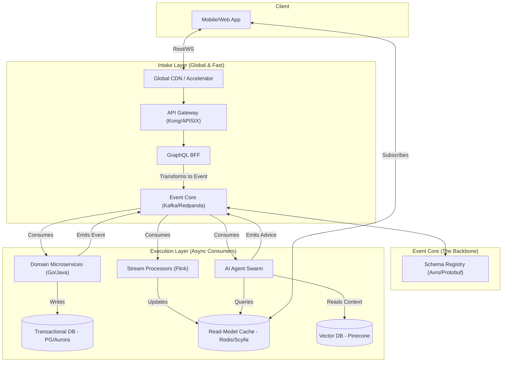

# High-Frequency Fintech Architecture (100k RPS)

## 1. High-Level Architecture

This system is designed to handle 100,000 requests per second (RPS) by leveraging an event-driven architecture, separating concerns into Intake, Event Core, and Execution layers.



### A. The Intake Layer (Gatekeeper)

- **Global Accelerator/CDN**: Terminates SSL at the edge to minimize latency.
- **API Gateway (Kong/APISIX)**: Handles authentication, rate-limiting, and request transformation. Converts synchronous REST/WebSocket calls into asynchronous events immediately.
- **BFF (Backend for Frontend)**: A GraphQL-based layer that orchestrates conversation state with Agents and allows the UI to fetch specific data requirements.

### B. The Event Core (The Backbone)

- **Streaming Platform**: Apache Kafka or Redpanda configured as a multi-region cluster to handle high throughput (100k RPS).
- **Schema Registry**: Enforces strict Avro or Protobuf schemas for all events (e.g., `Transaction_Initiated`, `Chat_Query_Received`) to ensure data consistency and parseability by AI Agents.

### C. The Execution Layer (Microservices & Agents)

- **Domain Microservices**: Low-latency services (Go/Java) for core domains like Ledger, Identity, and Payments. They update local "Read Models" and emit events.
- **AI Agent Swarm**: Specialized LLM-powered agents.
  - **Personalization Agent**: Updates user profiles based on behavior.
  - **Advisor Agent**: Calculates investment strategies upon deposit events.
  - **Guardrail Agent**: Intercepts and validates conversational events for compliance.

---

## 2. Deep Dive: Handling 100k RPS

To maintain a responsive, conversational UI at this scale, specific patterns are required:

### 1. The "Read-Aside" Pattern with CQRS

Directly querying the transactional database (PostgreSQL/Aurora) for every UI refresh is not viable.

- **Command**: The "Write" side processes a transaction and emits an event.
- **Query**: A dedicated "Read" service consumes the event and updates a highly optimized Read-Model in **Redis** or **ScyllaDB**.
- **Result**: The UI and Agents query only this ultra-fast cache, ensuring sub-millisecond response times.

### 2. Stream Processing (The "Brain")

Real-time aggregations are handled by **Apache Flink** or **Kafka Streams**:

- **Example**: "Instant Spend Analytics". Instead of an Agent calculating monthly spend on-the-fly (slow), Flink maintains a sliding window aggregation. When a user asks "How much did I spend?", the Agent simply reads the pre-calculated value.

### 3. Asynchronous Conversational State

Microservices are stateless, but conversations are stateful.

- **Vector Database**: **Pinecone** or **Milvus** stores "Long-term Memory".
- **Context Injection**: When a message arrives, relevant historical context is retrieved from the Vector DB and injected into the Agent's prompt context window, allowing for hyper-personalized responses without maintaining state in the application layer.

---

## 3. Scalability & Maintainability

| Strategy | Implementation | Why it matters |
| :--- | :--- | :--- |
| **Partitioning** | Partition Kafka topics by `user_id`. | Ensures strict ordering of events for a single user (e.g., Credit before Debit). |
| **Circuit Breakers** | Resilience4j or Envoy sidecars. | Prevents a slow downstream service (e.g., a complex AI Agent) from cascading failures back to the ingestion layer. |
| **Saga Pattern** | Distributed transactions via events. | Manages multi-step transactions (e.g., Transfer -> Notify). If "Notify" fails, compensating events trigger a rollback or retry. |
| **Dead Letter Queues** | Route failed events to a DLQ topic. | Allows "poison pill" or unparseable events to be isolated, inspected, and replayed after fixes, preventing stream blockage. |

---

## 4. Agent-Microservice Interaction Flow

```mermaid
sequenceDiagram
    participant User
    participant Gateway
    participant EventBus as Kafka
    participant Planner as Financial Planner Agent
    participant ReadModel as Read-Model (Redis)
    participant Analytics as Analytics Service
    participant UI

    User->>Gateway: "Can I afford this $500 watch?"
    Gateway->>EventBus: Emit Event: Conversation_Started
    EventBus->>Planner: Setup Context
    Planner->>ReadModel: Get Current Balance
    ReadModel-->>Planner: Balance: $2,000
    Planner->>Analytics: Get Upcoming Bills (API/Cache)
    Analytics-->>Planner: Bills: $1,600 due
    Planner->>Planner: Logic: $2000 - $1600 = $400 &lt; $500
    Planner->>EventBus: Emit Event: Advice_Generated
    EventBus->>UI: Push Notification (WebSocket)
    UI-->>User: "No, you have $1,600 in bills due soon."
```

User Action -> Ingestion -> Event Emission -> Agent Processing (with Read-Model & Analytics lookups) -> Advice Event -> Real-time UI Delivery.
