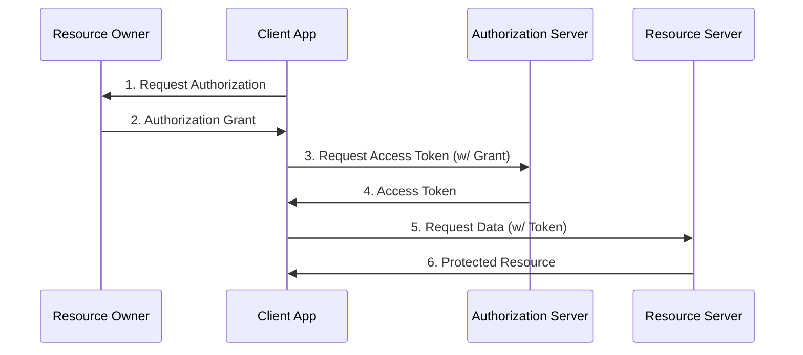
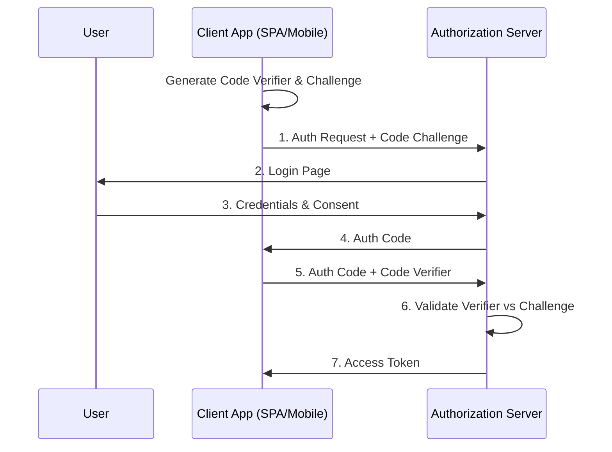

# OAuth 2.0: A Comprehensive System Design Guide

## 1. What is OAuth 2.0?

OAuth 2.0 (Open Authorization 2.0) is the industry-standard protocol for authorization. It allows a user to grant a third-party application access to their resources on another service (like Google, Facebook, or a corporate API) **without sharing their password**.

**The Valet Key Analogy:**
Think of OAuth 2.0 like a valet parking key.

- The **Master Key** (Your Password): Can open the doors, start the car, open the trunk, and access the glove box. You don't want to give this to the valet.
- The **Valet Key** (Access Token): Can only open the door and start the car. It cannot open the trunk or glove box.
- You give the valet the *Valet Key* so they can park your car (perform a specific task) without giving them full control (your Master Key).

---

## 2. Core Concepts & Roles

Before diving into the flow, it is essential to understand the four primary roles in OAuth 2.0:

1. **Resource Owner**: The user who owns the data (e.g., You).
2. **Client**: The application requesting access to the user's data (e.g., A printing app that wants photos from Google Photos).
3. **Authorization Server**: The server that authenticates the user and issues access tokens (e.g., Google's Auth Server).
4. **Resource Server**: The server hosting the user's data/resources (e.g., Google Photos API).

**Key Artifacts:**

- **Access Token**: A credential (usually a string) that the Client uses to access resources. It has a limited scope and lifetime.
- **Refresh Token**: A credential used to obtain new Access Tokens when the current one expires, without re-prompting the user.
- **Scope**: The level of access requested (e.g., `read:photos`, `write:files`).

---

## 3. How It Works (The General Flow)

The general abstract flow of OAuth 2.0 involves the following steps:

1. The **Client** requests authorization from the **Resource Owner**.
2. The **Resource Owner** grants authorization and gives the Client an **Authorization Grant**.
3. The **Client** presents the Authorization Grant to the **Authorization Server**.
4. The **Authorization Server** verifies the grant and issues an **Access Token**.
5. The **Client** uses the **Access Token** to request resources from the **Resource Server**.

---

## 4. Deep Dive: Grant Types

OAuth 2.0 defines several "grant types" to handle different scenarios. Choosing the right one is critical for security.

### 4.1 Authorization Code Grant

**Best for**: Traditional Server-side Web Apps.
**Security**: High. The Access Token is never exposed to the user's browser.

1. User is redirected to the Authorization Server.
2. User logs in and approves access.
3. Auth Server redirects user back to Client with an **Authorization Code**.
4. Client backend exchanges this code (plus its Client Secret) for an **Access Token**.

### 4.2 Authorization Code with PKCE (Proof Key for Code Exchange)

**Best for**: Single Page Apps (SPAs) and Mobile Apps.
**Security**: Very High. Prevents authorization code interception attacks.
**Context**: Replaces the insecure "Implicit Flow".

- **How it works**:
  - Client generates a random `code_verifier` and a hashed `code_challenge`.
  - Client sends `code_challenge` with the initial authorization request.
  - When exchanging the code for a token, Client sends the original `code_verifier`.
  - Auth Server hashes the `code_verifier` to ensure it matches the originally received `code_challenge`.

### 4.3 Client Credentials Grant

**Best for**: Machine-to-Machine (M2M) communication (e.g., generic background services).
**Context**: No user is involved. The Client is the Resource Owner.

1. Client sends its `client_id` and `client_secret` to the Auth Server.
2. Auth Server returns an Access Token.

### 4.4 Device Code Grant

**Best for**: Input-constrained devices (Smart TVs, IoT devices).

1. Device requests a code.
2. User visits a URL on their computer/phone and enters the code.
3. Device polls Auth Server until user completes the step, then receives the token.

### 4.5 Refresh Token Grant

**Best for**: Long-lived access.

- When an Access Token expires, the Client sends the Refresh Token to the Auth Server to get a new Access Token.

---

## 5. Advanced Concepts

### 5.1 Security Considerations

- **Use HTTPS**: Mandatory. OAuth2 is not secure over HTTP.
- **State Parameter**: Always use the `state` parameter to prevent CSRF (Cross-Site Request Forgery) attacks during the redirect.
- **Short-lived Access Tokens**: mitigate damage if a token is leaked.
- **Scope limitation**: Only ask for the scopes you absolutely need (Principle of Least Privilege).

### 5.2 Token Types

- **Bearer Tokens**: The most common. "Give access to whoever holds this token". Like cash. If stolen, it can be used by anyone.
- **Sender-Constrained Tokens (DPoP / mTLS)**: The token is bound to the client's cryptographic key. Using the token requires proving possession of the key. Much more secure but harder to implement.

### 5.3 Opaque Tokens vs JWTs (JSON Web Tokens)

- **Opaque Token**: A random string. The Resource Server must ask the Auth Server "Is this valid?" (Introspection). Better revocation control.
- **JWT**: Self-contained token with data (claims) signed by the Auth Server. Resource Server can validate it locally without calling Auth Server. Better performance, harder revocation.

---

## 6. Comparisons

### 6.1 OAuth 2.0 vs. SAML (Security Assertion Markup Language)

| Feature | OAuth 2.0 | SAML |
| :--- | :--- | :--- |
| **Primary Use** | Authorization (Access delegation) | Authentication (SSO) & Authorization |
| **Format** | JSON / HTTP | XML |
| **Environment** | Modern Web, Mobile, API | Enterprise, Legacy Web Apps |
| **Mobile Friendly** | Yes, very native | No, difficult to use on mobile |
| **Complexity** | Moderate | High (XML parsing, signatures) |
| **Analogy** | Valet Key | Passport |

### 6.2 OAuth 2.0 vs. API Keys

| Feature | OAuth 2.0 | API Keys |
| :--- | :--- | :--- |
| **Granularity** | High (Scopes, Users) | Low (Usually full access) |
| **Expiration** | Yes (Short-lived tokens) | No (Usually static/forever) |
| **Security** | High (Token rotation, no password sharing) | Low (Often hardcoded, leaked) |
| **User Context** | Can act on behalf of specific users | Acts as the Application itself |
| **Revocation** | Easy (Revoke token) | Hard (Key rotation breaks app) |

### 6.3 OAuth 2.0 vs. OpenID Connect (OIDC)

- **Relationship**: OIDC is a layer built **on top** of OAuth 2.0.
- **OAuth 2.0**: "I want to access your stuff." (Authorization)
- **OIDC**: "I want to know who you are." (Authentication)
- **OIDC adds**: An `ID Token` (JWT) to the OAuth flow, which contains user profile info.
- **Rule of Thumb**: simple login = OIDC. Accessing API = OAuth 2.0.

---

## 7. Real-World Provider Implementation Nuances

While the OAuth 2.0 spec is standard, every major provider has its own flavor and requirements.

### 7.1 Google (Identity Platform)

- **Discovery**: Uses a well-known OpenID Connect discovery document (`https://accounts.google.com/.well-known/openid-configuration`) to publish endpoints.
- **Scopes**: Very granular (e.g., `https://www.googleapis.com/auth/drive.readonly`).
- **Consent Screen**: Highly standardized. Apps must be verified by Google to remove "Unverified App" warnings if requesting sensitive scopes.
- **Libraries**: Provides a robust client library (`google-auth`) that handles token refreshing automatically.

### 7.2 Microsoft (Azure AD / Entra ID)

- **Tenancy**: The biggest difference is the concept of tenants.
  - `/common`: Allow users from any organization and personal accounts.
  - `/organizations`: Allow only users from work/school accounts.
  - `/{tenant-id}`: Restrict to a specific organization.
- **v1.0 vs v2.0**: Old endpoints are radically different. Always use v2.0 for standard OAuth2/OIDC compliance.
- **Manifest**: Configuration is often done via a JSON Manifest in the Azure Portal.

### 7.3 GitHub

- **Not OIDC Standard**: GitHub's implementation is close to pure OAuth 2.0 but historically didn't support OpenID Connect (OIDC) for user identity in the same standard way as Google/Microsoft until recently (for Actions).
- **Flow**: Very simple. `GET /login/oauth/authorize` -> `POST /login/oauth/access_token`.
- **Response Format**: Historically returned a query string (`access_token=...&scope=...`) instead of JSON by default, unless `Accept: application/json` header is set.

### 7.4 Facebook

- **Graph API**: OAuth token is used to query the Graph API.
- **Strict Redirect URI**: Extremely strict about matching Redirect URIs. Trailing slashes matter!
- **Inspection**: Provides a debug tool (`/debug_token`) to inspect token validity.

---

## 8. Pros and Cons

### Pros

- **Security**: Decouples authentication from authorization. Users never share passwords with clients.
- **Granularity**: Access can be limited by scope (read-only vs read-write) and duration.
- **Standardization**: Widely adopted; libraries exist for every language.
- **Versatility**: Supports various flows (Server, SPA, Mobile, IoT, M2M).

### Cons

- **Complexity**: Harder to implement than Basic Auth or API Keys.
- **Specification Bloat**: The core spec is simple, but the ecosystem (extensions, RFCs) is vast and can be confusing.
- **Phishing Risk**: Malicious apps can mimic authorization pages to trick users.

---

## 9. Where to Use?

- **Google/Facebook Login**: Use **OIDC** (which uses OAuth 2.0).
- **Mobile App accessing your API**: Use **Authorization Code Flow with PKCE**.
- **Server-side Web App integration**: Use **Authorization Code Flow**.
- **Microservice A calling Microservice B**: Use **Client Credentials Flow**.
- **IoT Device**: Use **Device Code Flow**.
